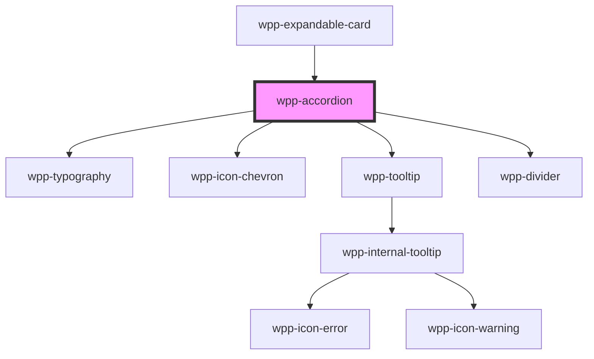

# wpp-accordion


<!-- Auto Generated Below -->


## Usage

### Angular

```html
<wpp-accordion size="l" [withTag]="true">
  <wpp-typography type="l-heading" slot="header">Beauty Science & Technology</wpp-typography>
  <wpp-typography>
    Dive into our constant search for cutting edge scientific discoveries and game-changing technologies, for more and
    more transparency and trust in our products, with no compromise on quality, efficacy and safety.
  </wpp-typography>
  <wpp-tag slot="tags" label="Neutral" variant="neutral"></wpp-tag>
</wpp-accordion>

<wpp-accordion expanded disabled [withDivider]="false">
  <wpp-typography type="m-strong" slot="header">Governance & Ethics</wpp-typography>
  <wpp-typography>
    Having a proactive Board and strong leadership that is deeply committed to high ethical standards is a business
    imperative for ensuring sustainable success
  </wpp-typography>
  <wpp-action-button disabled variant="secondary" slot="actions">
    Action
    <wpp-icon-edit slot="icon-start"></wpp-icon-edit>
  </wpp-action-button>
</wpp-accordion>
```


### React

```tsx
export const AccordionExample = () => (
  <>
    <WppAccordion size="m" withTag>
      <WppTypography type="m-strong" slot="header">Beauty Science & Technology</WppTypography>
      <WppTypography>
        Dive into our constant search for cutting edge scientific discoveries and game-changing technologies, for more and
        more transparency and trust in our products, with no compromise on quality, efficacy and safety.
      </WppTypography>
      <WppTag slot="tags" label="Neutral" variant="neutral" />
    </WppAccordion>

    <WppAccordion expanded disabled withDivider={false}>
      <WppTypography type="m-strong" slot="header">Governance & Ethics</WppTypography>
      <WppActionButton disabled variant="secondary" slot="actions">
        Action
        <WppIconEdit slot="icon-start" />
      </WppActionButton>
      <WppTypography>
        Having a proactive Board and strong leadership that is deeply committed to high ethical standards is a business
        imperative for ensuring sustainable success
      </WppTypography>
    </WppAccordion>
  </>
)
```


### Vue

```vue

<script setup lang="ts">
import { WppAccordion, WppTypography, WppActionButton, WppIconEdit, WppTag } from '@platform-ui-kit/components-library-vue'
</script>

<template>
  <WppAccordion size="m" withTag="true">
    <WppTypography type="m-strong" slot="header">Beauty Science & Technology</WppTypography>
    <WppTypography>
      Dive into our constant search for cutting edge scientific discoveries and game-changing technologies, for more and
      more transparency and trust in our products, with no compromise on quality, efficacy and safety.
    </WppTypography>
    <WppTag slot="tags" label="Neutral" variant="neutral" />
  </WppAccordion>

  <WppAccordion expanded disabled withDivider="false">
    <WppTypography type="m-strong" slot="header">Governance & Ethics</WppTypography>
    <WppActionButton disabled variant="secondary" slot="actions">
      Action
      <WppIconEdit slot="icon-start" />
    </WppActionButton>
    <WppTypography>
      Having a proactive Board and strong leadership that is deeply committed to high ethical standards is a business
      imperative for ensuring sustainable success
    </WppTypography>
  </WppAccordion>
</template>


```


## Properties

| Property            | Attribute             | Description                                                                                                                                                                                           | Type                                 | Default     |
| ------------------- | --------------------- | ----------------------------------------------------------------------------------------------------------------------------------------------------------------------------------------------------- | ------------------------------------ | ----------- |
| `counter`           | `counter`             | <span style="color:red">**[DEPRECATED]**</span> - this prop will be deleted in version 4.0.0.<br/><br/>Defines the number of elements within a specific section.                                      | `number`                             | `0`         |
| `disabled`          | `disabled`            | If the component is disabled.                                                                                                                                                                         | `boolean`                            | `false`     |
| `expanded`          | `expanded`            | If the component is expanded.                                                                                                                                                                         | `boolean`                            | `false`     |
| `expandedByDefault` | `expanded-by-default` | If the component is expanded by default. Enabling this prop prevents users from expanding the accordion and removes the initial expansion animation.                                                  | `boolean`                            | `false`     |
| `size`              | `size`                | Defines the section size.                                                                                                                                                                             | `"2xl" \| "l" \| "m" \| "s" \| "xl"` | `'l'`       |
| `text`              | `text`                | <span style="color:red">**[DEPRECATED]**</span> - this prop will be deleted in version 4.0.0. If you want to use this prop, use "header" slot instead<br/><br/>If set, adds text next to the section. | `string \| undefined`                | `undefined` |
| `withDivider`       | `with-divider`        | If the component has a divider at the bottom.                                                                                                                                                         | `boolean`                            | `true`      |
| `withTag`           | `with-tag`            | If set to true, displays `Tag` next to the section. The tag must placed in the `.tags` slot.                                                                                                          | `boolean`                            | `false`     |


## Events

| Event       | Description                              | Type                                             |
| ----------- | ---------------------------------------- | ------------------------------------------------ |
| `wppBlur`   | Emitted when a section loses focus.      | `CustomEvent<FocusEvent>`                        |
| `wppChange` | Emitted when the expanded state changes. | `CustomEvent<AccordionSectionChangeEventDetail>` |
| `wppFocus`  | Emitted when a section is in focus.      | `CustomEvent<FocusEvent>`                        |


## Methods

### `updateHeight() => Promise<void>`

Calculate the height of the content for the accordion.

#### Returns

Type: `Promise<void>`


## Slots

| Slot        | Description                                                                 |
| ----------- | --------------------------------------------------------------------------- |
| `"actions"` | Content is placed inside the `.actions` element and add content to actions. |
| `"header"`  | content that is placed inside the header section                            |
| `"tags"`    | Content that is placed inside the `.tags` to display contextual tags.       |


## Shadow Parts

| Part              | Description                                      |
| ----------------- | ------------------------------------------------ |
| `"content"`       |                                                  |
| `"counter"`       | Defines accordion counter.                       |
| `"divider"`       | Defines accordion divider.                       |
| `"icon"`          | Defines accordion icon chevron.                  |
| `"section"`       | Defines the accordion top wrapper.               |
| `"title"`         | Defines accordion title.                         |
| `"title-wrapper"` | Defines wrapper that contains title and chevron. |
| `"ws-inner"`      | Content slot element                             |
| `"ws-wrapper"`    | Content slot wrapper element                     |


## CSS Custom Properties

| Name                                             | Description |
| ------------------------------------------------ | ----------- |
| `--wpp-accordion-actions-wrapper-left-margin`    |             |
| `--wpp-accordion-counter-color`                  |             |
| `--wpp-accordion-counter-font-size`              |             |
| `--wpp-accordion-counter-font-weight`            |             |
| `--wpp-accordion-counter-height`                 |             |
| `--wpp-accordion-expandable-section-margin-2xl`  |             |
| `--wpp-accordion-expandable-section-margin-l`    |             |
| `--wpp-accordion-expandable-section-margin-left` |             |
| `--wpp-accordion-expandable-section-margin-m`    |             |
| `--wpp-accordion-expandable-section-margin-s`    |             |
| `--wpp-accordion-expandable-section-margin-xl`   |             |
| `--wpp-accordion-first-border-color-focus`       |             |
| `--wpp-accordion-icon-color`                     |             |
| `--wpp-accordion-icon-color-active`              |             |
| `--wpp-accordion-icon-color-disabled`            |             |
| `--wpp-accordion-icon-color-hover`               |             |
| `--wpp-accordion-icon-margin`                    |             |
| `--wpp-accordion-margin-2xl`                     |             |
| `--wpp-accordion-margin-bottom-l`                |             |
| `--wpp-accordion-margin-bottom-m`                |             |
| `--wpp-accordion-margin-bottom-s`                |             |
| `--wpp-accordion-margin-l`                       |             |
| `--wpp-accordion-margin-m`                       |             |
| `--wpp-accordion-margin-s`                       |             |
| `--wpp-accordion-margin-xl`                      |             |
| `--wpp-accordion-second-border-color-focus`      |             |
| `--wpp-accordion-text-color-disabled`            |             |


## Dependencies

### Used by

 - [wpp-expandable-card](../wpp-expandable-card)

### Depends on

- [wpp-typography](../wpp-typography)
- [wpp-icon-chevron](../wpp-icon/components/arrows/arrows/wpp-icon-chevron)
- [wpp-tooltip](../wpp-tooltip)
- [wpp-divider](../wpp-divider)

### Graph


----------------------------------------------

*Built with [StencilJS](https://stenciljs.com/)*
