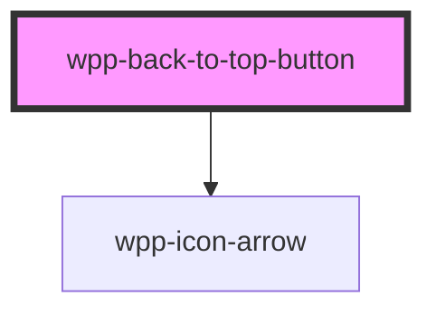

# wpp-back-to-top-button

<!-- Auto Generated Below -->


## Usage

### Angular

```html
<wpp-back-to-top-button *ngIf='showBackToTop' (click)='handleBackToTopClick()'>212</wpp-back-to-top-button>
```

```tsx
import { Component, HostListener } from '@angular/core'

@Component({
  ...
})
export class BackToTopButtonExamplePage {
  public showBackToTop: boolean = false

  @HostListener('window:scroll', ['$event'])
  onWindowScroll() {
    this.showBackToTop = window.scrollY > 200
  }

  public handleBackToTopClick(): void {
    window.scrollTo({
      top: 0,
      left: 0,
      behavior: 'smooth',
    })
  }
}
```


### React

```tsx
import { useState, useEffect } from 'react'
import { WppBackToTopButton } from '@platform-ui-kit/components-library-react'
import { debounce } from 'utils'

export const BackToTopButton = () => {
  const [showBackToTop, setShowBackToTop] = useState(false)

  useEffect(() => {
    const debouncedScrollHandler = debounce(() => {
      setShowBackToTop(window.scrollY > 200)
    }, 50)

    window.addEventListener('scroll', debouncedScrollHandler)

    return () => {
      window.removeEventListener('scroll', debouncedScrollHandler)
    }
  }, [])

  const handleBackToTopClick = () => {
    window.scrollTo({
      top: 0,
      left: 0,
      behavior: 'smooth',
    })
  }

  return (
    <div className="page">
      {showBackToTop && <WppBackToTopButton onClick={handleBackToTopClick} />}
    </div>
  )
}
```


## Properties

| Property    | Attribute | Description                        | Type        | Default                           |
| ----------- | --------- | ---------------------------------- | ----------- | --------------------------------- |
| `ariaProps` | --        | Contains the button `aria-` props. | `AriaProps` | `{     label: 'Back to top',   }` |


## Methods

### `setFocus() => Promise<void>`

Method that sets focus on the native button.

#### Returns

Type: `Promise<void>`


## Shadow Parts

| Part       | Description    |
| ---------- | -------------- |
| `"button"` | Button element |
| `"icon"`   | Icon element   |


## CSS Custom Properties

| Name                                                 | Description |
| ---------------------------------------------------- | ----------- |
| `--wpp-back-to-top-button-bg-color`                  |             |
| `--wpp-back-to-top-button-bg-color-active`           |             |
| `--wpp-back-to-top-button-bg-color-hover`            |             |
| `--wpp-back-to-top-button-border-color`              |             |
| `--wpp-back-to-top-button-border-color-hover`        |             |
| `--wpp-back-to-top-button-border-radius`             |             |
| `--wpp-back-to-top-button-box-shadow`                |             |
| `--wpp-back-to-top-button-first-border-color-focus`  |             |
| `--wpp-back-to-top-button-height`                    |             |
| `--wpp-back-to-top-button-icon-color`                |             |
| `--wpp-back-to-top-button-second-border-color-focus` |             |
| `--wpp-back-to-top-button-width`                     |             |


## Dependencies

### Depends on

- [wpp-icon-arrow](../wpp-icon/components/arrows/arrows/wpp-icon-arrow)

### Graph


----------------------------------------------

*Built with [StencilJS](https://stenciljs.com/)*
