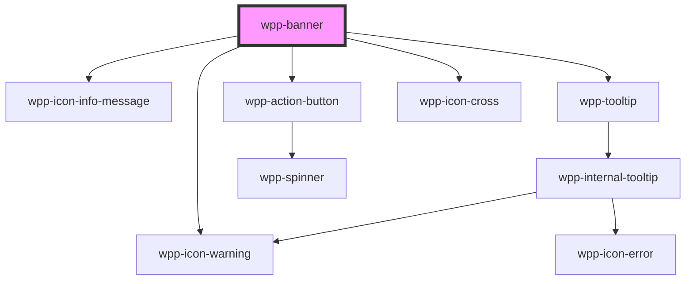

# wpp-banner

Create a prominent message to inform users about changes or give context to the page content.

<!-- Auto Generated Below -->


## Usage

### Angular

```ts
@Component({
  ...
})
export class BannerExample {
  public isToShowBanner: boolean = true;

  public handleBannerShowStateChange(event: Event): void {
    this.isToShowBanner = (event as CustomEvent<BannerChangeEventDetail>).detail.show
  }
}
```

```html
<wpp-banner closable type='information' [show]='isToShowBanner' (wppClose)="handleBannerShowStateChange($event)">
  USPS has updated their rates. Make sure you know how these changes affect your store.
  <div slot="actions">
    <wpp-action-button variant="inverted">Close</wpp-action-button>
  </div>
</wpp-banner>
```


### React

```tsx
import React, { useState } from 'react'
import { WppBanner } from '@platform-ui-kit/components-library-react'

export const BannerExample = () => {
  const [isToShowBanner, setIsToShowBanner] = useState(true)

  const handleBannerShowStateChange = (event: CustomEvent) => {
    setIsToShowBanner(event.detail.show)
  }

  return (
    <>
      <WppBanner type="information" show={isToShowBanner} closable onWppClose={handleBannerShowStateChange}>
        Banners should be used thoughtfully for only the most important information and can contain maximum 1 line of
        text.
      </WppBanner>
    </>
  )
}
```


### Vue

```vue
<script setup lang="ts">
import { ref } from 'vue'

import { WppBanner } from '@platform-ui-kit/components-library-vue'

const isToShowBanner = ref(true)

const handleBannerShowStateChange = (event: CustomEvent) => {
  isToShowBanner.value = event.detail.show
}
</script>

<template>
  <WppBanner type="information" :show="isToShowBanner" closable @wppClose="handleBannerShowStateChange">
    Banners should be used thoughtfully for only the most important information and can contain maximum 1 line of text.
  </WppBanner>
</template>
```


## Properties

| Property    | Attribute  | Description                                            | Type                         | Default     |
| ----------- | ---------- | ------------------------------------------------------ | ---------------------------- | ----------- |
| `ariaProps` | --         | Contains the button `aria-` props.                     | `AriaProps`                  | `{}`        |
| `closable`  | `closable` | If the banner can be closed.                           | `boolean`                    | `false`     |
| `role`      | `role`     | Role of the banner component.                          | `string`                     | `'alert'`   |
| `show`      | `show`     | If the banner is displayed.                            | `boolean`                    | `false`     |
| `type`      | `type`     | Defines the banner style based on the available types. | `"information" \| "warning"` | `undefined` |


## Events

| Event      | Description                            | Type                                   |
| ---------- | -------------------------------------- | -------------------------------------- |
| `wppClose` | Emitted when the banner state changes. | `CustomEvent<BannerChangeEventDetail>` |


## Slots

| Slot        | Description                                                                                                                                                                               |
| ----------- | ----------------------------------------------------------------------------------------------------------------------------------------------------------------------------------------- |
|             | Contains the main text content. This is the default slot, without the name attribute. Use only plain text or a `<span>` with plain text to maintain consistent styling and functionality. |
| `"actions"` | Can contain action buttons.                                                                                                                                                               |


## Shadow Parts

| Part                | Description               |
| ------------------- | ------------------------- |
| `"actions-inner"`   | actions slot              |
| `"actions-wrapper"` | actions wrapper element   |
| `"body"`            | Main content wrapper      |
| `"close-button"`    | close button element      |
| `"close-icon"`      | close icon element        |
| `"content-wrapper"` | content wrapper element   |
| `"left-icon"`       | left-icon element         |
| `"message"`         | message element           |
| `"wrapper"`         | component wrapper element |


## CSS Custom Properties

| Name                                          | Description |
| --------------------------------------------- | ----------- |
| `--wpp-banner-actions-wrapper-icon-margin`    |             |
| `--wpp-banner-actions-wrapper-margin`         |             |
| `--wpp-banner-animation-duration`             |             |
| `--wpp-banner-content-wrapper-icon-margin`    |             |
| `--wpp-banner-content-wrapper-max-width`      |             |
| `--wpp-banner-content-wrapper-padding`        |             |
| `--wpp-banner-information-bg-color`           |             |
| `--wpp-banner-information-box-shadow`         |             |
| `--wpp-banner-information-icon-message-color` |             |
| `--wpp-banner-min-height`                     |             |
| `--wpp-banner-padding`                        |             |
| `--wpp-banner-top-position`                   |             |
| `--wpp-banner-warning-bg-color`               |             |
| `--wpp-banner-warning-box-shadow`             |             |
| `--wpp-banner-warning-icon-message-color`     |             |
| `--wpp-banner-z-index`                        |             |


## Dependencies

### Depends on

- [wpp-icon-warning](../wpp-icon/components/status/status/wpp-icon-warning)
- [wpp-icon-info-message](../wpp-icon/components/status/status/wpp-icon-info-message)
- [wpp-tooltip](../wpp-tooltip)
- [wpp-action-button](../wpp-action-button)
- [wpp-icon-cross](../wpp-icon/components/add-and-remove/wpp-icon-cross)

### Graph


----------------------------------------------

*Built with [StencilJS](https://stenciljs.com/)*
