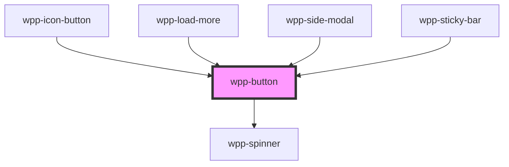

# wpp-button

Buttons can be used in forms or anywhere you want a user to act (submit, cancel, delete). Buttons can be styled with several attributes and display text, icons, or both.

<!-- Auto Generated Below -->


## Usage

### Angular

```html
<wpp-button>Primary</wpp-button>
<wpp-button variant='secondary'>Secondary</wpp-button>
<wpp-button variant='destructive'>Destructive</wpp-button>
<wpp-button variant='destructive-secondary'>Destructive secondary</wpp-button>
<wpp-button size='s'>Size s</wpp-button>
<wpp-button width='150px'>Width 150px</wpp-button>
<wpp-button>
  <wpp-icon-plus slot='icon-start'></wpp-icon-plus>
  Left Icon
</wpp-button>
<wpp-button>
  Right Icon
  <wpp-icon-chevron slot='icon-end'></wpp-icon-chevron>
</wpp-button>

<wpp-button inverted>Primary Inverted</wpp-button>
<wpp-button inverted variant='secondary'>Secondary Inverted</wpp-button>

<wpp-button
  [disabled]='disabled'
  [loading]='loading'
>Button</wpp-button>

<a href='https://savelife.in.ua/en/donate'>
  <wpp-button>Button</wpp-button>
</a>

<form [formGroup]="form" (ngSubmit)="submit()">
  <wpp-button type="submit">Submit</wpp-button>
</form>
```


### React

```tsx
import { WppButton, WppIconDirections, WppIconAddCircle } from '@platform-ui-kit/components-library-react'

export const ButtonExample = () => (
  <>
    <WppButton>Primary</WppButton>
    <WppButton variant='secondary'>Secondary</WppButton>
    <WppButton variant='destructive'>Destructive</WppButton>
    <WppButton variant='destructive-secondary'>Destructive secondary</WppButton>
    <WppButton size='s'>Size s</WppButton>
    <WppButton width='150px'>Width 150px</WppButton>
    <WppButton>
      <WppIconAddCircle slot='icon-start' />
      Left Icon
    </WppButton>
    <WppButton>
      Right Icon
      <WppIconDirections slot='icon-end' />
    </WppButton>

    <WppButton inverted>
      Primary Inverted
    </WppButton>
    <WppButton inverted variant='secondary'>Secondary Inverted</WppButton>

    <WppButton
      disabled={isDisabled}
      loading={loading}
    />

    <a href="https://savelife.in.ua/en/donate">
        <WppButton>Button</WppButton>
    </a>

    <form onSubmit={handleSubmit}>
      <WppButton type='submit'>Submit</WppButton>
    </form>
  </>
)
```


### Vue

```vue

<script setup lang="ts">
import { WppButton, WppIconArrow, WppIconPlus } from "@platform-ui-kit/components-library-vue"

// ...
</script>

<template>
  <WppButton>Primary</WppButton>
  <WppButton variant="secondary">Secondary</WppButton>
  <WppButton variant="destructive">Destructive</WppButton>
  <WppButton size="s">Size s</WppButton>
  <WppButton width="150px">Width 150px</WppButton>
  <WppButton>
    <WppIconPlus slot="icon-start" />
    Left Icon
  </WppButton>
  <WppButton>
    Right Icon
    <WppIconArrow slot="icon-end" />
  </WppButton>

  <WppButton inverted>Primary Inverted</WppButton>
  <WppButton inverted variant="secondary">Secondary Inverted</WppButton>

  <WppButton
    :disabled="isDisabled"
    :loading="loading"
  />

  <a href="https://savelife.in.ua/en/donate">
    <WppButton>Button</WppButton>
  </a>

  <form @submit="handleSubmit">
    <WppButton type="submit">Submit</WppButton>
  </form>
</template>


```


## Properties

| Property         | Attribute          | Description                                                                                                               | Type                                                                                        | Default     |
| ---------------- | ------------------ | ------------------------------------------------------------------------------------------------------------------------- | ------------------------------------------------------------------------------------------- | ----------- |
| `ariaProps`      | --                 | Contains the button `aria-` props.                                                                                        | `AriaProps`                                                                                 | `{}`        |
| `autoFocus`      | `auto-focus`       | If the button should be in focus on page load.                                                                            | `boolean`                                                                                   | `false`     |
| `disabled`       | `disabled`         | If the component is disabled.                                                                                             | `boolean`                                                                                   | `false`     |
| `form`           | `form`             | Defines the form to which the button belongs. Accepts id of form or FormElement reference                                 | `HTMLFormElement \| string \| undefined`                                                    | `undefined` |
| `formAction`     | `form-action`      | Defines where to send the form-data when the form is submitted. Only for buttons with `type="submit"`.                    | `string \| undefined`                                                                       | `undefined` |
| `formEncType`    | `form-enc-type`    | Defines how to encode the form-data before sending it to the server. Only for buttons with `type="submit"`.               | `"application/x-www-form-urlencoded" \| "multipart/form-data" \| "text/plain" \| undefined` | `undefined` |
| `formMethod`     | `form-method`      | Defines which HTTP method to use when sending the form-data. Only for buttons with `type="submit"`.                       | `"get" \| "post" \| undefined`                                                              | `undefined` |
| `formNoValidate` | `form-no-validate` | If the form-data is validated after submission. Only for buttons with `type="submit"`.                                    | `boolean`                                                                                   | `false`     |
| `formTarget`     | `form-target`      | Defines where to display a response after form submission. Only for buttons with `type="submit"`.                         | `"_blank" \| "_parent" \| "_self" \| "_top" \| undefined`                                   | `undefined` |
| `inverted`       | `inverted`         | If the component is inverted. This prop can only be used together with the following variants: "primary" and "secondary". | `boolean`                                                                                   | `false`     |
| `loading`        | `loading`          | If the component is in loading state.                                                                                     | `boolean`                                                                                   | `false`     |
| `name`           | `name`             | Defines the button name.                                                                                                  | `string \| undefined`                                                                       | `undefined` |
| `size`           | `size`             | Defines the button size. Setting this attribute changes the button height and padding.                                    | `"m" \| "s"`                                                                                | `'m'`       |
| `type`           | `type`             | Defines the button type.                                                                                                  | `"button" \| "reset" \| "submit"`                                                           | `'button'`  |
| `value`          | `value`            | Defines the button value. This property should be used only when the button is placed inside a form.                      | `string \| undefined`                                                                       | `undefined` |
| `variant`        | `variant`          | Defines the button type.                                                                                                  | `"destructive" \| "destructive-secondary" \| "primary" \| "secondary"`                      | `'primary'` |


## Events

| Event      | Description                             | Type                      |
| ---------- | --------------------------------------- | ------------------------- |
| `wppBlur`  | Emitted when the button loses focus.    | `CustomEvent<FocusEvent>` |
| `wppFocus` | Emitted when the button receives focus. | `CustomEvent<FocusEvent>` |


## Methods

### `setFocus() => Promise<void>`

Method that sets focus on the native button.

#### Returns

Type: `Promise<void>`


## Slots

| Slot           | Description                                                                                                                                                                                                                                           |
| -------------- | ----------------------------------------------------------------------------------------------------------------------------------------------------------------------------------------------------------------------------------------------------- |
|                | Contains the main text content. The default slot, without the name attribute.                                                                                                                                                                         |
| `"icon-end"`   | Can contain an icon that will be placed after the main content, e.g. a plus icon. For `wpp-button` with an `aria-expanded="true"` attribute: if you place an arrow icon with the `direction="down"` attribute in this slot, the icon will be rotated. |
| `"icon-start"` | Can contain an icon that will be placed before the main content, e.g. a plus icon.                                                                                                                                                                    |


## Shadow Parts

| Part                | Description             |
| ------------------- | ----------------------- |
| `"button"`          | Button element          |
| `"inner"`           | Content slot element    |
| `"spinner"`         | spinner element         |
| `"spinner-wrapper"` | spinner wrapper element |
| `"text"`            | Main text content       |


## CSS Custom Properties

| Name                                                       | Description |
| ---------------------------------------------------------- | ----------- |
| `--wpp-button-border-style`                                |             |
| `--wpp-button-border-width`                                |             |
| `--wpp-button-destructive-secondary-bg-color`              |             |
| `--wpp-button-destructive-secondary-bg-color-active`       |             |
| `--wpp-button-destructive-secondary-bg-color-disabled`     |             |
| `--wpp-button-destructive-secondary-bg-color-hover`        |             |
| `--wpp-button-destructive-secondary-bg-color-loading`      |             |
| `--wpp-button-destructive-secondary-border-color`          |             |
| `--wpp-button-destructive-secondary-border-color-active`   |             |
| `--wpp-button-destructive-secondary-border-color-disabled` |             |
| `--wpp-button-destructive-secondary-border-color-hover`    |             |
| `--wpp-button-destructive-secondary-border-color-loading`  |             |
| `--wpp-button-destructive-secondary-icon-color`            |             |
| `--wpp-button-destructive-secondary-padding-m`             |             |
| `--wpp-button-destructive-secondary-padding-s`             |             |
| `--wpp-button-destructive-secondary-text-color`            |             |
| `--wpp-button-destructive-secondary-text-color-disabled`   |             |
| `--wpp-button-first-border-color-focus`                    |             |
| `--wpp-button-font-size`                                   |             |
| `--wpp-button-font-weight`                                 |             |
| `--wpp-button-icon-padding-m`                              |             |
| `--wpp-button-icon-padding-s`                              |             |
| `--wpp-button-inverted-primary-active-opacity`             |             |
| `--wpp-button-inverted-primary-bg-color`                   |             |
| `--wpp-button-inverted-primary-disabled-bg-color`          |             |
| `--wpp-button-inverted-primary-hover-opacity`              |             |
| `--wpp-button-inverted-primary-icon-color`                 |             |
| `--wpp-button-inverted-primary-icon-color-disabled`        |             |
| `--wpp-button-inverted-primary-loading-opacity`            |             |
| `--wpp-button-inverted-primary-text-color`                 |             |
| `--wpp-button-inverted-primary-text-color-disabled`        |             |
| `--wpp-button-inverted-secondary-active-opacity`           |             |
| `--wpp-button-inverted-secondary-bg-color`                 |             |
| `--wpp-button-inverted-secondary-bg-color-disabled`        |             |
| `--wpp-button-inverted-secondary-border-color`             |             |
| `--wpp-button-inverted-secondary-border-color-disabled`    |             |
| `--wpp-button-inverted-secondary-hover-opacity`            |             |
| `--wpp-button-inverted-secondary-icon-color`               |             |
| `--wpp-button-inverted-secondary-icon-color-disabled`      |             |
| `--wpp-button-inverted-secondary-loading-opacity`          |             |
| `--wpp-button-inverted-secondary-text-color`               |             |
| `--wpp-button-inverted-secondary-text-color-disabled`      |             |
| `--wpp-button-line-height`                                 |             |
| `--wpp-button-padding-m`                                   |             |
| `--wpp-button-padding-s`                                   |             |
| `--wpp-button-primary-bg-color`                            |             |
| `--wpp-button-primary-bg-color-active`                     |             |
| `--wpp-button-primary-bg-color-disabled`                   |             |
| `--wpp-button-primary-bg-color-hover`                      |             |
| `--wpp-button-primary-icon-color`                          |             |
| `--wpp-button-primary-text-color`                          |             |
| `--wpp-button-second-border-color-focus`                   |             |
| `--wpp-button-secondary-bg-color`                          |             |
| `--wpp-button-secondary-bg-color-active`                   |             |
| `--wpp-button-secondary-bg-color-disabled`                 |             |
| `--wpp-button-secondary-bg-color-hover`                    |             |
| `--wpp-button-secondary-border-color`                      |             |
| `--wpp-button-secondary-border-color-active`               |             |
| `--wpp-button-secondary-border-color-disabled`             |             |
| `--wpp-button-secondary-icon-color`                        |             |
| `--wpp-button-secondary-icon-color-active`                 |             |
| `--wpp-button-secondary-icon-color-disabled`               |             |
| `--wpp-button-secondary-padding-m`                         |             |
| `--wpp-button-secondary-padding-s`                         |             |
| `--wpp-button-secondary-text-color`                        |             |
| `--wpp-button-secondary-text-color-active`                 |             |
| `--wpp-button-secondary-text-color-disabled`               |             |


## Dependencies

### Used by

 - [wpp-icon-button](../wpp-icon-button)
 - [wpp-load-more](../wpp-load-more)
 - [wpp-side-modal](../wpp-side-modal)
 - [wpp-sticky-bar](../wpp-sticky-bar)

### Depends on

- [wpp-spinner](../wpp-spinner)

### Graph


----------------------------------------------

*Built with [StencilJS](https://stenciljs.com/)*
