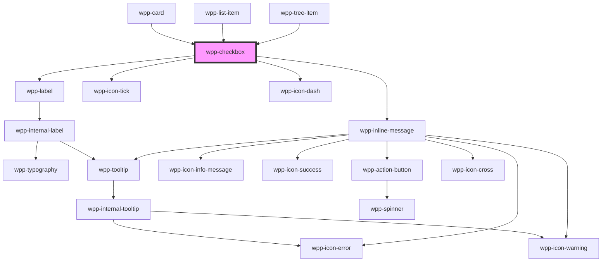

# wpp-checkbox

Checkboxes allow the user to select one or more items from a set.

Indeterminate state can be used to indicate a partial selection of nested checkboxes.

## Interfaces

### CheckboxChangeEventDetail

```typescript
interface CheckboxChangeEventDetail {
  checked: boolean
}
```

<!-- Auto Generated Below -->


## Usage

### Angular

```html
<wpp-checkbox></wpp-checkbox>

<wpp-checkbox
  [disabled]='disabled'
  [checked]='checked'
  [indeterminate]='indeterminate'
  [labelConfig]='labelConfig'
  name='options'
  (wppChange)="handleChange($event)"
></wpp-checkbox>

<wpp-checkbox [labelConfig]='labelConfig' [(ngModel)]='checked'></wpp-checkbox>

<form [formGroup]="form" (ngSubmit)="submit()">
  <wpp-checkbox formControlName="options" [labelConfig]='labelConfig' name='options'></wpp-checkbox>
</form>
```


### React

```tsx
import { WppCheckbox } from '@platform-ui-kit/components-library-react'

export const CheckboxExample = () => (
  <>
    <WppCheckbox />

    <WppCheckbox
      disabled={isDisabled}
      checked={isChecked}
      indeterminate={isIndeterminate}
      labelConfig={{ text: 'Option' }}
      name="options"
      onWppChange={({ detail: { checked } }) => setChecked(checked)}
    />

    <form onSubmit={handleSubmit}>
      <WppCheckbox
        checked={isChecked}
        labelConfig={{ text: 'Option' }}
        name="options"
        onWppChange={({ detail: { checked } }) => setChecked(checked)}
      />
    </form>
  </>
)
```


### Vue

```vue

<script setup lang="ts">
import { ref } from "vue";

import { WppCheckbox } from '@platform-ui-kit/components-library-vue'

const isChecked = ref(false)

const handleSubmit = (ev) => console.log("submit ev: ", ev);
</script>

<template>
  <WppCheckbox />

  <WppCheckbox
    :checked="isChecked"
    disabled="false"
    indeterminate="false"
    :labelConfig="{ text: 'Option' }"
    name="options"
    @wppChange="({ detail: { checked } }) => isChecked.value = checked"
  />

  <form @submit="handleSubmit">
    <WppCheckbox
      :checked="isChecked"
      :labelConfig="{ text: 'Option' }"
      name="options"
      @wppChange="({ detail: { checked } }) => isChecked.value = checked"
    />
  </form>
</template>

```


## Properties

| Property             | Attribute            | Description                                                                                                                                                                                         | Type                                | Default                                           |
| -------------------- | -------------------- | --------------------------------------------------------------------------------------------------------------------------------------------------------------------------------------------------- | ----------------------------------- | ------------------------------------------------- |
| `ariaProps`          | --                   | Contains the checkbox `aria-` props.                                                                                                                                                                | `AriaProps`                         | `{}`                                              |
| `autoFocus`          | `auto-focus`         | If `true`, the checkbox should be focused on page load                                                                                                                                              | `boolean`                           | `false`                                           |
| `checked`            | `checked`            | If the checkbox is selected.                                                                                                                                                                        | `boolean`                           | `false`                                           |
| `controlled`         | `controlled`         | If the checkbox is work as controlled component.                                                                                                                                                    | `boolean`                           | `false`                                           |
| `disabled`           | `disabled`           | If the checkbox is disabled.                                                                                                                                                                        | `boolean`                           | `false`                                           |
| `indeterminate`      | `indeterminate`      | If the checkbox is indeterminate.                                                                                                                                                                   | `boolean`                           | `false`                                           |
| `labelConfig`        | --                   | Indicates label config                                                                                                                                                                              | `LabelConfig \| undefined`          | `undefined`                                       |
| `labelTooltipConfig` | --                   | Tooltip config for label, under the hood tooltip using tippy.js, all information about this library and available props you can see via this link `https://atomiks.github.io/tippyjs/v6/all-props/` | `DropdownConfig`                    | `{     popperOptions: { strategy: 'fixed' },   }` |
| `maxMessageLength`   | `max-message-length` | Indicates input message maximum length                                                                                                                                                              | `number \| undefined`               | `undefined`                                       |
| `message`            | `message`            | Indicates input message                                                                                                                                                                             | `string \| undefined`               | `undefined`                                       |
| `messageType`        | `message-type`       | Indicates input message type                                                                                                                                                                        | `"error" \| "warning" \| undefined` | `undefined`                                       |
| `name`               | `name`               | Defines the checkbox name.                                                                                                                                                                          | `string \| undefined`               | `undefined`                                       |
| `required`           | `required`           | If the checkbox is required.                                                                                                                                                                        | `boolean`                           | `false`                                           |
| `value`              | `value`              | Defines the checkbox value.                                                                                                                                                                         | `number \| string`                  | `undefined`                                       |


## Events

| Event       | Description                              | Type                                                                                          |
| ----------- | ---------------------------------------- | --------------------------------------------------------------------------------------------- |
| `wppBlur`   | Emitted when the checkbox loses focus.   | `CustomEvent<FocusEvent>`                                                                     |
| `wppChange` | Emitted when the selected state changes. | `CustomEvent<BooleanFormControlEventDetail<CheckboxValue> & { name?: string \| undefined; }>` |
| `wppFocus`  | Emitted when the checkbox is in focus.   | `CustomEvent<FocusEvent>`                                                                     |


## Methods

### `setFocus() => Promise<void>`

Method that sets focus on the native input.

#### Returns

Type: `Promise<void>`


## Shadow Parts

| Part          | Description          |
| ------------- | -------------------- |
| `"body"`      | Main content wrapper |
| `"icon-dash"` | icon dash element    |
| `"icon-tick"` | icon tick element    |
| `"input"`     | Input element        |
| `"message"`   | message element      |
| `"square"`    | square element       |


## CSS Custom Properties

| Name                                                 | Description |
| ---------------------------------------------------- | ----------- |
| `--wpp-checkbox-bg-color`                            |             |
| `--wpp-checkbox-bg-color-active`                     |             |
| `--wpp-checkbox-bg-color-checked`                    |             |
| `--wpp-checkbox-bg-color-checked-active`             |             |
| `--wpp-checkbox-bg-color-checked-disabled`           |             |
| `--wpp-checkbox-bg-color-checked-hover`              |             |
| `--wpp-checkbox-bg-color-disabled`                   |             |
| `--wpp-checkbox-bg-color-hover`                      |             |
| `--wpp-checkbox-bg-color-indeterminate`              |             |
| `--wpp-checkbox-bg-color-indeterminate-active`       |             |
| `--wpp-checkbox-bg-color-indeterminate-disabled`     |             |
| `--wpp-checkbox-bg-color-indeterminate-hover`        |             |
| `--wpp-checkbox-border-color`                        |             |
| `--wpp-checkbox-border-color-active`                 |             |
| `--wpp-checkbox-border-color-checked`                |             |
| `--wpp-checkbox-border-color-checked-active`         |             |
| `--wpp-checkbox-border-color-checked-disabled`       |             |
| `--wpp-checkbox-border-color-checked-hover`          |             |
| `--wpp-checkbox-border-color-disabled`               |             |
| `--wpp-checkbox-border-color-hover`                  |             |
| `--wpp-checkbox-border-color-indeterminate`          |             |
| `--wpp-checkbox-border-color-indeterminate-active`   |             |
| `--wpp-checkbox-border-color-indeterminate-disabled` |             |
| `--wpp-checkbox-border-color-indeterminate-hover`    |             |
| `--wpp-checkbox-border-radius`                       |             |
| `--wpp-checkbox-border-style`                        |             |
| `--wpp-checkbox-border-width`                        |             |
| `--wpp-checkbox-first-border-color-focus`            |             |
| `--wpp-checkbox-icon-color-indeterminate`            |             |
| `--wpp-checkbox-icon-color-indeterminate-active`     |             |
| `--wpp-checkbox-icon-color-indeterminate-disabled`   |             |
| `--wpp-checkbox-icon-color-indeterminate-hover`      |             |
| `--wpp-checkbox-icons-color`                         |             |
| `--wpp-checkbox-inline-message-margin`               |             |
| `--wpp-checkbox-label-margin`                        |             |
| `--wpp-checkbox-label-text-color-checked-disabled`   |             |
| `--wpp-checkbox-label-text-color-disabled`           |             |
| `--wpp-checkbox-second-border-color-focus`           |             |
| `--wpp-checkbox-size`                                |             |


## Dependencies

### Used by

 - [wpp-card](../wpp-card-group/components/wpp-card)
 - [wpp-list-item](../wpp-list-item)
 - [wpp-tree-item](../wpp-tree/components/wpp-tree-item)

### Depends on

- [wpp-label](../wpp-label)
- [wpp-icon-tick](../wpp-icon/components/system/controls/wpp-icon-tick)
- [wpp-icon-dash](../wpp-icon/components/system/controls/wpp-icon-dash)
- [wpp-inline-message](../wpp-inline-message)

### Graph


----------------------------------------------

*Built with [StencilJS](https://stenciljs.com/)*
