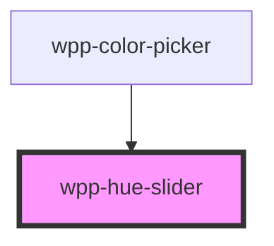

# hue-slider

<!-- Auto Generated Below -->

## Properties

| Property | Attribute | Description | Type     | Default     |
| -------- | --------- | ----------- | -------- | ----------- |
| `hue`    | `hue`     |             | `number` | `undefined` |

## Events

| Event        | Description | Type                  |
| ------------ | ----------- | --------------------- |
| `hueChanged` |             | `CustomEvent<number>` |

## Dependencies

### Used by

 - [wpp-color-picker](../..)

### Graph

----------------------------------------------

*Built with [StencilJS](https://stenciljs.com/)*
