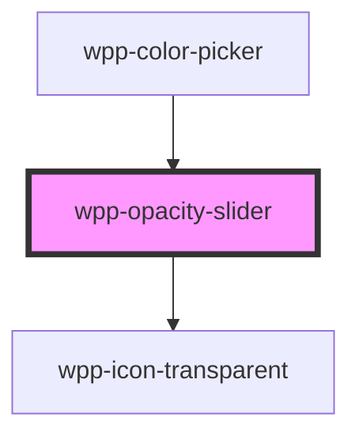

# wpp-opacity-slider

<!-- Auto Generated Below -->

## Properties

| Property   | Attribute   | Description                                         | Type     | Default     |
| ---------- | ----------- | --------------------------------------------------- | -------- | ----------- |
| `hexColor` | `hex-color` | Hex color of the slider.                            | `string` | `undefined` |
| `opacity`  | `opacity`   | Opacity value of the slider. Values between: [0, 1] | `number` | `1`         |

## Events

| Event            | Description                                  | Type                  |
| ---------------- | -------------------------------------------- | --------------------- |
| `opacityChanged` | Event emitted when the opacity value changes | `CustomEvent<number>` |

## Dependencies

### Used by

 - [wpp-color-picker](../..)

### Depends on

- [wpp-icon-transparent](../../../wpp-icon/components/system/controls/wpp-icon-transparent)

### Graph

----------------------------------------------

*Built with [StencilJS](https://stenciljs.com/)*
