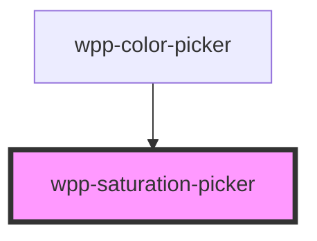

# saturation-picker

<!-- Auto Generated Below -->

## Properties

| Property     | Attribute    | Description                      | Type     | Default     |
| ------------ | ------------ | -------------------------------- | -------- | ----------- |
| `hue`        | `hue`        | Hue value to get the color.      | `number` | `0`         |
| `saturation` | `saturation` | Saturation value.                | `number` | `undefined` |
| `value`      | `value`      | Corresponds to brightness in HSV | `number` | `undefined` |

## Events

| Event               | Description                                                                             | Type                                  |
| ------------------- | --------------------------------------------------------------------------------------- | ------------------------------------- |
| `saturationChanged` | Event emitted when the saturation changes, containing the saturation and the brightness | `CustomEvent<SaturationChangeDetail>` |

## Dependencies

### Used by

 - [wpp-color-picker](../..)

### Graph

----------------------------------------------

*Built with [StencilJS](https://stenciljs.com/)*
