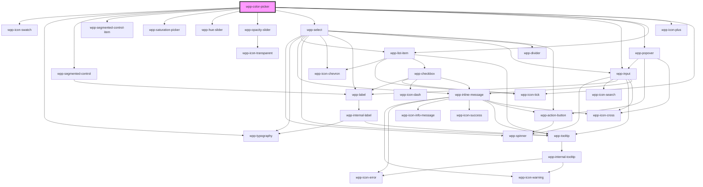

# wpp-color-picker


<!-- Auto Generated Below -->


## Usage

### Angular

```ts
import { ChangeDetectionStrategy, Component } from '@angular/core'
import { ChangeColorEventDetails, Theme } from '@platform-ui-kit/components-library'

@Component({
  selector: 'app-color-picker-example',
  templateUrl: './color-picker-example.page.html',
  styleUrls: ['./color-picker-example.page.scss'],
  changeDetection: ChangeDetectionStrategy.OnPush,
})
export class ColorPickerExamplePage {
  public color: string | undefined
  public savedColors: string[] = ['#7AB6FF', '#45E4B6', '#ECC707', '#FF9E66', '#FF7A91']

  handleSaveColor(event: Event): void {
    const color: string = (event as CustomEvent<string>).detail
    console.log('Saving color:', color)

    this.savedColors = [...this.savedColors, color]
  }

  handleRemoveSavedColor = (event: Event) => {
    const color: string = (event as CustomEvent<string>).detail
    console.log('Removing color:', color)
    const newSavedColors = this.savedColors.filter(item => item !== color)

    this.savedColors = newSavedColors
  }

  handleChangeColor(event: Event): void {
    const emittedColor: ChangeColorEventDetails = (event as CustomEvent<ChangeColorEventDetails>).detail
    console.log('Changing color:', emittedColor)

    if (emittedColor === this.color) {
      return
    }

    if (typeof emittedColor === 'string') {
      this.color = emittedColor
    } else {
      this.color = emittedColor.hexValue
    }
  }
}
```

```html
<div>
  <wpp-typography type="2xl-heading">Hex</wpp-typography>
  <wpp-color-picker
    (wppChange)="handleChangeColor($event)"
    (wppSaveColor)="handleSaveColor($event)"
    (wppRemoveSavedColor)="handleRemoveSavedColor($event)"
    [savedColors]="savedColors"
    mode="theme and custom"
    type="hex"
  >
  </wpp-color-picker>
</div>
```


### React

```tsx
import React, { useState } from 'react'
import { WppColorPicker, WppTypography } from '@platform-ui-kit/components-library-react'
import { ChangeColorEventDetails, Theme } from '@platform-ui-kit/components-library/components'

const SAVED_COLORS = ['#7AB6FF', '#45E4B6', '#ECC707', '#FF9E66', '#FF7A91']

const ColorPicker = () => {
  const [color, setColor] = useState<ChangeColorEventDetails>()
  const [savedColors, setSavedColors] = useState<string[]>(SAVED_COLORS)

  const handleSaveColor = (event: CustomEvent<string>) => {
    console.log('Saving color:', event.detail)
    const color: string = event.detail

    setSavedColors([...savedColors, color])
  }

  const handleRemoveSavedColor = (event: CustomEvent<string>) => {
    console.log('Removing color:', event.detail)
    const color: string = event.detail
    const newSavedColors = savedColors.filter(item => item !== color)

    setSavedColors(newSavedColors)
  }

  const handleChangeColor = (event: CustomEvent<ChangeColorEventDetails>) => {
    console.log('Changing color:', event.detail)
    const emittedColor: ChangeColorEventDetails = event.detail

    if (emittedColor === color) return

    if (typeof emittedColor === 'string') {
      setColor(emittedColor)
    } else {
      setColor(emittedColor.hexValue)
    }
  }

  return (
    <div>
      <WppTypography type="2xl-heading">Hex Color Picker</WppTypography>
      <WppColorPicker
        onWppChange={handleChangeColor}
        onWppSaveColor={handleSaveColor}
        onWppRemoveSavedColor={handleRemoveSavedColor}
        savedColors={savedColors}
        mode="theme and custom"
        type="hex"
      />
    </div>
  )
}
```


### Vue

```vue
<script setup lang="ts">
import { ref } from 'vue'
import { WppColorPicker, WppTypography } from '@platform-ui-kit/components-library-vue'

const SAVED_COLORS = ['#7AB6FF', '#45E4B6', '#ECC707', '#FF9E66', '#FF7A91']
const color = ref<string | undefined>(undefined)
const savedColors = ref<string[]>(SAVED_COLORS)

const handleSaveColor = (event: CustomEvent<string>) => {
  console.log('Saving color:', event.detail)
  const newColor = event.detail
  savedColors.value = [...savedColors.value, newColor]
}

const handleRemoveSavedColor = (event: CustomEvent<string>) => {
  console.log('Removing color:', event.detail)
  const color: string = event.detail
  const newSavedColors = savedColors.value.filter(item => item !== color)

  savedColors.value = newSavedColors
}

const handleChangeColor = (event: CustomEvent) => {
  const emittedColor = event.detail
  console.log('Changing color:', emittedColor)

  if (emittedColor === color.value) return

  if (typeof emittedColor === 'string') {
    color.value = emittedColor
  } else {
    color.value = emittedColor.hexValue
  }
}
</script>

<template>
  <div>
    <WppTypography type="2xl-heading"> Hex </WppTypography>
    <WppColorPicker
      @wppChange="handleChangeColor"
      @wppSaveColor="handleSaveColor"
      @wppRemoveSavedColor="handleRemoveSavedColor"
      :savedColors="savedColors"
      mode="theme and custom"
      type="hex"
    />
  </div>
</template>
```


## Properties

| Property         | Attribute       | Description                                                                                                                                                                                                                                                                                                                                                                                                | Type                                        | Default     |
| ---------------- | --------------- | ---------------------------------------------------------------------------------------------------------------------------------------------------------------------------------------------------------------------------------------------------------------------------------------------------------------------------------------------------------------------------------------------------------- | ------------------------------------------- | ----------- |
| `disabled`       | `disabled`      | If the color-picker is disabled.                                                                                                                                                                                                                                                                                                                                                                           | `boolean`                                   | `false`     |
| `dropdownConfig` | --              | Defines the dropdown configuration. Under the hood dropdown using tippy.js, all information about this library and available props you can see via this link `https://atomiks.github.io/tippyjs/v6/all-props/`                                                                                                                                                                                             | `DropdownConfig`                            | `{}`        |
| `hexOpacity`     | `hex-opacity`   | The opacity value for colors that are in 'hex' format. This property will not work for color values that are in 'rgba' format, as the opacity is already present in that format.                                                                                                                                                                                                                           | `string`                                    | `'100%'`    |
| `initialColor`   | `initial-color` | Used to display the initial color of the color-picker component. The color format must respect the type of the component!                                                                                                                                                                                                                                                                                  | `string \| undefined`                       | `undefined` |
| `mode`           | `mode`          | The mode of the color-picker. The default value is "theme", meaning that the color-picker will display all the colors from the app's theme. When mode is "custom", the user will have the Saturation picker, Hue slider and Opacity slider and can pick any color. Finally, if mode = "theme and custom", both "theme" and "custom" modes are enabled.                                                     | `"custom" \| "theme and custom" \| "theme"` | `'theme'`   |
| `savedColors`    | --              | This property represents a list of the saved colors which are going to be displayed under the custom color-picker in the dropdown. This only works for the following modes: "custom" and "theme and custom". The color values must be valid "hex" or "rgba" values.                                                                                                                                        | `string[]`                                  | `[]`        |
| `themeColors`    | --              | This property represents an object that contains the theme of the application. By default, the color-picker tries to take the default theme data from its environment. However, if the theme contains additional configuration from the default one, like custom color palettes, you need to pass it as a property here. Note: For OS-based application, this data is available in the "osContext" object. | `Theme \| undefined`                        | `undefined` |
| `type`           | `type`          | The type of the color-picker. The default value is 'hex', meaning that the colors will be represented in 'hex' format (E.g: "#0014CC"). The other option is 'rgba' (E.g: "rgba(0, 20, 204, 1)").                                                                                                                                                                                                           | `"hex" \| "rgba"`                           | `'hex'`     |


## Events

| Event                 | Description                                                                                                                                            | Type                                         |
| --------------------- | ------------------------------------------------------------------------------------------------------------------------------------------------------ | -------------------------------------------- |
| `wppBlur`             | Emitted when the color-picker loses focus.                                                                                                             | `CustomEvent<FocusEvent>`                    |
| `wppChange`           | Emitted when the color-picker selects a color to display. This happens when the dropdown of the color-picker is closed.                                | `CustomEvent<HexValueWithOpacity \| string>` |
| `wppFocus`            | Emitted when the color-picker is in focus.                                                                                                             | `CustomEvent<FocusEvent>`                    |
| `wppRemoveSavedColor` | Emitted when the "Remove color" options is clicked in the color's popover. The popover is opened when the color element from "Saved colors" is clicked | `CustomEvent<string>`                        |
| `wppSaveColor`        | Emitted when the "plus" icon is clicked in the "Saved colors" section. The value emitted is in rgba format.                                            | `CustomEvent<string>`                        |


## Dependencies

### Depends on

- wpp-icon-swatch
- [wpp-typography](../wpp-typography)
- [wpp-segmented-control](../wpp-segmented-control)
- [wpp-segmented-control-item](../wpp-segmented-control/components/wpp-segmented-control-item)
- wpp-saturation-picker
- wpp-hue-slider
- wpp-opacity-slider
- [wpp-select](../wpp-select)
- [wpp-input](../wpp-input)
- [wpp-popover](../wpp-popover)
- [wpp-list-item](../wpp-list-item)
- [wpp-icon-plus](../wpp-icon/components/add-and-remove/wpp-icon-plus)
- [wpp-icon-tick](../wpp-icon/components/system/controls/wpp-icon-tick)

### Graph


----------------------------------------------

*Built with [StencilJS](https://stenciljs.com/)*
