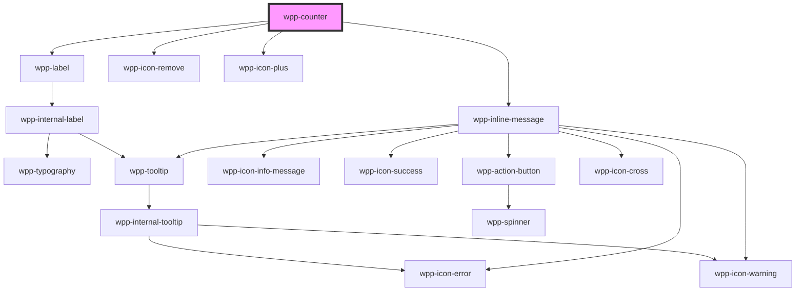

# wpp-counter

Create an input control that allows incrementing and decrementing values.

<!-- Auto Generated Below -->


## Usage

### Angular

```ts
@Component({
  ...
})
export class CounterExample {
  public value: number = 5;

  public handleCounterChange(event: Event): void {
    this.value = (event as CustomEvent<CounterChangeEventDetail>).detail.value
  }
}
```

```html
<wpp-counter [value]="value" (wppChange)="handleCounterChange($event)"></wpp-counter>
```


### React

```tsx
import React, { useState } from 'react'

import { WppCounter, WppTypography } from '@platform-ui-kit/components-library-react'
import { CounterChangeEventDetail } from '@platform-ui-kit/components-library'

export const CounterExample = () => {
  const [value, setValue] = useState(5)

  const handleCounterChange = (event: CustomEvent<CounterChangeEventDetail>) => {
    setValue(event.detail.value)
  }

  return (
    <>
      <WppCounter
        value={value}
        onWppChange={handleCounterChange}
        format={{
          searchValue: /(.)(?=(\d{3})+$)/g,
          replaceValue: '$1 ',
        }}
      />
      <WppTypography type="m-strong">Our current value is: {value}</WppTypography>
    </>
  )
}
```


### Vue

```vue
<script setup lang="ts">
import { ref } from "vue";

import {
  WppCounter,
  WppTypography,
} from "@platform-ui-kit/components-library-vue";

const initiallyValue = 1;

const value = ref(initiallyValue);
const formattedNumber = ref(String(initiallyValue));

const handleCounterChange = (event: CustomEvent) => {
  const number = event.detail.value;
  const formattedCounterNumber = String(number).replace(
    /(.)(?=(\d{3})+$)/g,
    "$1 "
  );

  value.value = number;
  formattedNumber.value = formattedCounterNumber;
};
</script>

<template>
  <h3>Counter</h3>
  <WppCounter
    min="10"
    :value="value"
    @wppChange="handleCounterChange"
    class="counter"
    max="1000000"
    data-testid="hover-counter"
    :format="{
      searchValue: /(.)(?=(\d{3})+$)/g,
      replaceValue: '$1 ',
    }"
  />
  <WppTypography tag="span" type="m-strong" class="message">
    Our current value is: {{ formattedNumber }}
  </WppTypography>
</template>
```


## Properties

| Property             | Attribute            | Description                                                                                                                                                                                                    | Type                                | Default                                           |
| -------------------- | -------------------- | -------------------------------------------------------------------------------------------------------------------------------------------------------------------------------------------------------------- | ----------------------------------- | ------------------------------------------------- |
| `ariaProps`          | --                   | Contains the counter `aria-` props.                                                                                                                                                                            | `AriaProps`                         | `{}`                                              |
| `autoFocus`          | `auto-focus`         | If `true`, the counter should be focused on page load                                                                                                                                                          | `boolean`                           | `false`                                           |
| `disabled`           | `disabled`           | If the counter is disabled.                                                                                                                                                                                    | `boolean`                           | `false`                                           |
| `format`             | --                   | Defines the counter format number.                                                                                                                                                                             | `CounterFormat`                     | `undefined`                                       |
| `labelConfig`        | --                   | Indicates label config                                                                                                                                                                                         | `LabelConfig \| undefined`          | `undefined`                                       |
| `labelTooltipConfig` | --                   | Defines the dropdown configuration. Under the hood dropdown using tippy.js, all information about this library and available props you can see via this link `https://atomiks.github.io/tippyjs/v6/all-props/` | `DropdownConfig`                    | `{     popperOptions: { strategy: 'fixed' },   }` |
| `max`                | `max`                | Defines the counter `max` value.                                                                                                                                                                               | `number`                            | `100`                                             |
| `maxMessageLength`   | `max-message-length` | Defines the counter message maximum length.                                                                                                                                                                    | `number \| undefined`               | `undefined`                                       |
| `message`            | `message`            | Defines the counter message.                                                                                                                                                                                   | `string \| undefined`               | `undefined`                                       |
| `messageType`        | `message-type`       | Defines the counter message type.                                                                                                                                                                              | `"error" \| "warning" \| undefined` | `undefined`                                       |
| `min`                | `min`                | Defines the counter `min` value.                                                                                                                                                                               | `number`                            | `1`                                               |
| `name`               | `name`               | Defines the counter name.                                                                                                                                                                                      | `string \| undefined`               | `undefined`                                       |
| `required`           | `required`           | If the counter is required.                                                                                                                                                                                    | `boolean`                           | `false`                                           |
| `size`               | `size`               | Defines the counter size.                                                                                                                                                                                      | `"m" \| "s"`                        | `'m'`                                             |
| `step`               | `step`               | Indicates the step of the counter.                                                                                                                                                                             | `number`                            | `1`                                               |
| `tooltipConfig`      | --                   | Defines the dropdown configuration. Under the hood dropdown using tippy.js, all information about this library and available props you can see via this link `https://atomiks.github.io/tippyjs/v6/all-props/` | `DropdownConfig`                    | `{}`                                              |
| `value`              | `value`              | Defines the counter value.                                                                                                                                                                                     | `number`                            | `1`                                               |
| `withButtons`        | `with-buttons`       | If `true`, the counter will show increment/decrement(+/-) buttons                                                                                                                                              | `boolean`                           | `true`                                            |


## Events

| Event       | Description                           | Type                                    |
| ----------- | ------------------------------------- | --------------------------------------- |
| `wppBlur`   | Emitted when the counter loses focus. | `CustomEvent<FocusEvent>`               |
| `wppChange` | Emitted when the input value changes. | `CustomEvent<CounterChangeEventDetail>` |
| `wppFocus`  | Emitted when the counter is in focus. | `CustomEvent<FocusEvent>`               |


## Methods

### `setFocus() => Promise<void>`

Method that sets focus on the native input.

#### Returns

Type: `Promise<void>`


## Shadow Parts

| Part                | Description             |
| ------------------- | ----------------------- |
| `"body"`            | Main content wrapper    |
| `"decrease-button"` | decrease button element |
| `"decrease-icon"`   | decrease icon element   |
| `"increase-button"` | increase button element |
| `"increase-icon"`   | increase icon element   |
| `"input"`           | Counter input element   |
| `"label"`           | Label text element      |
| `"message"`         | message element         |


## CSS Custom Properties

| Name                                      | Description |
| ----------------------------------------- | ----------- |
| `--wpp-counter-bg-color`                  |             |
| `--wpp-counter-bg-color-active`           |             |
| `--wpp-counter-bg-color-disabled`         |             |
| `--wpp-counter-bg-color-hover`            |             |
| `--wpp-counter-border-color-active`       |             |
| `--wpp-counter-border-color-disabled`     |             |
| `--wpp-counter-border-color-hover`        |             |
| `--wpp-counter-border-radius`             |             |
| `--wpp-counter-border-style`              |             |
| `--wpp-counter-decrease-wrapper-padding`  |             |
| `--wpp-counter-first-border-color-focus`  |             |
| `--wpp-counter-height-size-m`             |             |
| `--wpp-counter-height-size-s`             |             |
| `--wpp-counter-icons-color`               |             |
| `--wpp-counter-icons-color-active`        |             |
| `--wpp-counter-icons-color-disabled`      |             |
| `--wpp-counter-icons-color-hover`         |             |
| `--wpp-counter-increase-wrapper-padding`  |             |
| `--wpp-counter-input-padding`             |             |
| `--wpp-counter-input-text-color`          |             |
| `--wpp-counter-input-text-color-disabled` |             |
| `--wpp-counter-input-width`               |             |
| `--wpp-counter-label-margin`              |             |
| `--wpp-counter-second-border-color-focus` |             |


## Dependencies

### Depends on

- [wpp-label](../wpp-label)
- [wpp-icon-remove](../wpp-icon/components/actions/content actions/wpp-icon-remove)
- [wpp-icon-plus](../wpp-icon/components/add-and-remove/wpp-icon-plus)
- [wpp-inline-message](../wpp-inline-message)

### Graph


----------------------------------------------

*Built with [StencilJS](https://stenciljs.com/)*
