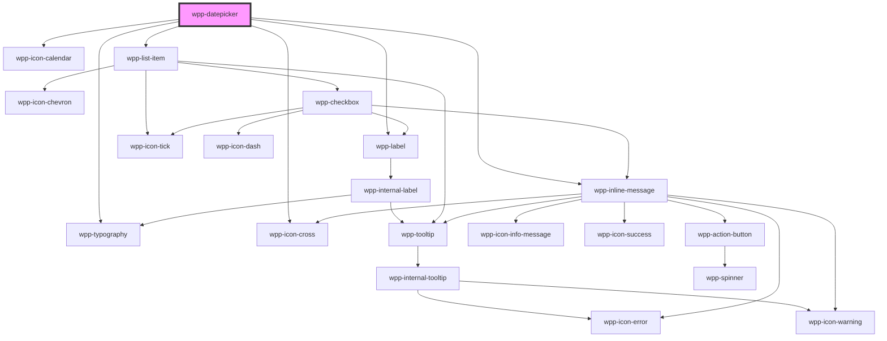

# wpp-datepicker
This datepicker using `air-datepicker` library under the hood, you can see all features on https://air-datepicker.com/

## Date formats

* Our default date formats are: "MM/dd/yyyy", "dd/MM/yyyy", and other variations using only "MM", "dd", "yyyy" with "/" or "." separators.

* When using the range datepicker, only default date formats can be applied.

* When using the single datepicker with a different format than the default one, the input becomes read-only.

* To handle a date format with a 2-digit year (e.g., "dd/MM/yy"), the following rule applies: years from "00" to "49" are interpreted as 2000-2049, and years from "50" to "99" are interpreted as 1950-1999.

## Locale Management:
### Overview
The locale property allows you to customize various datepicker settings, including the starting day of the week and date-related formatting. This is managed using two attributes:

* dateLocale: Automatically determines the starting day of the week and other settings based on the provided locale string.
* firstDay: Acts as a fallback if dateLocale is not provided or does not match any predefined mappings.

#### Priority Rules
* dateLocale Takes Precedence: If dateLocale is provided, the starting day of the week (firstDay) is automatically inferred from the internal mapping (localeToFirstDayMap).
* firstDay as Fallback: If dateLocale is not provided or does not match a predefined mapping, the firstDay value will be used.

### Locale to First Day Mappings

| dateLocale | First Day of Week | Description                |
|----------|-------------------|------------------------------|
| en-US    | 0                 | Sunday (United States)       |
| en-GB    | 1                 | Monday (United Kingdom)      |
| fr-FR    | 1                 | Monday (France)              |
| ar-SA    | 6                 | Saturday (Saudi Arabia)      |
| de-DE    | 1                 | Monday (Germany)             |
| es-ES    | 1                 | Monday (Spain)               |
| it-IT    | 1                 | Monday (Italy)               |
| ja-JP    | 0                 | Sunday (Japan)               |
| ko-KR    | 0                 | Sunday (South Korea)         |
| nl-NL    | 1                 | Monday (Netherlands)         |
| pt-BR    | 0                 | Sunday (Brazil)              |
| ru-RU    | 1                 | Monday (Russia)              |
| tr-TR    | 1                 | Monday (Turkey)              |
| zh-CN    | 1                 | Monday (China)               |
| hi-IN    | 0                 | Sunday (India)               |
| th-TH    | 0                 | Sunday (Thailand)            |
| sv-SE    | 1                 | Monday (Sweden)              |
| da-DK    | 1                 | Monday (Denmark)             |
| fi-FI    | 1                 | Monday (Finland)             |
| nb-NO    | 1                 | Monday (Norway)              |
| pl-PL    | 1                 | Monday (Poland)              |
| cs-CZ    | 1                 | Monday (Czech Republic)      |
| sk-SK    | 1                 | Monday (Slovakia)            |
| hu-HU    | 1                 | Monday (Hungary)             |
| el-GR    | 1                 | Monday (Greece)              |
| he-IL    | 0                 | Sunday (Israel)              |
| ar-EG    | 6                 | Saturday (Egypt)             |

#### Notes:
- If the provided `dateLocale` does not match any entry in this mapping, the `firstDay` property will act as a fallback.
- Users can override the default `firstDay` by explicitly setting it in the `locale` property.

#### Example:
```jsx
<WppDatepicker
  locale={{
    dateLocale: 'hi-IN',
    dateFormat: 'dd/MM/yyyy',
  }}
  value="15/10/2023"
/>
```

<!-- Auto Generated Below -->


## Usage

### Angular

#### datepicker-example.page.html
```html
<div class="container" data-testid="datepickers">
  <div class="datepicker">
    <wpp-typography type="xl-heading" class="text">Default Single select</wpp-typography>
    <wpp-datepicker (wppBlur)="handleBlur($event)" (wppFocus)="handleFocus($event)"></wpp-datepicker>

    <wpp-typography type="xl-heading" class="text">Single select with S size</wpp-typography>
    <wpp-datepicker size="s"></wpp-datepicker>

    <wpp-typography type="xl-heading" class="text">Default Range select</wpp-typography>
    <wpp-datepicker range></wpp-datepicker>

    <wpp-typography type="xl-heading" class="text">Range select with S size</wpp-typography>
    <wpp-datepicker size="s" range></wpp-datepicker>

    <wpp-typography type="xl-heading" class="text">With Placeholder</wpp-typography>
    <wpp-datepicker placeholder="Enter the date"></wpp-datepicker>

    <wpp-typography type="xl-heading" class="text">Single select initial date</wpp-typography>
    <wpp-datepicker value="12/12/2022"></wpp-datepicker>

    <wpp-typography type="xl-heading" class="text">Range select initial date</wpp-typography>
    <wpp-datepicker range [value]='initialValue'></wpp-datepicker>

    <wpp-typography type="xl-heading" class="text">Range select input test</wpp-typography>
    <wpp-datepicker range data-testid="datepicker"></wpp-datepicker>
  </div>
  <div class="datepicker">
    <wpp-typography type="xl-heading" class="text">Spanish locale</wpp-typography>
    <wpp-datepicker static value="08/02/2022" [locale]='locale'></wpp-datepicker>

    <wpp-typography type="xl-heading" class="text">Min and max - [07/04 - 07/20]</wpp-typography>
    <wpp-datepicker min-date="07/04/2022" max-date="07/20/2022" static></wpp-datepicker>

    <wpp-typography type="xl-heading" class="text">max date - 07/04/2022</wpp-typography>
    <wpp-datepicker max-date="07/04/2022" static></wpp-datepicker>

    <wpp-typography type="xl-heading" class="text">Min date - 07/20/2042</wpp-typography>
    <wpp-datepicker min-date="07/20/2042" static></wpp-datepicker>
  </div>
  <div class="datepicker">
    <wpp-typography type="xl-heading" class="text">With error message</wpp-typography>
    <wpp-datepicker message-type="error" message="Error message"></wpp-datepicker>

    <wpp-typography type="xl-heading" class="text">With error message (truncated)</wpp-typography>
    <wpp-datepicker message-type="error" message="Error message" max-message-length="12"></wpp-datepicker>

    <wpp-typography type="xl-heading" class="text">With warning message</wpp-typography>
    <wpp-datepicker message-type="warning" message="Warning message"></wpp-datepicker>

    <wpp-typography type="xl-heading" class="text">With warning message (truncated)</wpp-typography>
    <wpp-datepicker message-type="warning" message="Warning message" max-message-length="12"></wpp-datepicker>

    <wpp-typography type="xl-heading" class="text">W/o messageType</wpp-typography>
    <wpp-datepicker message="Info message"></wpp-datepicker>

    <wpp-typography type="xl-heading" class="text">W/o messageType (truncated)</wpp-typography>
    <wpp-datepicker message="Information message" [maxMessageLength]="12"></wpp-datepicker>

    <wpp-typography type="xl-heading" class="text">Modified Date Format only</wpp-typography>
    <wpp-datepicker
      placeholder="dd/MM/yyyy"
      value="20/08/2021"
      [locale]='modifiedDataFormat'
    ></wpp-datepicker>

    <wpp-typography type="xl-heading" class="text">With info icon</wpp-typography>
    <wpp-datepicker
      value="12/12/2022"
      [labelConfig]='labelConfig'
    ></wpp-datepicker>

    <wpp-typography type="xl-heading" class="text">Disabled</wpp-typography>
    <wpp-datepicker value="12/12/2022" disabled required></wpp-datepicker>
  </div>
</div>
```

#### datepicker-example.page.ts
```tsx
import { ChangeDetectionStrategy, Component } from '@angular/core'

@Component({
  selector: 'app-datepicker-example',
  templateUrl: './datepicker-example.page.html',
  styleUrls: ['./datepicker-example.page.scss'],
  changeDetection: ChangeDetectionStrategy.OnPush,
})
export class DatepickerExamplePage {
  public handleBlur = (event: any) => {
    console.log('event_blur :>> ', event)
  }

  public handleFocus = (event: any) => {
    console.log('event_focus :>> ', event)
  }

  public locale = {
    days: ['Domingo', 'Lunes', 'Martes', 'Miércoles', 'Jueves', 'Viernes', 'Sábado'],
    daysShort: ['Dom', 'Lun', 'Mar', 'Mié', 'Jue', 'Vie', 'Sáb'],
    daysMin: ['Dom', 'Lun', 'Mar', 'Mié', 'Jue', 'Vie', 'Sáb'],
    months: [
      'Enero',
      'Febrero',
      'Marzo',
      'Abril',
      'Mayo',
      'Junio',
      'Julio',
      'Agosto',
      'Septiembre',
      'Octubre',
      'Noviembre',
      'Diciembre',
    ],
    monthsShort: ['Enero', 'Feb', 'Marzo', 'Abr', 'Mayo', 'Jun', 'Jul', 'Agosto', 'Sept', 'Oct', 'Nov', 'Dic'],
    today: 'Hoy',
    clear: 'Limpiar',
    dateFormat: 'dd/MM/yyyy',
    timeFormat: 'hh:mm aa',
    firstDay: 1,
    dateLocale: 'en-US',
  }

  public initialValue = ['07/12/2011', '07/21/2011']

  public labelConfig = {
    icon: 'wpp-icon-info',
    text: 'Datepicker',
    description: 'Description',
    locales: {
      optional: 'Optionale',
    },
  }

  public modifiedDataFormat = {
    dateFormat: 'dd/MM/yyyy',
  }
}
```


### React

```tsx
import React from 'react'

import { WppDatepicker } from '@platform-ui-kit/components-library-react'

export const DatepickerExample = () => {
  return (
  <div>
    <h3 className={styles.text}>Single select</h3>
    <WppDatepicker />
    <h3 className={styles.text}>Range</h3>
    <WppDatepicker range={true} />
    <h3 className={styles.text}>Min and max date</h3>
    <WppDatepicker minDate="07/04/2022" maxDate="07/20/2022" />
    <h3 className={styles.text}>Locale</h3>
    <WppDatepicker locale={{
            days: ['Domingo', 'Lunes', 'Martes', 'Miércoles', 'Jueves', 'Viernes', 'Sábado'],
            daysShort: ['Dom', 'Lun', 'Mar', 'Mié', 'Jue', 'Vie', 'Sáb'],
            daysMin: ['Dom', 'Lun', 'Mar', 'Mié', 'Jue', 'Vie', 'Sáb'],
            months: [
              'Enero',
              'Febrero',
              'Marzo',
              'Abril',
              'Mayo',
              'Junio',
              'Julio',
              'Agosto',
              'Septiembre',
              'Octubre',
              'Noviembre',
              'Diciembre',
            ],
            monthsShort: ['Enero', 'Feb', 'Marzo', 'Abr', 'Mayo', 'Jun', 'Jul', 'Agosto', 'Sept', 'Oct', 'Nov', 'Dic'],
            today: 'Hoy',
            clear: 'Limpiar',
            dateFormat: 'dd/MM/yyyy',
            timeFormat: 'hh:mm aa',
            firstDay: 1,
            dateLocale: 'en-US',
          }}
 />
  </div>
  )
}
```


### Vue

```vue
<script setup lang="ts">
import { ref } from "vue";

import { WppDatepicker } from "@platform-ui-kit/components-library-vue";

const datepickerValue = ref(null);

const handleChange = (ev: CustomEvent) => {
  datepickerValue.value = ev.detail.checked;
};

const handleBlur = (event: CustomEvent<FocusEvent>) => {
  console.log("event_blur :>> ", event);
};

const handleFocus = (event: CustomEvent<FocusEvent>) => {
  console.log("event_focus :>> ", event);
};
</script>

<template>
  <WppDatepicker
    :locale="{
      days: [
        'Domingo',
        'Lunes',
        'Martes',
        'Miércoles',
        'Jueves',
        'Viernes',
        'Sábado',
      ],
      daysShort: ['Dom', 'Lun', 'Mar', 'Mié', 'Jue', 'Vie', 'Sáb'],
      daysMin: ['Dom', 'Lun', 'Mar', 'Mié', 'Jue', 'Vie', 'Sáb'],
      months: [
        'Enero',
        'Febrero',
        'Marzo',
        'Abril',
        'Mayo',
        'Junio',
        'Julio',
        'Agosto',
        'Septiembre',
        'Octubre',
        'Noviembre',
        'Diciembre',
      ],
      monthsShort: [
        'Enero',
        'Feb',
        'Marzo',
        'Abr',
        'Mayo',
        'Jun',
        'Jul',
        'Agosto',
        'Sept',
        'Oct',
        'Nov',
        'Dic',
      ],
      today: 'Hoy',
      clear: 'Limpiar',
      dateFormat: 'dd/MM/yyyy',
      timeFormat: 'hh:mm aa',
      firstDay: 1,
      dateLocale: 'en-US',
    }"
    static
    :value="datepickerValue.value"
    @wppBlur="handleBlur"
    @wppFocus="handleFocus"
    @wppChange="handleChange"
  />
</template>

```


## Properties

| Property              | Attribute                | Description                                                                                                                                                                                                                                              | Type                                | Default                                                                                                                                                                                                                                                                                          |
| --------------------- | ------------------------ | -------------------------------------------------------------------------------------------------------------------------------------------------------------------------------------------------------------------------------------------------------- | ----------------------------------- | ------------------------------------------------------------------------------------------------------------------------------------------------------------------------------------------------------------------------------------------------------------------------------------------------ |
| `appendToListWrapper` | `append-to-list-wrapper` | If `true`, the wpp-datepicker-portal containing the datepicker will be appended to the `#container` By default it is false, meaning that the wpp-datepicker-portal will be appended to the document.body in order to avoid clipping issues by the parent | `boolean \| undefined`              | `false`                                                                                                                                                                                                                                                                                          |
| `autoFocus`           | `auto-focus`             | If `true`, the input should be focused on page load                                                                                                                                                                                                      | `boolean`                           | `false`                                                                                                                                                                                                                                                                                          |
| `disabled`            | `disabled`               | If `true`, the datepicker input is disabled                                                                                                                                                                                                              | `boolean`                           | `false`                                                                                                                                                                                                                                                                                          |
| `dropdownConfig`      | --                       | Defines the dropdown configuration. Under the hood dropdown using tippy.js, all information about this library and available props you can see via this link `https://atomiks.github.io/tippyjs/v6/all-props/`                                           | `DropdownConfig`                    | `{}`                                                                                                                                                                                                                                                                                             |
| `labelConfig`         | --                       | Indicates label config                                                                                                                                                                                                                                   | `LabelConfig \| undefined`          | `undefined`                                                                                                                                                                                                                                                                                      |
| `labelTooltipConfig`  | --                       | Dropdown config for label, under the hood tooltip using tippy.js, all information about this library and available props you can see via this link `https://atomiks.github.io/tippyjs/v6/all-props/`                                                     | `DropdownConfig`                    | `{     popperOptions: { strategy: 'fixed' },   }`                                                                                                                                                                                                                                                |
| `locale`              | --                       | Defines the datepicker locale, uses English by default.                                                                                                                                                                                                  | `LocaleTypes`                       | `{     days: DAYS,     daysShort: DAYS_SHORT,     daysMin: DAYS_MIN,     months: MONTHS,     monthsShort: MONTHS_SHORT,     today: 'Today',     clear: 'Clear',     dateFormat: DATE_FORMAT.DAY_MONTH_YEAR,     timeFormat: 'hh:mm aa',     dateLocale: undefined,     firstDay: undefined,   }` |
| `maxDate`             | `max-date`               | Defines the maximal datepicker date.                                                                                                                                                                                                                     | `string \| undefined`               | `undefined`                                                                                                                                                                                                                                                                                      |
| `maxMessageLength`    | `max-message-length`     | Indicates datepicker input message maximum length                                                                                                                                                                                                        | `number \| undefined`               | `undefined`                                                                                                                                                                                                                                                                                      |
| `message`             | `message`                | Indicates datepicker message                                                                                                                                                                                                                             | `string \| undefined`               | `undefined`                                                                                                                                                                                                                                                                                      |
| `messageType`         | `message-type`           | Indicates datepicker message type                                                                                                                                                                                                                        | `"error" \| "warning" \| undefined` | `undefined`                                                                                                                                                                                                                                                                                      |
| `minDate`             | `min-date`               | Defines the minimal datepicker date.                                                                                                                                                                                                                     | `string \| undefined`               | `undefined`                                                                                                                                                                                                                                                                                      |
| `name`                | `name`                   | Indicates datepicker name                                                                                                                                                                                                                                | `string \| undefined`               | `undefined`                                                                                                                                                                                                                                                                                      |
| `placeholder`         | `placeholder`            | Defines the input placeholder.                                                                                                                                                                                                                           | `string \| undefined`               | `undefined`                                                                                                                                                                                                                                                                                      |
| `presets`             | --                       | An array of preset date ranges that the user can quickly select from the datepicker. This prop is available only for the range-datepicker. The format of the dates within each preset item should match the dateFormat provided to the component.        | `IPreset[]`                         | `[]`                                                                                                                                                                                                                                                                                             |
| `range`               | `range`                  | If the range mode is enabled.                                                                                                                                                                                                                            | `boolean`                           | `false`                                                                                                                                                                                                                                                                                          |
| `required`            | `required`               | If `true`, the datepicker input is required                                                                                                                                                                                                              | `boolean`                           | `false`                                                                                                                                                                                                                                                                                          |
| `size`                | `size`                   | Defines the datepicker size.                                                                                                                                                                                                                             | `"m" \| "s"`                        | `'m'`                                                                                                                                                                                                                                                                                            |
| `static`              | `static`                 | If the datepicker is always visible.                                                                                                                                                                                                                     | `boolean`                           | `false`                                                                                                                                                                                                                                                                                          |
| `toggleSelected`      | `toggle-selected`        | If `true`, any selected date can be unselected by clicking on it again.                                                                                                                                                                                  | `boolean`                           | `true`                                                                                                                                                                                                                                                                                           |
| `tooltipConfig`       | --                       | Defines the tooltip configuration. Under the hood dropdown using tippy.js, all information about this library and available props you can see via this link `https://atomiks.github.io/tippyjs/v6/all-props/`                                            | `DropdownConfig`                    | `{}`                                                                                                                                                                                                                                                                                             |
| `value`               | `value`                  | Defines the input value.                                                                                                                                                                                                                                 | `string \| string[]`                | `undefined`                                                                                                                                                                                                                                                                                      |
| `view`                | `view`                   | Defines datepicker view                                                                                                                                                                                                                                  | `"days" \| "months" \| "years"`     | `'days'`                                                                                                                                                                                                                                                                                         |


## Events

| Event          | Description                           | Type                                      |
| -------------- | ------------------------------------- | ----------------------------------------- |
| `wppBlur`      | Emitted when the input loses focus    | `CustomEvent<FocusEvent>`                 |
| `wppChange`    | Emitted when a date is chosen.        | `CustomEvent<DatePickerEventDetail>`      |
| `wppDateClear` | Emitted when a date is cleared.       | `CustomEvent<DatePickerClearEventDetail>` |
| `wppFocus`     | Emitted when the input receives focus | `CustomEvent<FocusEvent>`                 |


## Methods

### `getInstance() => Promise<AirDatepickerTypes>`

Method that returns a datepicker instance which allows manipulating all props and changing them as necessary. [Read more](https://air-datepicker.com/docs).

#### Returns

Type: `Promise<AirDatepickerTypes>`


### `setFocus() => Promise<void>`

Method that sets focus on the input.

#### Returns

Type: `Promise<void>`


## Shadow Parts

| Part                     | Description                  |
| ------------------------ | ---------------------------- |
| `"datepicker-container"` | datepicker container element |
| `"datepicker-input"`     | datepicker input element     |
| `"icon-calendar"`        | icon calendar element        |
| `"icon-cross"`           | icon cross wrapper           |
| `"label"`                | Label text element           |
| `"message"`              | message element              |


## CSS Custom Properties

| Name                                               | Description |
| -------------------------------------------------- | ----------- |
| `--wpp-datepicker-active-date-color`               |             |
| `--wpp-datepicker-bg-color`                        |             |
| `--wpp-datepicker-border-color`                    |             |
| `--wpp-datepicker-border-radius`                   |             |
| `--wpp-datepicker-border-style`                    |             |
| `--wpp-datepicker-border-width`                    |             |
| `--wpp-datepicker-box-shadow`                      |             |
| `--wpp-datepicker-buttons-height`                  |             |
| `--wpp-datepicker-buttons-margin`                  |             |
| `--wpp-datepicker-calendar-icon-color`             |             |
| `--wpp-datepicker-calendar-icon-color-disabled`    |             |
| `--wpp-datepicker-cancel-button-color-active`      |             |
| `--wpp-datepicker-cancel-button-color-disabled`    |             |
| `--wpp-datepicker-cell-bg-color-active`            |             |
| `--wpp-datepicker-cell-bg-color-hover`             |             |
| `--wpp-datepicker-cell-color-selected`             |             |
| `--wpp-datepicker-close-icon-color`                |             |
| `--wpp-datepicker-close-icon-color-active`         |             |
| `--wpp-datepicker-close-icon-color-hover`          |             |
| `--wpp-datepicker-color-active`                    |             |
| `--wpp-datepicker-color-hover`                     |             |
| `--wpp-datepicker-container-width`                 |             |
| `--wpp-datepicker-current-date-color`              |             |
| `--wpp-datepicker-current-date-color-active`       |             |
| `--wpp-datepicker-day-active-color`                |             |
| `--wpp-datepicker-day-color`                       |             |
| `--wpp-datepicker-day-in-range-border-color`       |             |
| `--wpp-datepicker-header-color`                    |             |
| `--wpp-datepicker-inline-message-margin`           |             |
| `--wpp-datepicker-input-bg-color-disabled`         |             |
| `--wpp-datepicker-input-bg-color-hover`            |             |
| `--wpp-datepicker-input-border-color`              |             |
| `--wpp-datepicker-input-border-color-active`       |             |
| `--wpp-datepicker-input-border-color-disabled`     |             |
| `--wpp-datepicker-input-border-color-hover`        |             |
| `--wpp-datepicker-input-border-radius`             |             |
| `--wpp-datepicker-input-first-border-color-focus`  |             |
| `--wpp-datepicker-input-height-m`                  |             |
| `--wpp-datepicker-input-height-s`                  |             |
| `--wpp-datepicker-input-padding`                   |             |
| `--wpp-datepicker-input-padding-m`                 |             |
| `--wpp-datepicker-input-padding-s`                 |             |
| `--wpp-datepicker-input-second-border-color-focus` |             |
| `--wpp-datepicker-input-text-color-disabled`       |             |
| `--wpp-datepicker-label-margin`                    |             |
| `--wpp-datepicker-month-color`                     |             |
| `--wpp-datepicker-month-year-margin`               |             |
| `--wpp-datepicker-padding`                         |             |
| `--wpp-datepicker-range-bg-color`                  |             |
| `--wpp-datepicker-range-bg-color-active`           |             |
| `--wpp-datepicker-range-bg-color-hover`            |             |
| `--wpp-datepicker-range-border-color`              |             |
| `--wpp-datepicker-title-color`                     |             |
| `--wpp-datepicker-title-margin`                    |             |
| `--wpp-datepicker-width`                           |             |
| `--wpp-datepicker-year-color`                      |             |
| `--wpp-datepicker-year-height`                     |             |
| `--wpp-datepicker-years-range-color`               |             |
| `--wpp-datepicker-z-index`                         |             |


## Dependencies

### Depends on

- [wpp-label](../wpp-label)
- [wpp-icon-calendar](../wpp-icon/components/content/calendar/wpp-icon-calendar)
- [wpp-list-item](../wpp-list-item)
- [wpp-typography](../wpp-typography)
- [wpp-icon-cross](../wpp-icon/components/add-and-remove/wpp-icon-cross)
- [wpp-inline-message](../wpp-inline-message)

### Graph


----------------------------------------------

*Built with [StencilJS](https://stenciljs.com/)*
