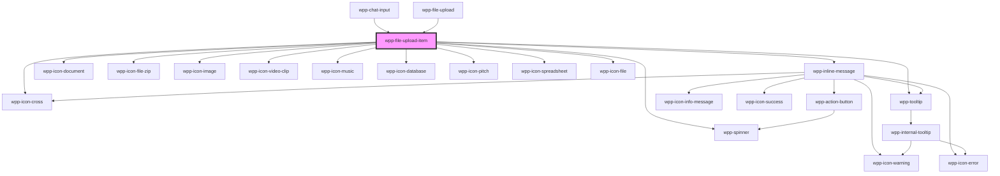

# wpp-file-upload-item

<!-- Auto Generated Below -->

## Properties

| Property         | Attribute          | Description                                                                                                               | Type                                                                                                                                                                                      | Default     |
| ---------------- | ------------------ | ------------------------------------------------------------------------------------------------------------------------- | ----------------------------------------------------------------------------------------------------------------------------------------------------------------------------------------- | ----------- |
| `currentIndex`   | `current-index`    | Represent current index in files list                                                                                     | `number`                                                                                                                                                                                  | `undefined` |
| `file`           | --                 | Current file                                                                                                              | `FileBasedItemType \| FileMetaData & { name: string; url: string; size: number; type: string; lastModified?: number \| undefined; result?: string \| ArrayBuffer \| null \| undefined; }` | `undefined` |
| `format`         | `format`           | Represent what result format datepicker return, it can be base64, arrayBuffer, binaryString, by default it returns base64 | `"arrayBuffer" \| "base64" \| "binaryString"`                                                                                                                                             | `'base64'`  |
| `locales`        | --                 | Indicates locales for file upload component                                                                               | `{ sizeError: string; formatError: string; }`                                                                                                                                             | `undefined` |
| `maxLabelLength` | `max-label-length` | Maximum label length (in characters) of single loading item                                                               | `number`                                                                                                                                                                                  | `30`        |

## Shadow Parts

| Part           | Description               |
| -------------- | ------------------------- |
| `"content"`    | content wrapper element   |
| `"controls"`   |                           |
| `"cross-icon"` | cross icon element        |
| `"file-item"`  | file item wrapper.        |
| `"file-name"`  | file name text element    |
| `"loading"`    | loading text element      |
| `"percentage"` | percentage text element   |
| `"tooltip"`    | tooltip wrapper content   |
| `"wrapper"`    | component wrapper element |

## CSS Custom Properties

| Name                                                          | Description |
| ------------------------------------------------------------- | ----------- |
| `--wpp-file-upload-item-bg-color`                             |             |
| `--wpp-file-upload-item-border-radius`                        |             |
| `--wpp-file-upload-item-close-icon-active-color`              |             |
| `--wpp-file-upload-item-close-icon-color-hover`               |             |
| `--wpp-file-upload-item-close-icon-first-border-color-focus`  |             |
| `--wpp-file-upload-item-close-icon-second-border-color-focus` |             |
| `--wpp-file-upload-item-color`                                |             |
| `--wpp-file-upload-item-error-color`                          |             |
| `--wpp-file-upload-item-height`                               |             |
| `--wpp-file-upload-item-loading-margin`                       |             |
| `--wpp-file-upload-item-margin`                               |             |
| `--wpp-file-upload-item-name-color`                           |             |
| `--wpp-file-upload-item-name-error-margin`                    |             |
| `--wpp-file-upload-item-name-margin`                          |             |
| `--wpp-file-upload-item-padding`                              |             |
| `--wpp-file-upload-item-percentage-margin`                    |             |

## Dependencies

### Used by

 - [wpp-chat-input](../../wpp-chat/components/wpp-chat-input)
 - [wpp-file-upload](..)

### Depends on

- [wpp-spinner](../../wpp-spinner)
- [wpp-inline-message](../../wpp-inline-message)
- [wpp-icon-cross](../../wpp-icon/components/add-and-remove/wpp-icon-cross)
- [wpp-tooltip](../../wpp-tooltip)
- [wpp-icon-document](../../wpp-icon/components/content/files/wpp-icon-document)
- [wpp-icon-file-zip](../../wpp-icon/components/content/files/wpp-icon-file-zip)
- [wpp-icon-image](../../wpp-icon/components/media/media/wpp-icon-image)
- [wpp-icon-video-clip](../../wpp-icon/components/media/media/wpp-icon-video-clip)
- [wpp-icon-music](../../wpp-icon/components/media/media/wpp-icon-music)
- [wpp-icon-database](../../wpp-icon/components/content/charts/wpp-icon-database)
- [wpp-icon-pitch](../../wpp-icon/components/content/content/wpp-icon-pitch)
- [wpp-icon-spreadsheet](../../wpp-icon/components/content/files/wpp-icon-spreadsheet)
- [wpp-icon-file](../../wpp-icon/components/content/files/wpp-icon-file)

### Graph

----------------------------------------------

*Built with [StencilJS](https://stenciljs.com/)*
