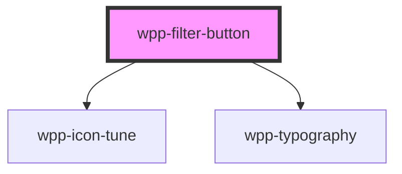

# wpp-filter-button

Create a custom filter button.

<!-- Auto Generated Below -->


## Usage

### Angular

```html
<wpp-filter-button>Filter</wpp-filter-button>
<wpp-filter-button
  [disabled]="true"
  [counter]="3"
>Filter</wpp-filter-button>
```


### React

```tsx
import { WppFilterButton } from '@platform-ui-kit/components-library-react'

export const FilterButtonExample = () => (
  <>
    <WppFilterButton>Filter</WppFilterButton>
    <WppFilterButton disabled>Filter</WppFilterButton>
    <WppFilterButton counter={3}>Filter</WppFilterButton>
  </>
)
```


### Vue

```vue

<script setup lang="ts">
import { WppFilterButton } from '@platform-ui-kit/components-library-vue'
</script>

<template>
  <WppFilterButton>Filter</WppFilterButton>
  <WppFilterButton disabled>Filter</WppFilterButton>
  <WppFilterButton counter="3">Filter</WppFilterButton>
</template>


```


## Properties

| Property    | Attribute    | Description                                               | Type                  | Default     |
| ----------- | ------------ | --------------------------------------------------------- | --------------------- | ----------- |
| `ariaProps` | --           | Contains the button `aria-` props.                        | `AriaProps`           | `{}`        |
| `autoFocus` | `auto-focus` | If the button should be in focus on page load.            | `boolean`             | `false`     |
| `counter`   | `counter`    | Defines the number of elements within a specific section. | `number`              | `0`         |
| `disabled`  | `disabled`   | If the component is disabled.                             | `boolean`             | `false`     |
| `name`      | `name`       | Defines the button name.                                  | `string \| undefined` | `undefined` |


## Methods

### `setFocus() => Promise<void>`

Method that sets focus on the native button.

#### Returns

Type: `Promise<void>`


## Slots

| Slot | Description                                                                   |
| ---- | ----------------------------------------------------------------------------- |
|      | Contains the main text content. The default slot, without the name attribute. |


## Shadow Parts

| Part        | Description          |
| ----------- | -------------------- |
| `"button"`  | Button element       |
| `"counter"` | counter text element |
| `"icon"`    | Icon element         |
| `"inner"`   | Content slot element |
| `"text"`    | Main text content    |


## CSS Custom Properties

| Name                                            | Description |
| ----------------------------------------------- | ----------- |
| `--wpp-filter-button-bg-color`                  |             |
| `--wpp-filter-button-bg-color-active`           |             |
| `--wpp-filter-button-bg-color-disabled`         |             |
| `--wpp-filter-button-bg-color-hover`            |             |
| `--wpp-filter-button-border-color`              |             |
| `--wpp-filter-button-border-color-active`       |             |
| `--wpp-filter-button-border-color-disabled`     |             |
| `--wpp-filter-button-border-color-hover`        |             |
| `--wpp-filter-button-border-radius`             |             |
| `--wpp-filter-button-border-style`              |             |
| `--wpp-filter-button-border-width`              |             |
| `--wpp-filter-button-counter-color`             |             |
| `--wpp-filter-button-counter-color-active`      |             |
| `--wpp-filter-button-counter-color-disabled`    |             |
| `--wpp-filter-button-counter-color-hover`       |             |
| `--wpp-filter-button-counter-margin`            |             |
| `--wpp-filter-button-first-border-color-focus`  |             |
| `--wpp-filter-button-height`                    |             |
| `--wpp-filter-button-icon-color`                |             |
| `--wpp-filter-button-icon-color-active`         |             |
| `--wpp-filter-button-icon-color-disabled`       |             |
| `--wpp-filter-button-icon-color-hover`          |             |
| `--wpp-filter-button-padding`                   |             |
| `--wpp-filter-button-second-border-color-focus` |             |
| `--wpp-filter-button-text-color`                |             |
| `--wpp-filter-button-text-color-active`         |             |
| `--wpp-filter-button-text-color-disabled`       |             |
| `--wpp-filter-button-text-color-hover`          |             |
| `--wpp-filter-button-text-margin`               |             |


## Dependencies

### Depends on

- [wpp-icon-tune](../wpp-icon/components/actions/filter/wpp-icon-tune)
- [wpp-typography](../wpp-typography)

### Graph


----------------------------------------------

*Built with [StencilJS](https://stenciljs.com/)*
