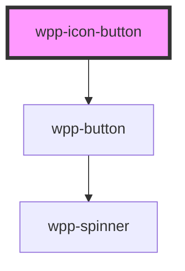

# wpp-icon-button

Create a call to take actions and make choices with a single tap.

<!-- Auto Generated Below -->


## Usage

### Angular

```html
<wpp-icon-button size='m'>
  <wpp-icon-menu-more></wpp-icon-menu-more>
</wpp-icon-button>

<wpp-icon-button
  [disabled]='disabled'
  [loading]='loading'
>
  <wpp-icon-menu-more></wpp-icon-menu-more>
</wpp-icon-button>
```


### React

```tsx
import { WppIconButton, WppIconMenuMore } from '@platform-ui-kit/components-library-react'

export const IconButtonExample = () => (
  <>
    <WppIconButton size="m">
      <WppIconMenuMore />
    </WppIconButton>

    <WppIconButton
      disabled={isDisabled}
      loading={loading}
    >
      <WppIconMenuMore />
    </WppIconButton>
  </>
)
```


### Vue

```vue

<script setup lang="ts">
import { WppIconButton, WppIconMenuMore } from '@platform-ui-kit/components-library-vue'
</script>

<template>
  <WppIconButton size="m">
    <WppIconMenuMore />
  </WppIconButton>

  <WppIconButton
    :disabled="isDisabled"
    :loading="loading"
  >
    <WppIconMenuMore />
  </WppIconButton>
</template>


```


## Properties

| Property   | Attribute  | Description                                                                            | Type                  | Default     |
| ---------- | ---------- | -------------------------------------------------------------------------------------- | --------------------- | ----------- |
| `disabled` | `disabled` | If the component is disabled.                                                          | `boolean`             | `false`     |
| `loading`  | `loading`  | If the component is in loading state.                                                  | `boolean`             | `false`     |
| `name`     | `name`     | Defines the button name.                                                               | `string \| undefined` | `undefined` |
| `size`     | `size`     | Defines the button size. Setting this attribute changes the button height and padding. | `"m" \| "s"`          | `'m'`       |


## Slots

| Slot | Description                                              |
| ---- | -------------------------------------------------------- |
|      | Icon slot. The default slot, without the name attribute. |


## Shadow Parts

| Part        | Description               |
| ----------- | ------------------------- |
| `"inner"`   | Content slot element      |
| `"wrapper"` | component wrapper element |


## Dependencies

### Depends on

- [wpp-button](../wpp-button)

### Graph


----------------------------------------------

*Built with [StencilJS](https://stenciljs.com/)*
