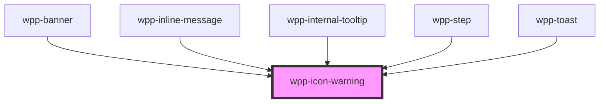

# wpp-icon-warning

<!-- Auto Generated Below -->

## Properties

| Property | Attribute | Description                                                                                                               | Type                  | Default                          |
| -------- | --------- | ------------------------------------------------------------------------------------------------------------------------- | --------------------- | -------------------------------- |
| `color`  | `color`   | Defines the icon color.                                                                                                   | `string`              | `'var(--wpp-warning-color-400)'` |
| `height` | `height`  | Defines the icon height and changes its default size. If you use `height` only, the icon width will not be affected.      | `number \| undefined` | `undefined`                      |
| `size`   | `size`    | Defines the icon size, where `s` is **16px** and `m` is **20px**.                                                         | `"m" \| "s"`          | `'m'`                            |
| `width`  | `width`   | Defines the icon width and changes its default size. If you use `width` only, the icon width and height will be the same. | `number \| undefined` | `undefined`                      |

## Dependencies

### Used by

 - [wpp-banner](../../../../../wpp-banner)
 - [wpp-inline-message](../../../../../wpp-inline-message)
 - wpp-internal-tooltip
 - [wpp-step](../../../../../wpp-stepper/components/wpp-step)
 - [wpp-toast](../../../../../wpp-toast)

### Graph

----------------------------------------------

*Built with [StencilJS](https://stenciljs.com/)*
