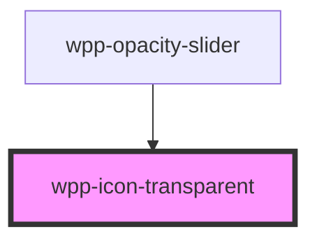

# wpp-icon-transparent

<!-- Auto Generated Below -->

## Dependencies

### Used by

 - [wpp-opacity-slider](../../../../../wpp-color-picker/components/wpp-opacity-slider)

### Graph

----------------------------------------------

*Built with [StencilJS](https://stenciljs.com/)*
