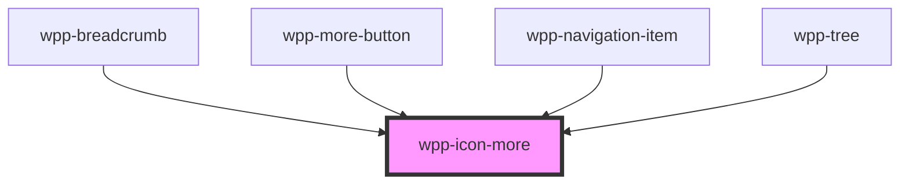

# wpp-icon-more

<!-- Auto Generated Below -->

## Properties

| Property    | Attribute   | Description                                                                                                               | Type                         | Default                   |
| ----------- | ----------- | ------------------------------------------------------------------------------------------------------------------------- | ---------------------------- | ------------------------- |
| `color`     | `color`     | Defines the icon color.                                                                                                   | `string`                     | `'var(--wpp-icon-color)'` |
| `direction` | `direction` | Defines the icon direction.                                                                                               | `"horizontal" \| "vertical"` | `'horizontal'`            |
| `height`    | `height`    | Defines the icon height and changes its default size. If you use `height` only, the icon width will not be affected.      | `number \| undefined`        | `undefined`               |
| `size`      | `size`      | Defines the icon size, where `s` is **16px** and `m` is **20px**.                                                         | `"m" \| "s"`                 | `'m'`                     |
| `width`     | `width`     | Defines the icon width and changes its default size. If you use `width` only, the icon width and height will be the same. | `number \| undefined`        | `undefined`               |

## Dependencies

### Used by

 - [wpp-breadcrumb](../../../../../wpp-breadcrumb)
 - [wpp-more-button](../../../../../wpp-more-button)
 - [wpp-navigation-item](../../../../../wpp-topbar/components/wpp-navigation-item)
 - [wpp-tree](../../../../../wpp-tree)

### Graph

----------------------------------------------

*Built with [StencilJS](https://stenciljs.com/)*
