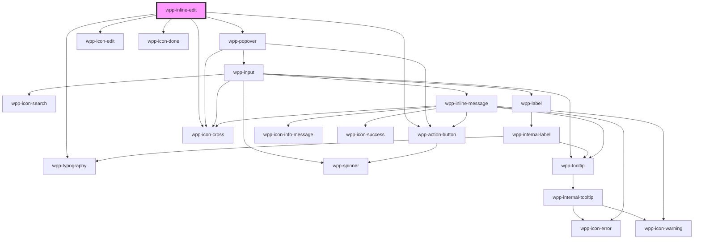

# wpp-inline-edit

InlineEdit component supports wpp-input and wpp-textarea-input only.

<!-- Auto Generated Below -->


## Usage

### Angular

### inline-edit-example.page.html
```angular2html
<div class="wrapper">
  <div>
    <h3>Inline Edit Input</h3>
    <wpp-inline-edit [value]="inputValue" [mode]="inputMode" (wppModeChange)="handleInputModeChange($event)" [inputWidth]="'300px'">
      <wpp-input
        size="s"
        slot="form-element"
        [value]="inputValue"
        (wppChange)="handleInputValueChange($event)"
      ></wpp-input>
    </wpp-inline-edit>
  </div>

  <div>
    <h3>Inline Edit Textarea</h3>
    <wpp-inline-edit
      [value]="textareaValue"
      [mode]="textareaMode"
      (wppModeChange)="handleTextareaModeChange($event)"
      [dropdownConfig]="textareaInlineEditConfig" [inputWidth]="'300px'"
    >
      <wpp-textarea-input
        slot="form-element"
        [value]="textareaValue"
        (wppChange)="handleTextareaValueChange($event)"
      ></wpp-textarea-input>
    </wpp-inline-edit>
  </div>
</div>

```

### inline-edit-example.page.ts
```typescript
@Component({
  selector: 'app-inline-edit-example',
  templateUrl: './inline-edit-example.page.html',
  styleUrls: ['./inline-edit-example.page.scss'],
  changeDetection: ChangeDetectionStrategy.OnPush,
})
export class InlineEditExamplePage {
  public inputValue = 'input value'
  public inputMode = 'read'
  public textareaValue = 'textarea value'
  public textareaMode = 'read'
  public textareaInlineEditConfig = { placement: 'bottom-start' }

  public handleInputModeChange(event: Event) {
    const e = event as CustomEvent<InlineEditChangeModeEventDetail>

    this.inputMode = e.detail.mode
    if (e.detail.mode === 'read') {
      e.detail.closePopover()
    }
  }

  public handleInputValueChange(event: Event) {
    this.inputValue = ((event as CustomEvent<InputChangeEventDetail>).target as HTMLWppInputElement).value
  }

  public handleTextareaModeChange(event: Event) {
    const e = event as CustomEvent<InlineEditChangeModeEventDetail>

    this.textareaMode = e.detail.mode
    if (e.detail.mode === 'read') {
      e.detail.closePopover()
    }
  }

  public handleTextareaValueChange(event: Event) {
    this.textareaValue = ((event as CustomEvent<InputChangeEventDetail>).target as HTMLWppInputElement).value
  }
}

```


### React

```tsx
import React, { useState } from 'react'

import { WppInlineEdit } from '@platform-ui-kit/components-library-react'

export const InlineEditVCPage = () => {
  const [inputMode, setInputMode] = useState('read')
  const [textareaMode, setTextareaMode] = useState('read')
  const [inputText, setInputText] = useState('input value')
  const [textareaText, setTextareaText] = useState('textarea value')

  return (
    <>
      <div>
        <h3>Inline Edit Input</h3>
        <WppInlineEdit
          value={inputText}
          mode={inputMode}
          inputWidth="300px"
          onWppModeChange={(event: WppInlineEditCustomEvent<InlineEditChangeModeEventDetail>) => {
            setInputMode(event.detail.mode)
            if (event.detail.mode === 'read') {
              event.detail.closePopover()
            }
          }}
        >
          <WppInput
            size="s"
            slot="form-element"
            value={inputText}
            onWppChange={(e: WppInputCustomEvent<InputChangeEventDetail>) => {
              setInputText(e.detail.value)
            }}
          />
        </WppInlineEdit>
      </div>

      <div className={styles.block}>
        <h3>Inline Edit Textarea</h3>
        <WppInlineEdit
          mode={textareaMode}
          value={textareaText}
          inputWidth="300px"
          dropdownConfig={{
            placement: 'bottom-start',
          }}
          onWppModeChange={(event: WppInlineEditCustomEvent<InlineEditChangeModeEventDetail>) => {
            setTextareaMode(event.detail.mode)
            if (event.detail.mode === 'read') {
              event.detail.closePopover()
            }
          }}
        >
          <WppTextareaInput
            slot="form-element"
            size="s"
            value={textareaText}
            onWppChange={(e: WppTextareaInputCustomEvent<InputChangeEventDetail>) => {
              setTextareaText(e.detail.value)
            }}
          />
        </WppInlineEdit>
      </div>
    </>
  )
}

```


### Vue

```vue
<script setup lang="ts">
import {
  WppInlineEdit,
  WppInput,
  WppTextareaInput,
} from "@platform-ui-kit/components-library-vue";
import { ref } from "vue";

const inputMode = ref("read");
const textareaMode = ref("read");
const inputText = ref("input text");
const textareaText = ref("textarea text");
const textareaInlineEditConfig = {
  placement: "bottom-start",
};

const handleInputModeChange = (event: CustomEvent) => {
  inputMode.value = event.detail.mode;
  if (event.detail.mode === "read") {
    event.detail.closePopover();
  }
};

const handleTextareaModeChange = (event: CustomEvent) => {
  textareaMode.value = event.detail.mode;
  if (event.detail.mode === "read") {
    event.detail.closePopover();
  }
};

const handleInputValueChange = (event: CustomEvent) => {
  inputText.value = event.detail.value;
};

const handleTextareaValueChange = (event: CustomEvent) => {
  textareaText.value = event.detail.value;
};
</script>

<template>
  <div class="container">
    <div class="block">
      <h3>Inline Edit Input</h3>
      <WppInlineEdit
        :value="inputText"
        :mode="inputMode"
        @WppModeChange="handleInputModeChange"
        :inputWidth="'300px'"
      >
        <WppInput
          size="s"
          slot="form-element"
          :value="inputText"
          @WppChange="handleInputValueChange"
        />
      </WppInlineEdit>
    </div>

    <div class="block">
      <h3>Inline Edit Textarea</h3>
      <WppInlineEdit
        :mode="textareaMode"
        :value="textareaText"
        :dropdownConfig="textareaInlineEditConfig"
        @WppModeChange="handleTextareaModeChange"
        :inputWidth="'300px'"
      >
        <WppTextareaInput
          slot="form-element"
          size="s"
          :value="textareaText"
          @WppChange="handleTextareaValueChange"
        />
      </WppInlineEdit>
    </div>
  </div>
</template>

<style>
.container {
  display: flex;
}
.block {
  width: 400px;
  margin-right: 30px;
}
</style>


```


## Properties

| Property         | Attribute     | Description                                                                                                                                                                                                    | Type                  | Default         |
| ---------------- | ------------- | -------------------------------------------------------------------------------------------------------------------------------------------------------------------------------------------------------------- | --------------------- | --------------- |
| `dropdownConfig` | --            | Defines the dropdown configuration. Under the hood dropdown using tippy.js, all information about this library and available props you can see via this link `https://atomiks.github.io/tippyjs/v6/all-props/` | `DropdownConfig`      | `{}`            |
| `inputWidth`     | `input-width` | Defines the width of the input field when in active state. Accepts any valid CSS width expression (e.g., "300px", "100%", "calc(100% - 68px)").                                                                | `string \| undefined` | `'auto'`        |
| `mode`           | `mode`        | Defines the inline edit mode.                                                                                                                                                                                  | `"edit" \| "read"`    | `'read'`        |
| `placeholder`    | `placeholder` | Defines the placeholder for the input field. It is displayed when the input field is empty. The placeholder is visible only in view mode. In edit mode, the input provided by the user will be displayed.      | `string \| undefined` | `'placeholder'` |
| `value`          | `value`       | Defines the value of the editing field.                                                                                                                                                                        | `string`              | `undefined`     |


## Events

| Event           | Description                               | Type                                                                                                                   |
| --------------- | ----------------------------------------- | ---------------------------------------------------------------------------------------------------------------------- |
| `wppModeChange` | Emitted when the inline edit mode changes | `CustomEvent<{ mode: InlineEditMode; closePopover: () => void; reason?: InlineEditClosePopoverReason \| undefined; }>` |


## Methods

### `closePopover() => Promise<void>`

Method for closing inline-edit

#### Returns

Type: `Promise<void>`


### `setFocus() => Promise<void>`

Method that sets focus on the native input.

#### Returns

Type: `Promise<void>`


## Shadow Parts

| Part                       | Description |
| -------------------------- | ----------- |
| `"buttons"`                |             |
| `"content"`                |             |
| `"content-bg"`             |             |
| `"inline-edit-typography"` |             |
| `"wrapper"`                |             |


## Dependencies

### Depends on

- [wpp-popover](../wpp-popover)
- [wpp-typography](../wpp-typography)
- [wpp-icon-edit](../wpp-icon/components/actions/content actions/wpp-icon-edit)
- [wpp-action-button](../wpp-action-button)
- [wpp-icon-done](../wpp-icon/components/status/status/wpp-icon-done)
- [wpp-icon-cross](../wpp-icon/components/add-and-remove/wpp-icon-cross)

### Graph


----------------------------------------------

*Built with [StencilJS](https://stenciljs.com/)*
