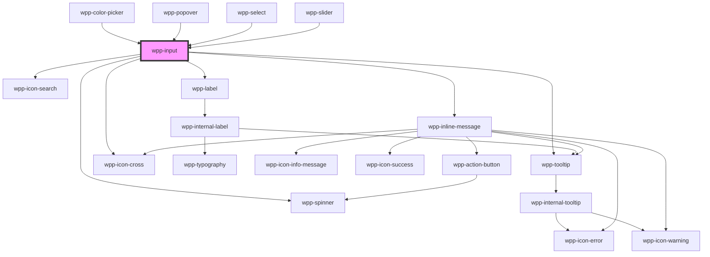

# wpp-text-input


<!-- Auto Generated Below -->


## Usage

### Angular

```html
<wpp-input
  [labelConfig]='labelConfig'
  [message]='validationMessage()'
  [messageType]='messageType'
  name='name'
  id='name'
>
  <wpp-icon-search slot="icon-start" aria-label="Search icon" />
  <wpp-icon-cross slot="icon-end" aria-label="Clear icon" onClick={this.handleInputClear} />
</wpp-input>
```

**component.ts**

```tsx
import { Component } from '@angular/core';
import { FormControl, FormGroup, Validators } from '@angular/forms'


@Component({…})

export class TextInputExample {
  public messageType: string = ''
  public labelConfig = {
    text: 'Label',
  }

  form = new FormGroup({
    name: new FormControl('', [Validators.required]),
    isReady: new FormControl(true),
  })

  get formControls(): any {
    return this.form.controls
  }

  validationMessage() {
    if (this.formControls.name.touched && this.formControls.name.invalid) {
      this.messageType = 'error'
      return 'Name is Required'
    }
    this.messageType = ''
    return ''
  }
}
```


### React

```tsx
import { WppInput } from '@platform-ui-kit/components-library-react'

export const TextInputExample = () => (
  <WppInput
    name="email"
    labelConfig={{ text: 'Enter your email' }}
    placeholder="Email"
    message="Email error"
    messageType="error"
    value="example@gmail."
    onWppChange={handleEmailChange}
  >
    <WppIconSearch slot="icon-start" aria-label="Search icon" onClick={() => console.log('Left icon clicked')} />
    <WppIconAdd slot="icon-end" aria-label="Clear icon" onClick={() => console.log('Right icon clicked')} />
  </WppInput>
)
```


### Vue

```vue
<script setup lang="ts">
import {
  WppIconSearch,
  WppInput,
} from "@platform-ui-kit/components-library-vue";
</script>

<template>
  <WppInput
    name="wpp-input"
    placeholder="Enter text"
    data-testid="regular-m-input"
    required
    autoFocus
    :labelConfig="{
      icon: 'wpp-icon-info',
      text: 'Normal Input',
      description: 'Description',
      locales: {
        optional: 'Optional',
      },
    }"
  />

  <WppInput
    name="wpp-input"
    :labelConfig="{ text: 'Error Input with Search Icon' }"
    placeholder="Enter text"
    messageType="error"
    message="Error message"
    data-testid="search-icon-error-s-input"
    size="s"
    required
  >
    <WppIconSearch slot="icon-start" />
  </WppInput>
</template>
```


## Properties

| Property             | Attribute            | Description                                                                                                                                                                                                                                                        | Type                                                                                                                                                                                                                                                                                                                          | Default                                                                                                                                                                                                    |
| -------------------- | -------------------- | ------------------------------------------------------------------------------------------------------------------------------------------------------------------------------------------------------------------------------------------------------------------ | ----------------------------------------------------------------------------------------------------------------------------------------------------------------------------------------------------------------------------------------------------------------------------------------------------------------------------- | ---------------------------------------------------------------------------------------------------------------------------------------------------------------------------------------------------------- |
| `ariaProps`          | --                   | Contains the input `aria-` props.                                                                                                                                                                                                                                  | `AriaProps`                                                                                                                                                                                                                                                                                                                   | `{}`                                                                                                                                                                                                       |
| `autoFocus`          | `auto-focus`         | If `true`, the input should be focused on page load                                                                                                                                                                                                                | `boolean`                                                                                                                                                                                                                                                                                                                     | `false`                                                                                                                                                                                                    |
| `autocomplete`       | `autocomplete`       | Defines the autocomplete behavior for the input. Possible values: - "on": Enables autocomplete for the input. - "off": Disables autocomplete for the input. - Additional valid values: See HTML specifications (e.g., "name", "email", "username"). Default: "off" | `string`                                                                                                                                                                                                                                                                                                                      | `'off'`                                                                                                                                                                                                    |
| `defaultValue`       | `default-value`      | Defines the default value of the input. Note: This value is used only when the component is uncontrolled.                                                                                                                                                          | `string \| undefined`                                                                                                                                                                                                                                                                                                         | `undefined`                                                                                                                                                                                                |
| `disabled`           | `disabled`           | If the input is disabled.                                                                                                                                                                                                                                          | `boolean`                                                                                                                                                                                                                                                                                                                     | `false`                                                                                                                                                                                                    |
| `labelConfig`        | --                   | Indicates label config                                                                                                                                                                                                                                             | `LabelConfig \| undefined`                                                                                                                                                                                                                                                                                                    | `undefined`                                                                                                                                                                                                |
| `labelTooltipConfig` | --                   | Defines the dropdown configuration. Under the hood dropdown using tippy.js, all information about this library and available props you can see via this link `https://atomiks.github.io/tippyjs/v6/all-props/`                                                     | `DropdownConfig`                                                                                                                                                                                                                                                                                                              | `{     popperOptions: { strategy: 'fixed' },   }`                                                                                                                                                          |
| `loading`            | `loading`            | If the component is loading.                                                                                                                                                                                                                                       | `boolean`                                                                                                                                                                                                                                                                                                                     | `false`                                                                                                                                                                                                    |
| `locales`            | --                   | Defines the component locale types.                                                                                                                                                                                                                                | `{ minLengthErrorMessage: (minLength: number) => string; maxLengthErrorMessage: (maxLength: number) => string; }`                                                                                                                                                                                                             | `{     minLengthErrorMessage: minLength => `The input must have at least ${minLength} characters`,     maxLengthErrorMessage: maxLength => `The input can have a maximum of ${maxLength} characters`,   }` |
| `maskOptions`        | --                   | Defines the custom mask options. Currently, it can be used with the following types: 'decimal', 'text', 'tel'                                                                                                                                                      | `undefined \| { decimalPatternOptions?: DecimalMaskOptions \| undefined; maskPlaceholder?: string \| undefined; customPatternOptions?: MaskitoOptions \| undefined; telPatternOptions?: { mask?: MaskitoMask \| undefined; countryCode?: CountryCode \| undefined; countryPhoneCode?: string \| undefined; } \| undefined; }` | `undefined`                                                                                                                                                                                                |
| `maxLength`          | `max-length`         | Indicates the maximum number of characters the input can accept. If the user introduces more characters, the input will display an error.                                                                                                                          | `number \| undefined`                                                                                                                                                                                                                                                                                                         | `undefined`                                                                                                                                                                                                |
| `maxMessageLength`   | `max-message-length` | Defines the input message maximum length.                                                                                                                                                                                                                          | `"auto" \| number \| undefined`                                                                                                                                                                                                                                                                                               | `undefined`                                                                                                                                                                                                |
| `message`            | `message`            | Defines the input message.                                                                                                                                                                                                                                         | `string \| undefined`                                                                                                                                                                                                                                                                                                         | `undefined`                                                                                                                                                                                                |
| `messageType`        | `message-type`       | Defines the input message type.                                                                                                                                                                                                                                    | `"error" \| "warning" \| undefined`                                                                                                                                                                                                                                                                                           | `undefined`                                                                                                                                                                                                |
| `minLength`          | `min-length`         | Indicates the minimum number of characters the input can accept. If the user introduces less characters, the input will display an error.                                                                                                                          | `number \| undefined`                                                                                                                                                                                                                                                                                                         | `undefined`                                                                                                                                                                                                |
| `name`               | `name`               | Defines the input name.                                                                                                                                                                                                                                            | `string \| undefined`                                                                                                                                                                                                                                                                                                         | `undefined`                                                                                                                                                                                                |
| `placeholder`        | `placeholder`        | Defines the input placeholder.                                                                                                                                                                                                                                     | `string \| undefined`                                                                                                                                                                                                                                                                                                         | `undefined`                                                                                                                                                                                                |
| `readOnly`           | `read-only`          | If the input is readonly.                                                                                                                                                                                                                                          | `boolean`                                                                                                                                                                                                                                                                                                                     | `false`                                                                                                                                                                                                    |
| `required`           | `required`           | If the input is required.                                                                                                                                                                                                                                          | `boolean`                                                                                                                                                                                                                                                                                                                     | `false`                                                                                                                                                                                                    |
| `size`               | `size`               | Defines the input size.                                                                                                                                                                                                                                            | `"m" \| "s"`                                                                                                                                                                                                                                                                                                                  | `'m'`                                                                                                                                                                                                      |
| `tooltipConfig`      | --                   | Defines the dropdown configuration. Under the hood dropdown using tippy.js, all information about this library and available props you can see via this link `https://atomiks.github.io/tippyjs/v6/all-props/`                                                     | `DropdownConfig`                                                                                                                                                                                                                                                                                                              | `{}`                                                                                                                                                                                                       |
| `type`               | `type`               | Defines the input type.                                                                                                                                                                                                                                            | `"decimal" \| "email" \| "number" \| "password" \| "search" \| "tel" \| "text" \| "url"`                                                                                                                                                                                                                                      | `'text'`                                                                                                                                                                                                   |
| `value`              | `value`              | Defines the input value.                                                                                                                                                                                                                                           | `string`                                                                                                                                                                                                                                                                                                                      | `undefined`                                                                                                                                                                                                |


## Events

| Event            | Description                                                                                                                                                                                                                                                                                                                                                                                                                                                                                                                                                                                                            | Type                                                                           |
| ---------------- | ---------------------------------------------------------------------------------------------------------------------------------------------------------------------------------------------------------------------------------------------------------------------------------------------------------------------------------------------------------------------------------------------------------------------------------------------------------------------------------------------------------------------------------------------------------------------------------------------------------------------- | ------------------------------------------------------------------------------ |
| `wppBlur`        | Emitted when the input loses focus.                                                                                                                                                                                                                                                                                                                                                                                                                                                                                                                                                                                    | `CustomEvent<FocusEvent>`                                                      |
| `wppChange`      | Emitted when the input value changes.                                                                                                                                                                                                                                                                                                                                                                                                                                                                                                                                                                                  | `CustomEvent<InputChangeEventDetail>`                                          |
| `wppChangeExtra` | New optional event that emits both raw and formatted values of the input. - `raw`: The unformatted input value, typically representing the actual data entered by the user. - `formatted`: The processed or masked value displayed in the input field, based on the applied mask or formatting rules.  This event can be useful in cases where both raw and formatted values are needed, such as when handling currency, phone numbers, or other masked inputs.  Unlike `wppChange`, which emits only the formatted value, `wppChangeExtra` provides both representations, allowing better control over data handling. | `CustomEvent<{ raw: string; formatted: string; name?: string \| undefined; }>` |
| `wppFocus`       | Emitted when the input is in focus.                                                                                                                                                                                                                                                                                                                                                                                                                                                                                                                                                                                    | `CustomEvent<FocusEvent>`                                                      |


## Methods

### `getValue() => Promise<InputValue>`

Method that returns current input value.

#### Returns

Type: `Promise<string>`


### `select() => Promise<void>`

Method that selects all the text in an element

#### Returns

Type: `Promise<void>`


### `setFocus() => Promise<void>`

Method that sets focus on the native input.

#### Returns

Type: `Promise<void>`


### `setValue(value: InputValue) => Promise<void>`

Method that sets the input value programmatically.

#### Returns

Type: `Promise<void>`


## Slots

| Slot           | Description                                                                          |
| -------------- | ------------------------------------------------------------------------------------ |
| `"icon-end"`   | Can contain an icon that will be placed after the main content, e.g. a cross icon.   |
| `"icon-start"` | Can contain an icon that will be placed before the main content, e.g. a search icon. |


## Shadow Parts

| Part            | Description          |
| --------------- | -------------------- |
| `"anchor"`      |                      |
| `"body"`        | Main content element |
| `"icon-cross"`  | icon cross element   |
| `"icon-search"` | icon search element  |
| `"input"`       | Input element        |
| `"label"`       | label text element   |
| `"message"`     | message              |


## CSS Custom Properties

| Name                                             | Description |
| ------------------------------------------------ | ----------- |
| `--wpp-input-bg-color`                           |             |
| `--wpp-input-bg-color-active`                    |             |
| `--wpp-input-bg-color-disabled`                  |             |
| `--wpp-input-bg-color-hover`                     |             |
| `--wpp-input-border-color`                       |             |
| `--wpp-input-border-color-active`                |             |
| `--wpp-input-border-color-disabled`              |             |
| `--wpp-input-border-color-hover`                 |             |
| `--wpp-input-border-style`                       |             |
| `--wpp-input-border-width`                       |             |
| `--wpp-input-first-border-color-focus`           |             |
| `--wpp-input-height-m`                           |             |
| `--wpp-input-height-s`                           |             |
| `--wpp-input-icon-color`                         |             |
| `--wpp-input-icon-color-disabled`                |             |
| `--wpp-input-icon-end-color-active`              |             |
| `--wpp-input-icon-end-color-hover`               |             |
| `--wpp-input-icon-end-first-border-color-focus`  |             |
| `--wpp-input-icon-end-margin-m`                  |             |
| `--wpp-input-icon-end-margin-s`                  |             |
| `--wpp-input-icon-end-second-border-color-focus` |             |
| `--wpp-input-icon-start-margin-m`                |             |
| `--wpp-input-icon-start-margin-s`                |             |
| `--wpp-input-label-color`                        |             |
| `--wpp-input-padding-m`                          |             |
| `--wpp-input-padding-s`                          |             |
| `--wpp-input-placeholder-color`                  |             |
| `--wpp-input-second-border-color-focus`          |             |
| `--wpp-input-text-color-disabled`                |             |
| `--wpp-input-with-icons-padding-m`               |             |
| `--wpp-input-with-icons-padding-s`               |             |


## Dependencies

### Used by

 - [wpp-color-picker](../wpp-color-picker)
 - [wpp-popover](../wpp-popover)
 - [wpp-select](../wpp-select)
 - [wpp-slider](../wpp-slider)

### Depends on

- [wpp-spinner](../wpp-spinner)
- [wpp-icon-search](../wpp-icon/components/actions/content actions/wpp-icon-search)
- [wpp-label](../wpp-label)
- [wpp-tooltip](../wpp-tooltip)
- [wpp-icon-cross](../wpp-icon/components/add-and-remove/wpp-icon-cross)
- [wpp-inline-message](../wpp-inline-message)

### Graph


----------------------------------------------

*Built with [StencilJS](https://stenciljs.com/)*
