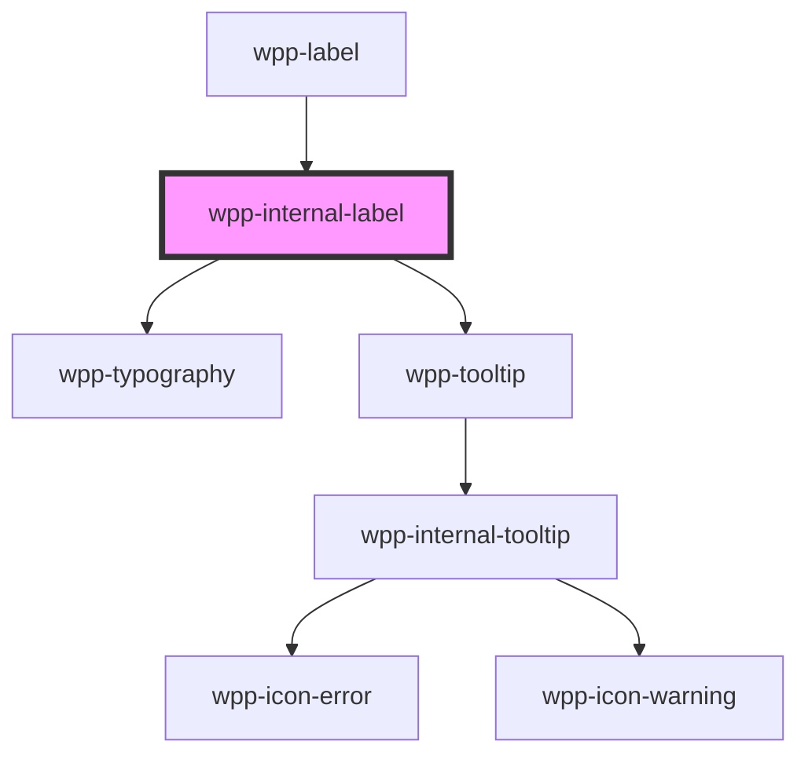

# wpp-internal-label

This is internal component that is used in `wpp-label` component

<!-- Auto Generated Below -->

## Properties

| Property        | Attribute     | Description                                                                                                                                                                                                    | Type                     | Default                           |
| --------------- | ------------- | -------------------------------------------------------------------------------------------------------------------------------------------------------------------------------------------------------------- | ------------------------ | --------------------------------- |
| `description`   | `description` | Indicates description message in tooltip when hover on icon                                                                                                                                                    | `string \| undefined`    | `undefined`                       |
| `disabled`      | `disabled`    | If `true`, the component is disabled                                                                                                                                                                           | `boolean`                | `false`                           |
| `labelText`     | `label-text`  | Indicates text of the label                                                                                                                                                                                    | `string \| undefined`    | `undefined`                       |
| `locales`       | --            | Indicates locales for label component                                                                                                                                                                          | `LabelLocales`           | `{     optional: 'Optional',   }` |
| `optional`      | `optional`    | Indicates optional field to fill with (Optional) text after label                                                                                                                                              | `boolean`                | `false`                           |
| `role`          | `role`        | Indicates the role attribute for the component                                                                                                                                                                 | `string`                 | `'presentation'`                  |
| `tooltipConfig` | --            | Defines the dropdown configuration. Under the hood dropdown using tippy.js, all information about this library and available props you can see via this link `https://atomiks.github.io/tippyjs/v6/all-props/` | `DropdownConfig`         | `{}`                              |
| `typography`    | `typography`  | Indicates different typography styles for label                                                                                                                                                                | `"s-body" \| "s-strong"` | `'s-body'`                        |

## Slots

| Slot     | Description                                                                  |
| -------- | ---------------------------------------------------------------------------- |
| `"icon"` | may contain an icon that will be placed after text wrapper, e.g. a info icon |

## Shadow Parts

| Part               | Description                           |
| ------------------ | ------------------------------------- |
| `"info-wrapper"`   | wrapper around text and optional text |
| `"info-wrapper -"` |                                       |
| `"optional-text"`  | optional text element                 |
| `"text"`           | label text                            |
| `"tooltip"`        | tooltip wrapper content               |

## CSS Custom Properties

| Name                              | Description |
| --------------------------------- | ----------- |
| `--wpp-label-icon-color`          |             |
| `--wpp-label-info-wrapper-margin` |             |
| `--wpp-label-optional-margin`     |             |
| `--wpp-label-optional-text-color` |             |
| `--wpp-label-s-body-text-color`   |             |
| `--wpp-label-s-strong-text-color` |             |
| `--wpp-label-text-color`          |             |
| `--wpp-label-text-color-disabled` |             |
| `--wpp-label-tooltip-width`       |             |

## Dependencies

### Used by

 - [wpp-label](../..)

### Depends on

- [wpp-typography](../../../wpp-typography)
- [wpp-tooltip](../../../wpp-tooltip)

### Graph

----------------------------------------------

*Built with [StencilJS](https://stenciljs.com/)*
