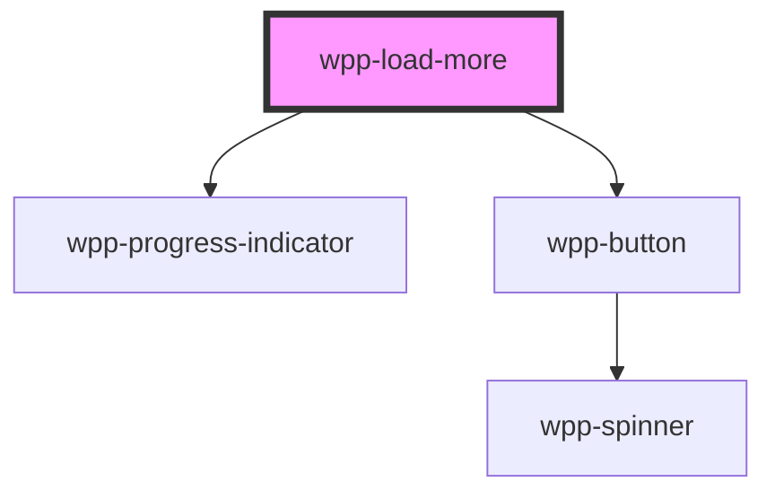

# wpp-load-more

The component is used to display a "Load more" button that can be clicked to load more items.

<!-- Auto Generated Below -->


## Usage

### Angular

```html
<wpp-load-more
  [totalItems]="100"
  [itemsLoaded]="itemsLoaded1"
  [showProgressBar]="true"
  [loading]="loading1"
  [incrementBy]="10"
  (wppClickLoadMore)="handleLoadMore1($event)"
></wpp-load-more>

<wpp-load-more
  [totalItems]="100"
  [itemsLoaded]="50"
  [showProgressBar]="true"
  [loading]="false"
  [incrementBy]="10"
></wpp-load-more>
```

**component.ts**

```tsx
import { Component } from '@angular/core';

@Component({
  selector: 'app-root',
  templateUrl: './app.component.html',
  styleUrls: ['./app.component.css']
})
export class AppComponent {
  itemsLoaded1 = 30;
  loading1 = false;

  handleLoadMore1(event: CustomEvent<{ newItemsLoaded: number; incrementBy: number }>) {
    const { newItemsLoaded, incrementBy } = event.detail;
    this.loading1 = true;
    setTimeout(() => {
      this.itemsLoaded1 = newItemsLoaded;
      this.loading1 = false;
    }, 1000);
  }
}
```


### React

```tsx
import React, { useState } from 'react';
import { WppLoadMore } from '@platform-ui-kit/components-library-react';

export const LoadMoreExample = () => {
  const [itemsLoaded, setItemsLoaded] = useState(30);
  const [loading, setLoading] = useState(false);
  const totalItems = 100;
  const incrementBy = 20;

  const handleLoadMore = (e: { detail: { newItemsLoaded: number; incrementBy: number } }) => {
    const { newItemsLoaded, incrementBy } = e.detail;
    setLoading(true);
    setTimeout(() => {
      setItemsLoaded(newItemsLoaded);
      setLoading(false);
    }, 1000);
  };

  return (
    <>
      <WppLoadMore
        totalItems={totalItems}
        itemsLoaded={itemsLoaded}
        showProgressBar
        loading={loading}
        incrementBy={incrementBy}
        onWppClickLoadMore={handleLoadMore}
      />

      <WppLoadMore
        totalItems={totalItems}
        itemsLoaded={50}
      />
    </>
  );
};
```


### Vue

```vue

<template>
  <div>
    <WppLoadMore
      :total-items="100"
      :items-loaded="itemsLoaded"
      :show-progress-bar="true"
      :loading="loading"
      :increment-by="incrementBy"
      @wppClickLoadMore="handleLoadMore"
    />

    <WppLoadMore
      :total-items="100"
      :items-loaded="50"
      :show-progress-bar="true"
      :loading="false"
      :increment-by="10"
    />
  </div>
</template>

<script setup lang="ts">
import { ref } from 'vue';

const itemsLoaded = ref(30);
const loading = ref(false);
const incrementBy = 10;

const handleLoadMore = (event: CustomEvent<{ newItemsLoaded: number; incrementBy: number }>) => {
  const { newItemsLoaded, incrementBy } = event.detail;
  loading.value = true;
  setTimeout(() => {
    itemsLoaded.value = newItemsLoaded;
    loading.value = false;
  }, 1000);
};
</script>

<style scoped>
/* Add your styles here */
</style>

```


## Properties

| Property          | Attribute           | Description                                                                          | Type        | Default        |
| ----------------- | ------------------- | ------------------------------------------------------------------------------------ | ----------- | -------------- |
| `ariaProps`       | --                  | Aria properties that will be applied on the button only.                             | `AriaProps` | `{}`           |
| `disabled`        | `disabled`          | Determines whether the component is disabled.                                        | `boolean`   | `false`        |
| `incrementBy`     | `increment-by`      | Defines the amount by which to increment the itemsLoaded when the button is clicked. | `number`    | `INCREASE_BY`  |
| `itemsLoaded`     | `items-loaded`      | The number of items that have been loaded.                                           | `number`    | `ITEMS_LOADED` |
| `loading`         | `loading`           | Determines whether the component is in a loading state.                              | `boolean`   | `false`        |
| `showProgressBar` | `show-progress-bar` | Determines whether to show the progress bar.                                         | `boolean`   | `false`        |
| `totalItems`      | `total-items`       | The total number of items.                                                           | `number`    | `TOTAL_ITEMS`  |


## Events

| Event              | Description                                     | Type                                     |
| ------------------ | ----------------------------------------------- | ---------------------------------------- |
| `wppClickLoadMore` | Emitted when the "Load more" button is clicked. | `CustomEvent<LoadMoreChangeEventDetail>` |


## Methods

### `setFocus() => Promise<void>`

Method that sets focus on the load button.

#### Returns

Type: `Promise<void>`


## Shadow Parts

| Part              | Description              |
| ----------------- | ------------------------ |
| `"button"`        | Load more button element |
| `"container"`     | Container element        |
| `"progress-text"` | Progress text element    |


## Dependencies

### Depends on

- [wpp-progress-indicator](../wpp-progress-indicator)
- [wpp-button](../wpp-button)

### Graph


----------------------------------------------

*Built with [StencilJS](https://stenciljs.com/)*
