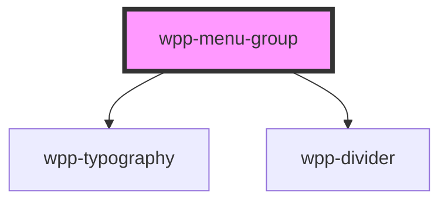

# wpp-menu-item

<!-- Auto Generated Below -->

## Properties

| Property      | Attribute      | Description                 | Type                   | Default     |
| ------------- | -------------- | --------------------------- | ---------------------- | ----------- |
| `header`      | `header`       | Defines the header message. | `string \| undefined`  | `undefined` |
| `withDivider` | `with-divider` | If a divider is displayed.  | `boolean \| undefined` | `false`     |

## Slots

| Slot | Description                                                                                        |
| ---- | -------------------------------------------------------------------------------------------------- |
|      | Content displayed within the `menu-group` component. The default slot, without the name attribute. |

## Shadow Parts

| Part        | Description         |
| ----------- | ------------------- |
| `"divider"` | divider element     |
| `"header"`  | header text element |

## CSS Custom Properties

| Name                              | Description |
| --------------------------------- | ----------- |
| `--wpp-menu-group-divider-margin` |             |
| `--wpp-menu-group-title-color`    |             |
| `--wpp-menu-group-title-margin`   |             |

## Dependencies

### Depends on

- [wpp-typography](../../../wpp-typography)
- [wpp-divider](../../../wpp-divider)

### Graph

----------------------------------------------

*Built with [StencilJS](https://stenciljs.com/)*
