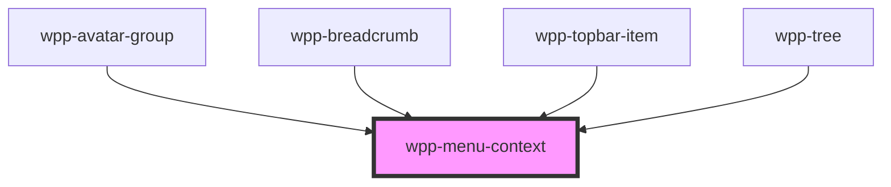

# wpp-menu-context

Create a control that opens a dropdown with different items.

In order to render items properly you should wrap all the elements
except the trigger-element into a separate element (f.e div).
Please check the usage example below.

**Note**: nested menu context does NOT work when appended to document.body
due to the technical difficulties, in this case list should be appended to
the `.wpp-list-wrapper`

**Note**: `onClick` event is not triggered for `wpp-list-item`in case when menu-context is appended
to the document.body, the root cause of this is that list items in this case
are located separately from the menu-context and located in the root of the document.body.
In order to handle `onClick`, you can use `onWppChangeListItem` event instead, it
will be triggered when `wpp-list-item` will be clicked.

<!-- Auto Generated Below -->


## Usage

### Angular

#### menu-context.example.page.html
```html
<div class="context">
  <h3>The list is the Same Width as a Button</h3>
  <wpp-menu-context [dropdownConfig]="dropdownConfig">
    <wpp-button disabled="false" slot="trigger-element" data-testid="same-width-button" class="long-button">
      Click to open
    </wpp-button>
    <div>
      <wpp-list-item>
        <wpp-icon-plus slot="left"></wpp-icon-plus>
        <p slot="label">Item 1</p>
      </wpp-list-item>
      <wpp-list-item active>
        <p slot="label">Item 2</p>
      </wpp-list-item>
      <wpp-list-item disabled>
        <p slot="label">Item 3</p>
      </wpp-list-item>
      <wpp-list-item>
        <p slot="label">Item 4</p>
        <wpp-icon-success slot="right"></wpp-icon-success>
      </wpp-list-item>
      <wpp-list-item>
        <wpp-icon-plus slot="left"></wpp-icon-plus>
        <p slot="label">withPlus</p>
      </wpp-list-item>
      <wpp-list-item>
        <p slot="label">With label</p>
      </wpp-list-item>
      <wpp-list-item value="text">
        <p slot="label">With value</p>
      </wpp-list-item>
      <wpp-list-item [linkConfig]="linkConfig">
        <p slot="label">Link</p>
      </wpp-list-item>
      <wpp-list-item [linkConfig]="linkConfig">
        <p slot="label">Link with preventDefault</p>
      </wpp-list-item>
    </div>
  </wpp-menu-context>
</div>

<div class="context">
  <h3>Expandable Nested List with Fixed Width</h3>
  <wpp-menu-context list-width="100px" [appendToListWrapper]='true'>
    <wpp-button slot="trigger-element" data-testid="fixed-width-button">
      Click to open
    </wpp-button>
    <div>
      <wpp-list-item>
        <wpp-icon-plus slot="left"></wpp-icon-plus>
        <p slot="label">Lorem ipsum dolor sit amet, consectetur</p>
      </wpp-list-item>
      <wpp-list-item>
        <p slot="label">Pellentesque venenatis eget diam sit amet dictum</p>
        <wpp-icon-cross slot="right"></wpp-icon-cross>
      </wpp-list-item>
      <wpp-menu-context [appendToListWrapper]='true'>
        <wpp-list-item slot="trigger-element" [isExtended]='true'>
          <p slot="label">Extendable Item</p>
        </wpp-list-item>
        <div>
          <wpp-menu-context [appendToListWrapper]='true'>
            <wpp-list-item slot="trigger-element" [isExtended]='true'>
              <p slot="label">SubItem 1</p>
            </wpp-list-item>
            <div>
              <wpp-list-item>
                <p slot="label">SubItem 2</p>
              </wpp-list-item>
              <wpp-list-item>
                <p slot="label">SubItem 3</p>
              </wpp-list-item>
              <wpp-list-item>
                <p slot="label">SubItem 3</p>
              </wpp-list-item>
              <wpp-list-item>
                <p slot="label">SubItem 3</p>
              </wpp-list-item>
              <wpp-list-item>
                <p slot="label">SubItem 3</p>
              </wpp-list-item>
            </div>
          </wpp-menu-context>
          <wpp-list-item disabled>
            <p slot="label">SubItem 2</p>
          </wpp-list-item>
          <wpp-list-item>
            <p slot="label">SubItem 3</p>
          </wpp-list-item>
        </div>
      </wpp-menu-context>
      <wpp-list-item>
        <p slot="label">Nulla sit amet bibendum augue curabitur non erat purus</p>
      </wpp-list-item>
    </div>
  </wpp-menu-context>
</div>
```

#### menu-context.example.page.ts
```tsx
import { ChangeDetectionStrategy, Component } from '@angular/core'

@Component({
  selector: 'menu-context-example',
  templateUrl: './menu-context-example.page.html',
  styleUrls: ['./menu-context-example.page.scss'],
  changeDetection: ChangeDetectionStrategy.OnPush,
})
export class MenuContextVC {
  public dropdownConfig = { triggerElementWidth: true }
  public linkConfig = { href: 'https://google.com', target: '_blank' }
  public listWidth = '150px'
}
```


### React

```tsx
import {
  WppMenuContext,
  WppListItem,
  WppButton,
  WppIconAdd,
  WppIconAddCircle,
} from '@platform-ui-kit/components-library-react'

export const MenuContextExample = () => (
  <>
    <WppMenuContext>
      <WppButton slot="trigger-element">Click to open</WppButton>
      <div>
        <WppListItem>
          <WppIconAddCircle slot="icon-start" />
          <p slot="label"></p>Item 1
        </WppListItem>
        <WppListItem><p slot="label">Item 2</p></WppListItem>
        <WppListItem><p slot="label">Item 3</p></WppListItem>
        <WppListItem><p slot="label">Item 4</p></WppListItem>
      </div>
    </WppMenuContext>

    <WppMenuContext>
      <WppButton slot="trigger-element">Click to open</WppButton>
      <div>
        <WppListItem>
          <WppIconAddCircle slot="icon-start" />
          <p slot="label">Item 1</p>
        </WppListItem>
        <WppListItem>
          <p slot="label">Item 2</p>
          <WppIconAdd slot="icon-end" />
        </WppListItem>
        <WppMenuContext>
          <WppListItem slot="trigger-element" isExtended><p slot="label">Item 3</p></WppListItem>
          <div>
            <WppListItem><p slot="label">SubItem 1</p></WppListItem>
            <WppListItem disabled><p slot="label">SubItem 2</p></WppListItem>
            <WppListItem><p slot="label">SubItem 3</p></WppListItem>
          </div>
        </WppMenuContext>
        <WppListItem><p slot="label">Item 4</p></WppListItem>
      </div>
    </WppMenuContext>
  </>
)
```


### Vue

```vue

<script setup lang="ts">
import {
  WppMenuContext,
  WppListItem,
  WppButton,
  WppIconCross,
  WppIconPlus,
} from '@platform-ui-kit/components-library-vue'
</script>

<template>
  <WppMenuContext>
    <WppButton slot="trigger-element">Click to open</WppButton>
    <div>
      <WppListItem>
        <WppIconPlus slot="icon-start" />
        <p slot="label"></p>Item 1
      </WppListItem>
      <WppListItem><p slot="label">Item 2</p></WppListItem>
      <WppListItem><p slot="label">Item 3</p></WppListItem>
      <WppListItem><p slot="label">Item 4</p></WppListItem>
    </div>
  </WppMenuContext>

  <WppMenuContext>
    <WppButton slot="trigger-element">Click to open</WppButton>
    <div>
      <WppListItem>
        <WppIconPlus slot="icon-start" />
        <p slot="label">Item 1</p>
      </WppListItem>
      <WppListItem>
        <p slot="label">Item 2</p>
        <WppIconCross slot="icon-end" />
      </WppListItem>
      <WppMenuContext>
        <WppListItem slot="trigger-element" isExtended><p slot="label">Item 3</p></WppListItem>
        <div>
          <WppListItem><p slot="label">SubItem 1</p></WppListItem>
          <WppListItem disabled><p slot="label">SubItem 2</p></WppListItem>
          <WppListItem><p slot="label">SubItem 3</p></WppListItem>
        </div>
      </WppMenuContext>
      <WppListItem><p slot="label">Item 4</p></WppListItem>
    </div>
  </WppMenuContext>
</template>


```


## Properties

| Property              | Attribute                | Description                                                                                                                                                                                                                                                                                 | Type             | Default  |
| --------------------- | ------------------------ | ------------------------------------------------------------------------------------------------------------------------------------------------------------------------------------------------------------------------------------------------------------------------------------------- | ---------------- | -------- |
| `appendToListWrapper` | `append-to-list-wrapper` | If `true`, menu-context content will be appended to the `.wpp-list-wrapper`                                                                                                                                                                                                                 | `boolean`        | `false`  |
| `ariaProps`           | --                       | Contains the button `aria-` props.                                                                                                                                                                                                                                                          | `AriaProps`      | `{}`     |
| `dropdownConfig`      | --                       | Defines the dropdown configuration. Under the hood dropdown using tippy.js, all information about this library and available props you can see via this link `https://atomiks.github.io/tippyjs/v6/all-props/`                                                                              | `DropdownConfig` | `{}`     |
| `externalClass`       | `external-class`         | Add an external class to the dropdown list. This class will be applied to the list wrapper that placed in tippy box that appended to the body. To add some properties to this class you have to add this class to global styles, for example .wpp-menu-context.external-class-name {  ... } | `string`         | `''`     |
| `listWidth`           | `list-width`             | Defines the context menu width. The maximum width of the menu is 350px.                                                                                                                                                                                                                     | `string`         | `'auto'` |


## Shadow Parts

| Part                                   | Description                        |
| -------------------------------------- | ---------------------------------- |
| `"inner"`                              | Content slot element               |
| `"list"`                               | Contains the `menu-item` elements. |
| `"list-wrapper"`                       |                                    |
| `"list-wrapper -list wrapper element"` |                                    |
| `"trigger"`                            | Trigger menu element               |


## CSS Custom Properties

| Name                                               | Description |
| -------------------------------------------------- | ----------- |
| `--DEPRECATED-wpp-menu-context-bg-color`           |             |
| `--DEPRECATED-wpp-menu-context-list-border-radius` |             |
| `--DEPRECATED-wpp-menu-context-list-box-shadow`    |             |
| `--DEPRECATED-wpp-menu-context-list-max-height`    |             |
| `--DEPRECATED-wpp-menu-context-list-padding`       |             |


## Dependencies

### Used by

 - [wpp-avatar-group](../wpp-avatar-group)
 - [wpp-breadcrumb](../wpp-breadcrumb)
 - [wpp-topbar-item](../wpp-topbar/components/wpp-topbar-item)
 - [wpp-tree](../wpp-tree)

### Graph


----------------------------------------------

*Built with [StencilJS](https://stenciljs.com/)*
