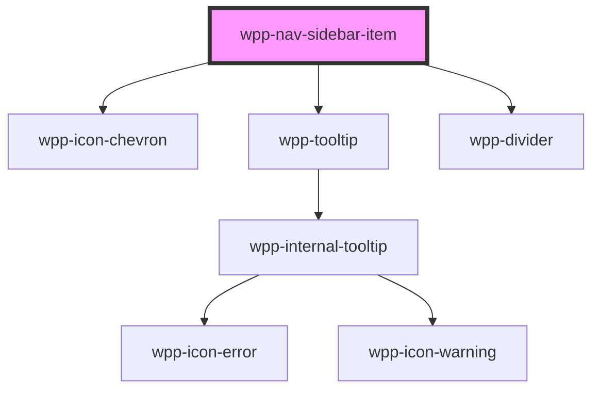

# wpp-navigation-sidebar-item

<!-- Auto Generated Below -->

## Properties

| Property                        | Attribute                            | Description                                                                                                                                                                                                                                                                                                                                                                                                                                                                                                                                  | Type                  | Default     |
| ------------------------------- | ------------------------------------ | -------------------------------------------------------------------------------------------------------------------------------------------------------------------------------------------------------------------------------------------------------------------------------------------------------------------------------------------------------------------------------------------------------------------------------------------------------------------------------------------------------------------------------------------- | --------------------- | ----------- |
| `active`                        | `active`                             | If `true`, item active                                                                                                                                                                                                                                                                                                                                                                                                                                                                                                                       | `boolean`             | `false`     |
| `divide`                        | `divide`                             | If `true`, show divide line in item                                                                                                                                                                                                                                                                                                                                                                                                                                                                                                          | `boolean`             | `false`     |
| `expanded`                      | `expanded`                           | If `true`, navigation item expanded                                                                                                                                                                                                                                                                                                                                                                                                                                                                                                          | `boolean`             | `false`     |
| `extended`                      | `extended`                           | If `true`, navigation item should have sub items                                                                                                                                                                                                                                                                                                                                                                                                                                                                                             | `boolean`             | `false`     |
| `groupTitle`                    | `group-title`                        | Indicates navigation item group title                                                                                                                                                                                                                                                                                                                                                                                                                                                                                                        | `string`              | `undefined` |
| `label`                         | `label`                              | Indicates navigation item label                                                                                                                                                                                                                                                                                                                                                                                                                                                                                                              | `string`              | `undefined` |
| `maxTitleLengthWithSubItems`    | `max-title-length-with-sub-items`    | Indicates max title length for item with sub items                                                                                                                                                                                                                                                                                                                                                                                                                                                                                           | `number`              | `15`        |
| `maxTitleLengthWithoutSubItems` | `max-title-length-without-sub-items` | Indicates max title length for item without sub items                                                                                                                                                                                                                                                                                                                                                                                                                                                                                        | `number`              | `21`        |
| `nativeLink`                    | `native-link`                        | If `true`, the navigation link will be have native behaviour `a` tag. If app using `client side render` you need to leave `nativeLink` false, if `server side render`, then better to use this prop This is not dynamic prop, so in Storybook when change value of this prop, need you to refresh the page                                                                                                                                                                                                                                   | `boolean`             | `undefined` |
| `nestedItem`                    | `nested-item`                        | Indicates navigation item is sub items, this prop don't need to pass in item, it pass automaticly from Navigation sidebar component                                                                                                                                                                                                                                                                                                                                                                                                          | `boolean`             | `false`     |
| `path`                          | `path`                               | Indicates navigation item path                                                                                                                                                                                                                                                                                                                                                                                                                                                                                                               | `string`              | `undefined` |
| `target`                        | `target`                             | Specifies where to open the linked document. Allows all valid values for the native "target" attribute: _self, _blank, _parent, _top, etc.  _self: The current browsing context. (Default) _blank: Usually a new tab, but users can configure browsers to open a new window instead. _parent: The parent browsing context of the current one. If no parent, behaves as _self. _top: The topmost browsing context. To be specific, this means the "highest" context that's an ancestor of the current one. If no ancestors, behaves as _self. | `string \| undefined` | `undefined` |

## Events

| Event                 | Description                                                                             | Type                                     |
| --------------------- | --------------------------------------------------------------------------------------- | ---------------------------------------- |
| `wppClickSidebarItem` | Emitted when the item path changes, return object like { path: '/home', label: 'Home' } | `CustomEvent<NavSidebarItemEventDetail>` |

## Slots

| Slot           | Description                                                                                                                            |
| -------------- | -------------------------------------------------------------------------------------------------------------------------------------- |
|                | Should contain `wpp-navigation-sidebar-item` if first level item need to have sub items. The default slot, without the name attribute. |
| `"icon-end"`   | May contain an icon that will be placed after the main content, e.g. a plus icon                                                       |
| `"icon-start"` | May contain an icon that will be placed before the main content, e.g. a plus icon                                                      |

## Shadow Parts

| Part              | Description             |
| ----------------- | ----------------------- |
| `"divider"`       | divider element         |
| `"extended-item"` | extended item element   |
| `"icon-chevron"`  | icon chevron element    |
| `"label"`         | Label text element      |
| `"link-item"`     | link item element       |
| `"title"`         | title text element      |
| `"tooltip"`       | tooltip wrapper content |

## CSS Custom Properties

| Name                                                             | Description |
| ---------------------------------------------------------------- | ----------- |
| `--wpp-nav-sidebar-item-border-radius`                           |             |
| `--wpp-nav-sidebar-item-expanded-icon-start-color`               |             |
| `--wpp-nav-sidebar-item-expanded-label-text-color`               |             |
| `--wpp-nav-sidebar-item-group-title-margin`                      |             |
| `--wpp-nav-sidebar-item-height`                                  |             |
| `--wpp-nav-sidebar-item-icons-active-color`                      |             |
| `--wpp-nav-sidebar-item-icons-active-color-hover`                |             |
| `--wpp-nav-sidebar-item-icons-active-color-pressed`              |             |
| `--wpp-nav-sidebar-item-icons-color`                             |             |
| `--wpp-nav-sidebar-item-icons-color-hover`                       |             |
| `--wpp-nav-sidebar-item-icons-color-pressed`                     |             |
| `--wpp-nav-sidebar-item-label-paddings`                          |             |
| `--wpp-nav-sidebar-item-label-text-color`                        |             |
| `--wpp-nav-sidebar-item-label-text-color-active`                 |             |
| `--wpp-nav-sidebar-item-label-text-color-hover`                  |             |
| `--wpp-nav-sidebar-item-label-text-color-pressed`                |             |
| `--wpp-nav-sidebar-item-margin`                                  |             |
| `--wpp-nav-sidebar-item-nested-label-padding`                    |             |
| `--wpp-nav-sidebar-item-nested-label-text-color`                 |             |
| `--wpp-nav-sidebar-item-nested-label-text-color-active`          |             |
| `--wpp-nav-sidebar-item-nested-label-text-color-hover`           |             |
| `--wpp-nav-sidebar-item-nested-label-text-color-selected`        |             |
| `--wpp-nav-sidebar-item-nested-label-text-color-selected-active` |             |
| `--wpp-nav-sidebar-item-nested-label-text-color-selected-hover`  |             |
| `--wpp-nav-sidebar-item-padding`                                 |             |
| `--wpp-nav-sidebar-item-submenu-label-margin`                    |             |
| `--wpp-nav-sidebar-item-submenu-paddings`                        |             |
| `--wpp-nav-sidebar-item-submenu-width`                           |             |
| `--wpp-nav-sidebar-item-without-icon-start-padding`              |             |

## Dependencies

### Depends on

- [wpp-icon-chevron](../../../wpp-icon/components/arrows/arrows/wpp-icon-chevron)
- [wpp-tooltip](../../../wpp-tooltip)
- [wpp-divider](../../../wpp-divider)

### Graph

----------------------------------------------

*Built with [StencilJS](https://stenciljs.com/)*
