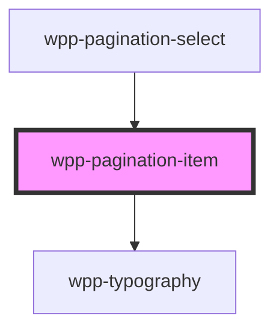

# wpp-pagination-item

This component used to show the page number. It is used in wpp-pagination-select component

<!-- Auto Generated Below -->

## Properties

| Property              | Attribute  | Description                          | Type      | Default     |
| --------------------- | ---------- | ------------------------------------ | --------- | ----------- |
| `number` _(required)_ | `number`   | Indicates current page number        | `number`  | `undefined` |
| `selected`            | `selected` | If `true`, the component is selected | `boolean` | `false`     |

## Events

| Event           | Description                | Type                                           |
| --------------- | -------------------------- | ---------------------------------------------- |
| `wppPageChange` | Emitted active page number | `CustomEvent<PaginationPageChangeEventDetail>` |

## Shadow Parts

| Part       | Description         |
| ---------- | ------------------- |
| `"number"` | number text element |

## CSS Custom Properties

| Name                                              | Description |
| ------------------------------------------------- | ----------- |
| `--wpp-pagination-item-bg-color-active`           |             |
| `--wpp-pagination-item-bg-color-hover`            |             |
| `--wpp-pagination-item-border-radius`             |             |
| `--wpp-pagination-item-first-border-color-focus`  |             |
| `--wpp-pagination-item-padding`                   |             |
| `--wpp-pagination-item-second-border-color-focus` |             |
| `--wpp-pagination-item-size`                      |             |
| `--wpp-pagination-item-text-color`                |             |
| `--wpp-pagination-item-text-color-active`         |             |
| `--wpp-pagination-item-text-color-hover`          |             |
| `--wpp-pagination-item-text-color-selected`       |             |

## Dependencies

### Used by

 - [wpp-pagination-select](../wpp-pagination-select)

### Depends on

- [wpp-typography](../../../wpp-typography)

### Graph

----------------------------------------------

*Built with [StencilJS](https://stenciljs.com/)*
