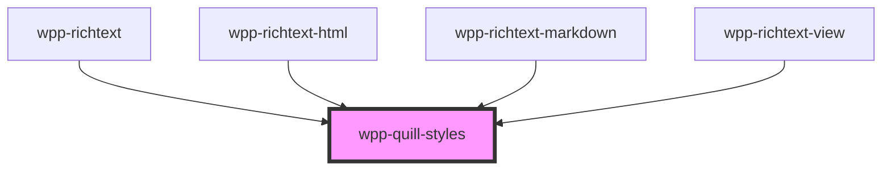

# wpp-quill-styles

<!-- Auto Generated Below -->

## Overview

Adds Quill styles.
Implemented as a separate component to avoid styles duplication

## Dependencies

### Used by

 - [wpp-richtext](../..)
 - [wpp-richtext-html](../wpp-richtext-html)
 - [wpp-richtext-markdown](../wpp-richtext-markdown)
 - [wpp-richtext-view](../wpp-richtext-view)

### Graph

----------------------------------------------

*Built with [StencilJS](https://stenciljs.com/)*
