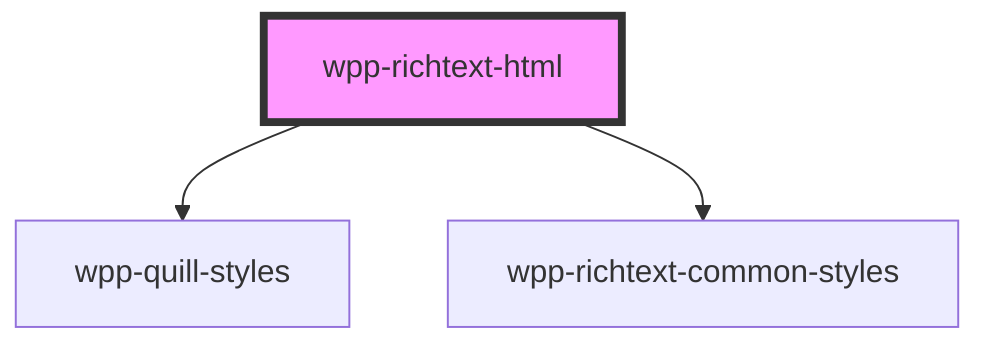

# wpp-richtext-html

<!-- Auto Generated Below -->

## Properties

| Property | Attribute | Description  | Type     | Default     |
| -------- | --------- | ------------ | -------- | ----------- |
| `value`  | `value`   | Editor value | `string` | `undefined` |

## Dependencies

### Depends on

- [wpp-quill-styles](../wpp-quill-styles)
- [wpp-richtext-common-styles](../wpp-richtext-common-styles)

### Graph

----------------------------------------------

*Built with [StencilJS](https://stenciljs.com/)*
