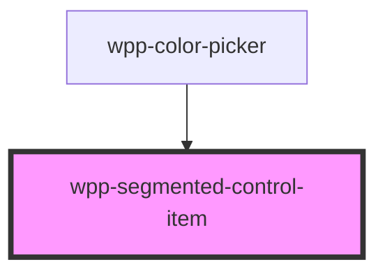

# wpp-segmented-control-item

<!-- Auto Generated Below -->

## Properties

| Property             | Attribute         | Description                                                                                                                         | Type               | Default     |
| -------------------- | ----------------- | ----------------------------------------------------------------------------------------------------------------------------------- | ------------------ | ----------- |
| `counter`            | `counter`         | Defines the number of elements within a specific item. The counter is only displayed when the `variant` is set to 'text'.           | `number`           | `0`         |
| `disabled`           | `disabled`        | If the component is disabled.                                                                                                       | `boolean`          | `false`     |
| `hugContentOff`      | `hug-content-off` | If the item size is relative to the control bar size.                                                                               | `boolean`          | `false`     |
| `size`               | `size`            | Defines the item size.                                                                                                              | `"m" \| "s"`       | `'m'`       |
| `value` _(required)_ | `value`           | Indicates value of item (must be unique)                                                                                            | `number \| string` | `undefined` |
| `variant`            | `variant`         | Defines the item style. - 'text': Displays text with an optional counter if provided. - 'icon': Displays an icon without a counter. | `"icon" \| "text"` | `'text'`    |

## Events

| Event                           | Description                       | Type                                                 |
| ------------------------------- | --------------------------------- | ---------------------------------------------------- |
| `wppBlur`                       | Emitted when an item loses focus. | `CustomEvent<FocusEvent>`                            |
| `wppChangeSegmentedControlItem` | Emitted when an item is clicked.  | `CustomEvent<SegmentedControlItemChangeEventDetail>` |
| `wppFocus`                      | Emitted when an item is in focus. | `CustomEvent<FocusEvent>`                            |

## Slots

| Slot | Description                                                                                                                                                                                                                                     |
| ---- | ----------------------------------------------------------------------------------------------------------------------------------------------------------------------------------------------------------------------------------------------- |
|      | Can contain either plain text or an icon depending on the `variant` prop. Use icons provided with the component library or custom **.svg** files that can be styled with the CSS color attribute. The default slot, without the name attribute. |

## Shadow Parts

| Part     | Description                            |
| -------- | -------------------------------------- |
| `"item"` | Wrapper that can contain label or icon |

## CSS Custom Properties

| Name                                                      | Description |
| --------------------------------------------------------- | ----------- |
| `--wpp-segmented-control-item-bg-color`                   |             |
| `--wpp-segmented-control-item-border-color`               |             |
| `--wpp-segmented-control-item-border-radius-m`            |             |
| `--wpp-segmented-control-item-border-radius-s`            |             |
| `--wpp-segmented-control-item-border-style`               |             |
| `--wpp-segmented-control-item-border-width`               |             |
| `--wpp-segmented-control-item-counter-font-weight`        |             |
| `--wpp-segmented-control-item-height-m`                   |             |
| `--wpp-segmented-control-item-height-s`                   |             |
| `--wpp-segmented-control-item-icon-bg-color-active`       |             |
| `--wpp-segmented-control-item-icon-bg-color-disabled`     |             |
| `--wpp-segmented-control-item-icon-bg-color-hover`        |             |
| `--wpp-segmented-control-item-icon-bg-color-selected`     |             |
| `--wpp-segmented-control-item-icon-border-color`          |             |
| `--wpp-segmented-control-item-icon-border-color-active`   |             |
| `--wpp-segmented-control-item-icon-border-color-disabled` |             |
| `--wpp-segmented-control-item-icon-border-color-hover`    |             |
| `--wpp-segmented-control-item-icon-border-color-selected` |             |
| `--wpp-segmented-control-item-icon-color`                 |             |
| `--wpp-segmented-control-item-icon-color-active`          |             |
| `--wpp-segmented-control-item-icon-color-disabled`        |             |
| `--wpp-segmented-control-item-icon-color-hover`           |             |
| `--wpp-segmented-control-item-icon-color-selected`        |             |
| `--wpp-segmented-control-item-icon-padding-m`             |             |
| `--wpp-segmented-control-item-icon-padding-s`             |             |
| `--wpp-segmented-control-item-text-bg-color-active`       |             |
| `--wpp-segmented-control-item-text-bg-color-disabled`     |             |
| `--wpp-segmented-control-item-text-bg-color-hover`        |             |
| `--wpp-segmented-control-item-text-bg-color-selected`     |             |
| `--wpp-segmented-control-item-text-border-color`          |             |
| `--wpp-segmented-control-item-text-border-color-active`   |             |
| `--wpp-segmented-control-item-text-border-color-disabled` |             |
| `--wpp-segmented-control-item-text-border-color-hover`    |             |
| `--wpp-segmented-control-item-text-border-color-selected` |             |
| `--wpp-segmented-control-item-text-color`                 |             |
| `--wpp-segmented-control-item-text-color-active`          |             |
| `--wpp-segmented-control-item-text-color-disabled`        |             |
| `--wpp-segmented-control-item-text-color-hover`           |             |
| `--wpp-segmented-control-item-text-color-selected`        |             |
| `--wpp-segmented-control-item-text-padding-m`             |             |
| `--wpp-segmented-control-item-text-padding-s`             |             |

## Dependencies

### Used by

 - [wpp-color-picker](../../../wpp-color-picker)

### Graph

----------------------------------------------

*Built with [StencilJS](https://stenciljs.com/)*
