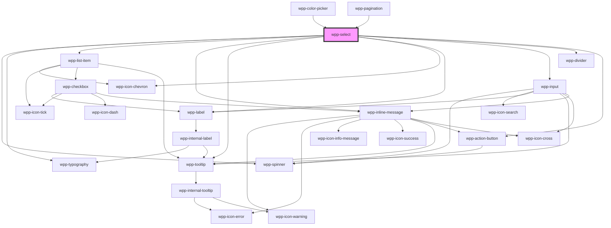

# wpp-input-select

Create a control that allows users to make a single selection or multiple selections from a list of options.

## Custom select

In case if there is a need to create a custom select for a select component,
it is possible to use a combination of a select `WppSelect`
and a popover component `WppPoppover`. The popover component can be used to display a list
of options or a customized dropdown when the input field is clicked or focused.

This approach allows for greater flexibility in customizing the dropdown behavior and appearance,
as you can control how the options are displayed, filtered, etc.

Example of implementation is provided below:

```tsx
import React, { useRef, useState } from 'react'

import { WppPopover, WppSelect, WppButton } from '@platform-ui-kit/components-library-react'

import styles from './CustomSelect.module.scss'

const OPTIONS_LIST = ['Add', 'Reset', 'Edit']

export const CustomSelect = () => {
  const [selectedOption, setSelectedOption] = useState<string>('')
  const [isOpened, setIsOpened] = useState<boolean>(false)
  const popoverRef = useRef<HTMLWppPopoverElement>(null)

  const handleOptionSelect = (selectedOption: string) => {
    setSelectedOption(selectedOption)

    popoverRef.current?.closePopover()
  }

  return (
    <div>
      <WppPopover
        ref={popoverRef}
        config={{
          triggerElementWidth: true,
          onShow: () => {
            setIsOpened(true)
          },
          onHide: () => {
            setIsOpened(false)
          },
        }}
      >
        <WppSelect
          displayValue={selectedOption}
          slot="trigger-element"
          isDropdownOpen={isOpened}
          placeholder="Select action"
          labelConfig={{ text: 'Action (Custom select using WppSelect + WppPoppover)' }}
          required
        ></WppSelect>
        {/* Any other content here */}
        <div className={styles.list}>
          {OPTIONS_LIST.map((optionName, i) => (
            <WppButton
              key={i}
              className={styles.option}
              variant={selectedOption === optionName ? 'primary' : 'secondary'}
              onClick={() => handleOptionSelect(optionName)}
            >
              {optionName}
            </WppButton>
          ))}
        </div>
      </WppPopover>
    </div>
  )
}
```

## Passing the list of WppListItems to the component.

The way `wpp-list-items` are passed into this component has been updated.

> ✅ The component now accepts a list of `ListItemInterface` objects.

---

### 🆕 Structure: `ListItemInterface[]`

Each item in the list is now passed as a plain object. These objects accept all previously supported properties from `WppListItem`, and additionally support a new `slots` property.

---

### 📦 Example

```ts
const SAMPLE_LIST: ListItemInterface[] = [
  {
    label: 'This is the end',
    value: 'end',
    slots: [
      {
        type: 'wpp-icon-plus',
        props: {
          slot: 'left',
        },
      },
    ],
  },
  {
    label: 'Tree',
    value: 'tree',
    checked: true,
  },
  {
    label: 'Car',
    value: 'car',
    disabled: true,
  },
  {
    label: 'House',
    value: 'house',
    slots: [
      {
        type: 'wpp-icon-success',
        props: {
          slot: 'right',
        },
      },
    ],
  },
  {
    label: 'Magazine',
    value: 'magazine',
    slots: [
      {
        type: 'wpp-icon-plus',
        props: {
          slot: 'left',
        },
      },
    ],
  },
  {
    label: 'Website',
    value: 'website',
  },
]
```

### 🧰 Optional Helper: `createSlotElement`

To simplify creation of slot content for list items, you can use a reusable helper:

```ts
function createSlotElement(
  type: string,
  props: Record<string, any> = {},
  children?: SlotItemNode | SlotItemNode[] | string,
): SlotItemNode {
  return {
    type,
    props,
    ...(children && {
      children: Array.isArray(children)
        ? children
        : typeof children === 'string'
        ? [{ type: '#text', props: { value: children } }]
        : [children],
    }),
  }
}
```

This makes list construction more intuitive and clean:

```ts
{
  label: 'Cherry',
  value: 'cherry',
  slots: [
    createSlotElement('wpp-avatar', { slot: 'left', size: 's', name: 'Lost Cherry' }),
    createSlotElement('wpp-tag', { slot: 'right', label: 'Text', variant: 'positive', disabled: true, }),
    createSlotElement('span', { slot: 'subtitle', children: 'This is a subtitle' })
  ],
}

```

<!-- Auto Generated Below -->


## Usage

### Angular

### single-select-example.page.html

```html
<div class="container">
  <div class="section">
    <wpp-typography type="2xl-heading">Default Select</wpp-typography>

    <div class="content">
      <wpp-select
        name="select-component"
        class="selectItem"
        data-testid="default-single-select-m"
        [list]="SAMPLE_LIST"
        [labelConfig]="{ text: 'Size M' }"
        placeholder="Choose option"
        [value]="value"
        [autoFocus]="true"
        (wppChange)="handleChange($event)"
      ></wpp-select>

      <wpp-select
        name="select-component"
        class="selectItem"
        data-testid="default-single-select-s"
        [list]="SAMPLE_LIST"
        [labelConfig]="{ text: 'Size S' }"
        placeholder="Choose option"
        [value]="value"
        [autoFocus]="true"
        size="s"
        (wppChange)="handleChange($event)"
      ></wpp-select>
    </div>
  </div>
</div>
```

### single-select-example.page.ts

```tsx
import { ChangeDetectionStrategy, Component } from '@angular/core'
import { ListItemInterface } from '@platform-ui-kit/components-library'

const SAMPLE_LIST: ListItemInterface[] = [
  {
    label: 'This is the end',
    value: 'end',
    slots: [
      {
        type: 'wpp-icon-plus',
        props: {
          slot: 'left',
        },
      },
    ],
  },
  {
    label: 'Tree',
    value: 'tree',
    checked: true,
  },
  {
    label: 'Car',
    value: 'car',
    disabled: true,
  },
  {
    label: 'House',
    value: 'house',
    slots: [
      {
        type: 'wpp-icon-success',
        props: {
          slot: 'right',
        },
      },
    ],
  },
  {
    label: 'Magazine',
    value: 'magazine',
    slots: [
      {
        type: 'wpp-icon-plus',
        props: {
          slot: 'left',
        },
      },
    ],
  },
  {
    label: 'Website',
    value: 'website',
  },
]

@Component({
  selector: 'app-single-select-example',
  templateUrl: './single-select-example.page.html',
  styleUrls: ['./single-select-example.page.scss'],
  changeDetection: ChangeDetectionStrategy.OnPush,
})
export class SingleSelectPage {
  public SAMPLE_LIST: ListItemInterface[] = SAMPLE_LIST
  public value = ''

  handleChange(event: Event) {
    const customEvent = event as CustomEvent
    console.log('On Change single', customEvent.detail)
    this.value = customEvent.detail.value
  }
}
```

### single-select-example.page.scss

```scss
.container {
  display: flex;
  flex-direction: column;
  align-items: flex-start;
  padding: 50px;

  .section {
    width: 900px;
    margin-bottom: 40px;

    .content {
      display: flex;
      justify-content: space-between;
      margin-top: 10px;

      .selectItem {
        width: 300px;
      }
    }
  }
}
```

### combined-select-example.page.ts

```tsx
import { ChangeDetectionStrategy, Component } from '@angular/core'
import { ListItemInterface } from '@platform-ui-kit/components-library'

const SAMPLE_LIST: ListItemInterface[] = [
  {
    id: 1,
    label: 'None',
    value: '',
  },
  {
    id: 2,
    label: 'UAH',
    value: 'uah',
  },
  {
    id: 3,
    label: 'USD',
    value: 'usd',
  },
  {
    id: 4,
    label: 'EUR',
    value: 'eur',
  },
]

@Component({
  selector: 'app-combined-select-example',
  templateUrl: './combined-select-example.page.html',
  styleUrls: ['./combined-select-example.page.scss'],
  changeDetection: ChangeDetectionStrategy.OnPush,
})
export class CombinedSelectPage {
  public SAMPLE_LIST_COMBINED = SAMPLE_LIST
  public value = ''

  handleChange(event: Event) {
    const customEvent = event as CustomEvent
    console.log('On Change combined', customEvent.detail)
    this.value = customEvent.detail.value
  }
}
```

### combined-select-example.page.html

```html
<div class="container">
  <div class="section">
    <wpp-typography type="2xl-heading">Default Combined Select</wpp-typography>

    <div class="content">
      <wpp-select
        type="combined"
        name="select-component"
        class="selectItem"
        data-testid="default-combined-select-m"
        [list]="SAMPLE_LIST_COMBINED"
        [labelConfig]="{ text: 'Size M' }"
        placeholder="Choose option"
        [value]="value"
        autoFocus
        (wppChange)="handleChange($event)"
      ></wpp-select>

      <wpp-select
        type="combined"
        name="select-component"
        class="selectItem"
        data-testid="default-combined-select-s"
        [list]="SAMPLE_LIST_COMBINED"
        [labelConfig]="{ text: 'Size S' }"
        placeholder="Choose option"
        [value]="value"
        autoFocus
        size="s"
        (wppChange)="handleChange($event)"
      ></wpp-select>
    </div>
  </div>
</div>
```


### React

```tsx
import { ListItemInterface } from '@platform-ui-kit/components-library'
import { WppSelect, WppIconClock } from '@platform-ui-kit/components-library-react'

const SAMPLE_LIST: ListItemInterface[] = [
  {
    label: 'This is the end',
    value: 'end',
    slots: [
      {
        type: 'wpp-icon-plus',
        props: {
          slot: 'left',
        },
      },
    ],
  },
  {
    label: 'Tree',
    value: 'tree',
    checked: true,
  },
  {
    label: 'Car',
    value: 'car',
    disabled: true,
  },
  {
    label: 'House',
    value: 'house',
    slots: [
      {
        type: 'wpp-icon-success',
        props: {
          slot: 'right',
        },
      },
    ],
  },
  {
    label: 'Magazine',
    value: 'magazine',
    slots: [
      {
        type: 'wpp-icon-plus',
        props: {
          slot: 'left',
        },
      },
    ],
  },
  {
    label: 'Website',
    value: 'website',
  },
]

export const SelectExample = () => {
  const [value, setValue] = useState<string>('')

  return (
    <WppSelect
      name="select-component"
      className={styles.selectItem}
      list={SAMPLE_LIST}
      labelConfig={{
        text: 'Single Select size M',
      }}
      placeholder="Choose option"
      value={value}
      autoFocus
      onWppChange={(e: CustomEvent) => {
        console.log('On Change single', e.detail)

        setValue(e.detail.value)
      }}
    >
      <WppIconClock slot="icon-start" />
    </WppSelect>
  )
}
```

```tsx
import { useState } from 'react'
import { h } from '@stencil/core'
import { ListItemInterface } from '@platform-ui-kit/components-library'
import { WppSelect } from '@platform-ui-kit/components-library-react'

export const SAMPLE_LIST: ListItemInterface[] = [
  {
    id: 1,
    label: 'None',
    value: '',
  },
  {
    id: 2,
    label: 'UAH',
    value: 'uah',
  },
  {
    id: 3,
    label: 'USD',
    value: 'usd',
  },
  {
    id: 4,
    label: 'EUR',
    value: 'eur',
  },
]

export const SelectCombinedExample = () => {
  const [value, setValue] = useState('usd')
  const [inputValue, setInputValue] = useState('100')

  const handleWppChange = (e: CustomEvent) => {
    const { value: newValue, inputValue: newInputValue } = e.detail

    setValue(newValue)
    setInputValue(newInputValue)
    console.log('WppChange event:', newValue, newInputValue)
  }

  return (
    <div>
      <h1>Selects Combined</h1>
      <WppSelect
        type="combined"
        name="combined-select"
        value={value}
        inputValue={inputValue}
        placeholder="Placeholder"
        size="m"
        disabled={false}
        required
        labelConfig={{ text: 'Currency' }}
        dropdownWidth="auto"
        onWppChange={handleWppChange}
        list={SAMPLE_LIST}
      />
    </div>
  )
}
```


### Vue

```vue
<script setup lang="ts">
import type { ListItemInterface } from '@platform-ui-kit/components-library/src/components'
import { WppSelect, WppIconClock } from '@platform-ui-kit/components-library-vue'

const SAMPLE_LIST: ListItemInterface[] = [
  {
    label: 'This is the end',
    value: 'end',
    slots: [
      {
        type: 'wpp-icon-plus',
        props: {
          slot: 'left',
        },
      },
    ],
  },
  {
    label: 'Tree',
    value: 'tree',
    checked: true,
  },
  {
    label: 'Car',
    value: 'car',
    disabled: true,
  },
  {
    label: 'House',
    value: 'house',
    slots: [
      {
        type: 'wpp-icon-success',
        props: {
          slot: 'right',
        },
      },
    ],
  },
  {
    label: 'Magazine',
    value: 'magazine',
    slots: [
      {
        type: 'wpp-icon-plus',
        props: {
          slot: 'left',
        },
      },
    ],
  },
  {
    label: 'Website',
    value: 'website',
  },
]

const value = ref('')

const handleChange = event => {
  console.log('On Change single', event.detail)
  value.value = event.detail.value
}
</script>

<template>
  <WppSelect
    name="select-component"
    class="selectItem"
    data-testid="default-single-select-m"
    :list="SAMPLE_LIST"
    :label-config="{ text: 'Size M' }"
    placeholder="Choose option"
    :value="value"
    autoFocus
    @wppChange="handleChange"
  >
    <WppIconClock slot="icon-start" />
  </WppSelect>
</template>
```

### Select Combined Example

```vue
<script setup lang="ts">
import type { ListItemInterface } from '@platform-ui-kit/components-library/src/components'
import { WppSelect } from '@platform-ui-kit/components-library-vue'
import { ref } from 'vue'

export const SAMPLE_LIST: ListItemInterface[] = [
  {
    id: 1,
    label: 'None',
    value: '',
  },
  {
    id: 2,
    label: 'UAH',
    value: 'uah',
  },
  {
    id: 3,
    label: 'USD',
    value: 'usd',
  },
  {
    id: 4,
    label: 'EUR',
    value: 'eur',
  },
]

const value = ref('usd')
const inputValue = ref('100')

const handleChange = (event: CustomEvent) => {
  const { value: newValue, inputValue: newInputValue } = event.detail
  value.value = newValue
  inputValue.value = newInputValue
  console.log('value :>> ', event.detail)
}
</script>

<template>
  <div class="container" data-testid="text-selects">
    <h1 class="title">Selects Combined</h1>

    <div class="variants">
      <WppSelect
        type="combined"
        name="combined-select"
        :value="value"
        :list="SAMPLE_LIST"
        :inputValue="inputValue"
        placeholder="Placeholder"
        size="m"
        :disabled="false"
        :required="true"
        :labelConfig="{ text: 'Currency' }"
        dropdownWidth="auto"
        @wppChange="handleChange"
      >
      </WppSelect>
    </div>
  </div>
</template>
```


## Properties

| Property               | Attribute                | Description                                                                                                                                                                                                                                                                                                                                       | Type                                             | Default                                           |
| ---------------------- | ------------------------ | ------------------------------------------------------------------------------------------------------------------------------------------------------------------------------------------------------------------------------------------------------------------------------------------------------------------------------------------------- | ------------------------------------------------ | ------------------------------------------------- |
| `ariaProps`            | --                       | Contains the component `aria-` props.                                                                                                                                                                                                                                                                                                             | `AriaProps`                                      | `{}`                                              |
| `autoFocus`            | `auto-focus`             | If `true`, the input should be focused on page load                                                                                                                                                                                                                                                                                               | `boolean`                                        | `false`                                           |
| `disabled`             | `disabled`               | If the input is disabled.                                                                                                                                                                                                                                                                                                                         | `boolean`                                        | `false`                                           |
| `displayValue`         | `display-value`          | Defines the displayed input value. If provided overrides the existing displayed value. This property should be used only in custom single selects.                                                                                                                                                                                                | `string`                                         | `undefined`                                       |
| `dropdownConfig`       | --                       | Defines the dropdown configuration. Under the hood dropdown using tippy.js, all information about this library and available props you can see via this link `https://atomiks.github.io/tippyjs/v6/all-props/`                                                                                                                                    | `DropdownConfig`                                 | `{}`                                              |
| `dropdownWidth`        | `dropdown-width`         | Defines the dropdown width. The width of the dropdown cannot be smaller than the width of the trigger element.                                                                                                                                                                                                                                    | `string`                                         | `'auto'`                                          |
| `enableStaticOptions`  | `enable-static-options`  | If true, wouldn't update `select` when the list changes.                                                                                                                                                                                                                                                                                          | `boolean`                                        | `false`                                           |
| `inputValue`           | `input-value`            | Defines the combined input value.                                                                                                                                                                                                                                                                                                                 | `string`                                         | `undefined`                                       |
| `isDropdownOpen`       | `is-dropdown-open`       | Defines if the dropdown of the select is opened or not. This property is used to control the direction of chevron icon (opened / closed). This property should be used only in custom single selects.                                                                                                                                             | `boolean`                                        | `false`                                           |
| `labelConfig`          | --                       | Indicates the configuration of the label.                                                                                                                                                                                                                                                                                                         | `LabelConfig \| undefined`                       | `undefined`                                       |
| `labelTooltipConfig`   | --                       | Tooltip config for label, under the hood tooltip using tippy.js, all information about this library and available props you can see via this link `https://atomiks.github.io/tippyjs/v6/all-props/`                                                                                                                                               | `DropdownConfig`                                 | `{     popperOptions: { strategy: 'fixed' },   }` |
| `list`                 | --                       | List of items in the dropdown.                                                                                                                                                                                                                                                                                                                    | `ListItemInterface[]`                            | `[]`                                              |
| `loading`              | `loading`                | If the component is loading.                                                                                                                                                                                                                                                                                                                      | `boolean`                                        | `false`                                           |
| `locales`              | --                       | Defines the component locale types.                                                                                                                                                                                                                                                                                                               | `SelectLocaleInterface`                          | `LOCALES_DEFAULTS`                                |
| `maxItemsToDisplay`    | `max-items-to-display`   | Defines multiple select, maximum selected items to show.                                                                                                                                                                                                                                                                                          | `number`                                         | `2`                                               |
| `maxMessageLength`     | `max-message-length`     | Defines the input message maximum length. The message will get truncated after limit is reached. This property has to be used together with "message".                                                                                                                                                                                            | `number \| undefined`                            | `undefined`                                       |
| `maximumSelectedItems` | `maximum-selected-items` | Defines the maximum number of items the user can select in a dropdown. If the maximum number is reached, the other items are disabled. This property can be used only on the "multiple" select.                                                                                                                                                   | `number \| undefined`                            | `undefined`                                       |
| `message`              | `message`                | Defines the input message. The message is placed right below the select.                                                                                                                                                                                                                                                                          | `string \| undefined`                            | `undefined`                                       |
| `messageInTooltip`     | `message-in-tooltip`     | Render error/warning/info message in tooltip instead of an inline message below a select element                                                                                                                                                                                                                                                  | `boolean`                                        | `false`                                           |
| `messageType`          | `message-type`           | Defines the input message type, which can be "error" or "warning". This property has to be used together with "message".                                                                                                                                                                                                                          | `"error" \| "warning" \| undefined`              | `undefined`                                       |
| `name`                 | `name`                   | Defines the input name.                                                                                                                                                                                                                                                                                                                           | `string \| undefined`                            | `undefined`                                       |
| `placeholder`          | `placeholder`            | Defines the input placeholder.                                                                                                                                                                                                                                                                                                                    | `string \| undefined`                            | `undefined`                                       |
| `required`             | `required`               | If the input is required.                                                                                                                                                                                                                                                                                                                         | `boolean`                                        | `false`                                           |
| `showSelectAllText`    | `show-select-all-text`   | If 'true', instead of displaying comma-separated values, the input should show the text "All selected" when all options in the multi-select are selected.                                                                                                                                                                                         | `boolean`                                        | `true`                                            |
| `size`                 | `size`                   | Defines the input size.                                                                                                                                                                                                                                                                                                                           | `"m" \| "s"`                                     | `'m'`                                             |
| `tooltipConfig`        | --                       | Defines the dropdown configuration of the tooltip of the select's message. Under the hood dropdown using tippy.js, all information about this library and available props you can see via this link `https://atomiks.github.io/tippyjs/v6/all-props/`                                                                                             | `DropdownConfig`                                 | `{}`                                              |
| `truncate`             | `truncate`               | Used to control whether or not the selected value from a text-select should be truncated with an ellipsis (three dots) to fit within a specified width. If set to false, the selected value from the text-select may appear on multiple lines. If set to true (which is the default), the content will always be on 1 line and will be truncated. | `boolean`                                        | `true`                                            |
| `type`                 | `type`                   | Defines the input type.                                                                                                                                                                                                                                                                                                                           | `"combined" \| "multiple" \| "single" \| "text"` | `'single'`                                        |
| `value`                | `value`                  | Defines the input value.                                                                                                                                                                                                                                                                                                                          | `any`                                            | `undefined`                                       |
| `withFolder`           | `with-folder`            | If `true` the dropdown has controls folder, meaning that the "Select All" and "Clear All" button will appear at the bottom of the dropdown. This property works just for the multiple select.                                                                                                                                                     | `boolean`                                        | `false`                                           |
| `withSearch`           | `with-search`            | If `true` the search field will appear. The default value 'auto' displays the search only when the number of items displayed is >= 10.                                                                                                                                                                                                            | `"auto" \| boolean`                              | `'auto'`                                          |


## Events

| Event       | Description                          | Type                                    |
| ----------- | ------------------------------------ | --------------------------------------- |
| `wppBlur`   | Emitted when the input loses focus.  | `CustomEvent<FocusEvent>`               |
| `wppChange` | Emitted when an input value changes. | `CustomEvent<SelectChangeEventDetails>` |
| `wppFocus`  | Emitted when the input is in focus.  | `CustomEvent<FocusEvent>`               |


## Methods

### `setFocus() => Promise<void>`

Sets focus on the select and opens the dropdown.

#### Returns

Type: `Promise<void>`


## Slots

| Slot           | Description                                                                          |
| -------------- | ------------------------------------------------------------------------------------ |
| `"icon-start"` | can contain an icon that will be placed before the main content, e.g. a search icon. |


## Dependencies

### Used by

 - [wpp-color-picker](../wpp-color-picker)
 - [wpp-pagination](../wpp-pagination)

### Depends on

- [wpp-spinner](../wpp-spinner)
- [wpp-typography](../wpp-typography)
- [wpp-list-item](../wpp-list-item)
- [wpp-inline-message](../wpp-inline-message)
- [wpp-tooltip](../wpp-tooltip)
- [wpp-icon-chevron](../wpp-icon/components/arrows/arrows/wpp-icon-chevron)
- [wpp-label](../wpp-label)
- [wpp-input](../wpp-input)
- [wpp-divider](../wpp-divider)
- [wpp-action-button](../wpp-action-button)

### Graph


----------------------------------------------

*Built with [StencilJS](https://stenciljs.com/)*
