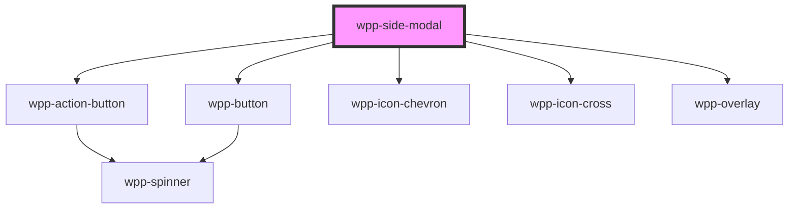

# wpp-side-modal

Create a dialog in a panel that slides in from the right side of the screen to display content that requires user interaction.

<!-- Auto Generated Below -->


> **[DEPRECATED]** The `actions` slot is deprecated and will be removed in the next major release (v3.0.0). Use the `actionsConfig` property instead.

## Usage

### Angular

```ts
import { Component } from '@angular/core'

@Component({
  // ...
})
export class SideModalExample {
  public isOpen: boolean = false

  public open(): void {
    this.isOpen = true
  }

  public close(): void {
    this.isOpen = false
  }

  // Action handlers for actionsConfig
  public handleCancel(): void {
    this.close()
  }

  public handleConfirm(): void {
    alert('Confirm action clicked')
  }

  public handleRemove(): void {
    alert('Remove action clicked')
  }

  /**
    The `actionsConfig` property is an array that can contain at most 1 of each:
      - 1 WppButton with variant = "primary" / "destructive"
      - 1 WppButton with variant = "secondary" / "destructive-secondary"
      - 1 WppActionButton with variant = "primary" / "destructive". The button also has to have an icon.
  */
  public actionsConfig = [
    {
      label: 'Cancel',
      variant: 'secondary',
      onClick: () => this.handleCancel(),
      size: 'm',
      name: 'Cancel-secondary-btn',
      ariaProps: { label: 'Cancel btn' },
    },
    {
      label: 'Confirm',
      variant: 'primary',
      onClick: () => this.handleConfirm(),
      size: 'm',
      name: 'confirm-primary-btn',
      ariaProps: { label: 'Confirm btn' },
    },
    {
      label: 'Remove',
      variant: 'destructive',
      onClick: () => this.handleRemove(),
      icon: 'wpp-icon-remove-circle',
      name: 'remove-destructive-btn',
      ariaProps: { label: 'Remove btn' },
    },
  ]
}
```

```html
<!-- Note: The `actions` slot is deprecated and will be removed in a future release. Please use the `actionsConfig` property instead. -->

<wpp-button (click)="open()">Open</wpp-button>

<!-- Using actionsConfig -->
<wpp-side-modal [open]="isOpen" (wppSideModalClose)="close()" [actionsConfig]="actionsConfig">
  <div slot="header">Lorem Ipsum</div>

  <div slot="body">
    <p>
      Lorem ipsum dolor sit amet, consectetur adipiscing elit, sed do eiusmod tempor incididunt ut labore et dolore
      magna aliqua.
    </p>
  </div>
</wpp-side-modal>

<!-- Using the deprecated actions slot -->
<wpp-side-modal [open]="isOpen" (onWppSideModalClose)="close()">
  <div slot="header">Lorem Ipsum</div>

  <div slot="body">
    <p>
      Lorem ipsum dolor sit amet, consectetur adipiscing elit, sed do eiusmod tempor incididunt ut labore et dolore
      magna aliqua.
    </p>
  </div>

  <!-- Deprecated actions slot -->
  <div slot="actions">
    <wpp-button variant="secondary" (click)="close()">Close</wpp-button>
  </div>
</wpp-side-modal>
```


### React

```tsx
import { useState } from 'react'
import { WppSideModal, WppButton } from '@platform-ui-kit/components-library-react'

export const SideModalExample = () => {
  const [isModalOpen, setModalStatus] = useState(false)

  const handleOpenModal = () => setModalStatus(true)
  const handleCloseModal = () => setModalStatus(false)

  // Action handlers for actionsConfig
  const handleCancel = () => handleCloseModal()
  const handleConfirm = () => alert('Confirm action clicked')
  const handleRemove = () => alert('Remove action clicked')

  return (
    <>
      <WppButton onClick={handleOpenModal}>Open Modal</WppButton>

      {/* Using actionsConfig */}
      <WppSideModal
        open={isModalOpen}
        onWppSideModalClose={handleCloseModal}
        /**
          The `actionsConfig` property is an array that can contain at most 1 of each:
            - 1 WppButton with variant = "primary" / "destructive"
            - 1 WppButton with variant = "secondary" / "destructive-secondary"
            - 1 WppActionButton with variant = "primary" / "destructive". The button also has to have an icon.
         */
        actionsConfig={[
          {
            label: 'Cancel',
            variant: 'secondary',
            onClick: handleCancel,
            name: 'Cancel-secondary-btn',
            ariaProps: { label: 'Cancel btn' },
          },
          {
            label: 'Confirm',
            variant: 'primary',
            onClick: handleConfirm,
            name: 'confirm-primary-btn',
            ariaProps: { label: 'Confirm btn' },
          },
          {
            label: 'Remove',
            variant: 'destructive',
            onClick: handleRemove,
            icon: 'wpp-icon-remove-circle',
            name: 'remove-destructive-btn',
            ariaProps: { label: 'Remove btn' },
          },
        ]}
      >
        <div slot="header">Title</div>
        <p slot="body">Body of the modal</p>
      </WppSideModal>

      {/* Using the deprecated actions slot */}
      <WppSideModal open={isModalOpen} onWppSideModalClose={handleCloseModal}>
        <div slot="header">Title</div>
        <p slot="body">Body of the modal</p>
        {/* Deprecated actions slot */}
        <div slot="actions">
          <WppButton variant="primary" size="s" onClick={handleCloseModal}>
            Close
          </WppButton>
        </div>
      </WppSideModal>
    </>
  )
}
```


### Vue

```vue
<script setup lang="ts">
import { ref } from 'vue'
import { WppButton, WppSideModal } from '@platform-ui-kit/components-library-vue'

const isSideModalOpen = ref(false)

const handleOpenSideModal = () => (isSideModalOpen.value = true)
const handleCloseSideModal = () => (isSideModalOpen.value = false)

// Action handlers for actionsConfig
const handleCancel = () => handleCloseSideModal()
const handleConfirm = () => alert('Confirm action clicked')
const handleRemove = () => alert('Remove action clicked')

/**
  The `actionsConfig` property is an array that can contain at most 1 of each:
    - 1 WppButton with variant = "primary" / "destructive"
    - 1 WppButton with variant = "secondary" / "destructive-secondary"
    - 1 WppActionButton with variant = "primary" / "destructive". The button also has to have an icon.
*/
const actionsConfig = [
  {
    label: 'Cancel',
    variant: 'secondary',
    onClick: handleCancel,
    size: 'm',
    name: 'Cancel-secondary-btn',
    ariaProps: { label: 'Cancel btn' },
  },
  {
    label: 'Confirm',
    variant: 'primary',
    onClick: handleConfirm,
    size: 'm',
    name: 'confirm-primary-btn',
    ariaProps: { label: 'Confirm btn' },
  },
  {
    label: 'Remove',
    variant: 'destructive',
    onClick: handleRemove,
    icon: 'wpp-icon-remove-circle',
    name: 'remove-destructive-btn',
    ariaProps: { label: 'Remove btn' },
  },
]
</script>

<template>
  <div>
    <WppButton @click="handleOpenSideModal">Open Side Modal</WppButton>

    <!-- Using actionsConfig -->
    <WppSideModal :open="isSideModalOpen" @wppSideModalClose="handleCloseSideModal" :actionsConfig="actionsConfig">
      <div slot="header">Title</div>
      <p slot="body">Body of the modal</p>
    </WppSideModal>

    <!-- Using the deprecated actions slot -->
    <WppSideModal :open="isSideModalOpen" @wppSideModalClose="handleCloseSideModal">
      <div slot="header">Title</div>
      <p slot="body">Body of the modal</p>
      <!-- Deprecated actions slot -->
      <div slot="actions">
        <WppButton variant="primary" size="s" @click="handleCloseSideModal"> Close </WppButton>
      </div>
    </WppSideModal>
  </div>
</template>

<!-- Note: The `actions` slot is deprecated and will be removed in a future release. Please use the `actionsConfig` property instead. -->
```


## Properties

| Property              | Attribute               | Description                                                                                                                                                                                                                                                                                                                                            | Type                                                                                                                                                                                                                                                                                                                                                                                                                                                                                                                                                                                                                                                                                                                                        | Default     |
| --------------------- | ----------------------- | ------------------------------------------------------------------------------------------------------------------------------------------------------------------------------------------------------------------------------------------------------------------------------------------------------------------------------------------------------ | ------------------------------------------------------------------------------------------------------------------------------------------------------------------------------------------------------------------------------------------------------------------------------------------------------------------------------------------------------------------------------------------------------------------------------------------------------------------------------------------------------------------------------------------------------------------------------------------------------------------------------------------------------------------------------------------------------------------------------------------- | ----------- |
| `actionsConfig`       | --                      | Configuration for rendering action buttons.  The `actionsConfig` property is an array that can contain at most 1 of each: - 1 WppButton with variant = "primary" / "destructive" - 1 WppButton with variant = "secondary" / "destructive-secondary" - 1 WppActionButton with variant = "primary" / "destructive". The button also has to have an icon. | `[FirstActionConfig, SecondActionConfig, ThirdActionConfig] \| [FirstActionConfig, SecondActionConfig] \| [FirstActionConfig, ThirdActionConfig, SecondActionConfig] \| [FirstActionConfig, ThirdActionConfig] \| [FirstActionConfig] \| [SecondActionConfig, FirstActionConfig, ThirdActionConfig] \| [SecondActionConfig, FirstActionConfig] \| [SecondActionConfig, ThirdActionConfig, FirstActionConfig] \| [SecondActionConfig, ThirdActionConfig] \| [SecondActionConfig] \| [ThirdActionConfig, FirstActionConfig, SecondActionConfig] \| [ThirdActionConfig, FirstActionConfig] \| [ThirdActionConfig, SecondActionConfig, FirstActionConfig] \| [ThirdActionConfig, SecondActionConfig] \| [ThirdActionConfig] \| [] \| undefined` | `undefined` |
| `backdropVisible`     | `backdrop-visible`      | If the side modal backdrop is visible.                                                                                                                                                                                                                                                                                                                 | `boolean`                                                                                                                                                                                                                                                                                                                                                                                                                                                                                                                                                                                                                                                                                                                                   | `true`      |
| `disableOutsideClick` | `disable-outside-click` | If the side modal can be closed by clicking outside of it.                                                                                                                                                                                                                                                                                             | `boolean`                                                                                                                                                                                                                                                                                                                                                                                                                                                                                                                                                                                                                                                                                                                                   | `false`     |
| `formConfig`          | --                      | If you pass this prop wrapper of dialog will be rendered as form.                                                                                                                                                                                                                                                                                      | `SideModalFormConfig \| undefined`                                                                                                                                                                                                                                                                                                                                                                                                                                                                                                                                                                                                                                                                                                          | `undefined` |
| `open`                | `open`                  | If the side modal is open.                                                                                                                                                                                                                                                                                                                             | `boolean`                                                                                                                                                                                                                                                                                                                                                                                                                                                                                                                                                                                                                                                                                                                                   | `false`     |
| `size`                | `size`                  | Indicates the side modal size                                                                                                                                                                                                                                                                                                                          | `"2xl" \| "l" \| "m" \| "s" \| "xl" \| undefined`                                                                                                                                                                                                                                                                                                                                                                                                                                                                                                                                                                                                                                                                                           | `undefined` |
| `withBackButton`      | `with-back-button`      | If the side modal has back button in the header.                                                                                                                                                                                                                                                                                                       | `boolean`                                                                                                                                                                                                                                                                                                                                                                                                                                                                                                                                                                                                                                                                                                                                   | `false`     |


## Events

| Event                         | Description                                                                                                                                                                                                  | Type                                 |
| ----------------------------- | ------------------------------------------------------------------------------------------------------------------------------------------------------------------------------------------------------------ | ------------------------------------ |
| `wppSideModalBackButtonClick` | Handles the side modal back button click.                                                                                                                                                                    | `CustomEvent<void>`                  |
| `wppSideModalClose`           | Handles the side modal closing actions.                                                                                                                                                                      | `CustomEvent<SideModalCloseDetails>` |
| `wppSideModalCloseComplete`   | Event emitted when the close animation ends.                                                                                                                                                                 | `CustomEvent<SideModalCloseDetails>` |
| `wppSideModalCloseStart`      | Event emitted when the close animation starts.                                                                                                                                                               | `CustomEvent<SideModalCloseDetails>` |
| `wppSideModalOpen`            | <span style="color:red">**[DEPRECATED]**</span> - this prop will be deleted in version 4.0.0 . Use `wppSideModalOpenStart`/`wppSideModalOpenComplete` instead<br/><br/>Handles the side modal click actions. | `CustomEvent<void>`                  |
| `wppSideModalOpenComplete`    | Event emitted when the open animation ends.                                                                                                                                                                  | `CustomEvent<void>`                  |
| `wppSideModalOpenStart`       | Event emitted when the open animation starts.                                                                                                                                                                | `CustomEvent<void>`                  |


## Methods

### `closeModal() => Promise<void>`

Method for closing the modal.

#### Returns

Type: `Promise<void>`


### `openModal() => Promise<void>`

Method for opening the modal.

#### Returns

Type: `Promise<void>`


## Slots

| Slot        | Description                                                                                                                                                  |
| ----------- | ------------------------------------------------------------------------------------------------------------------------------------------------------------ |
| `"actions"` | Content that is displayed within the `.side-modal` element. To add actions, pass `slot="actions"` – can contain any action buttons.                          |
| `"body"`    | Content that is displayed within the `.side-modal` element. To add body content, pass `slot="body"` – can contain any text that describes the modal actions. |
| `"header"`  | Content that is displayed within the `.side-modal` element. To add header content, pass `slot="header"` – can contain the modal title.                       |


## Shadow Parts

| Part                        | Description                                  |
| --------------------------- | -------------------------------------------- |
| `"actions"`                 | actions slot element                         |
| `"back-button"`             | Back button element                          |
| `"button"`                  | Button element                               |
| `"content"`                 | modal content element                        |
| `"header-container"`        | root header element                          |
| `"header-with-back-button"` | wrapper with header and back button elements |
| `"header-wrapper"`          | element for slotted header                   |
| `"icon-chevron"`            | icon chevron element                         |
| `"icon-cross"`              | icon cross element                           |
| `"overlay"`                 | side modal overlay element                   |
| `"wrapper"`                 | component wrapper element                    |


## CSS Custom Properties

| Name                                                        | Description |
| ----------------------------------------------------------- | ----------- |
| `--wpp-side-modal-actions-bg-color`                         |             |
| `--wpp-side-modal-actions-border-color`                     |             |
| `--wpp-side-modal-actions-paddings`                         |             |
| `--wpp-side-modal-back-button-margin-left`                  |             |
| `--wpp-side-modal-bg-color`                                 |             |
| `--wpp-side-modal-body-paddings`                            |             |
| `--wpp-side-modal-box-shadow`                               |             |
| `--wpp-side-modal-close-button-margin-left`                 |             |
| `--wpp-side-modal-header-paddings`                          |             |
| `--wpp-side-modal-header-with-back-button-paddings`         |             |
| `--wpp-side-modal-overlay-background-color`                 |             |
| `--wpp-side-modal-vertical-position-animation-minus-number` |             |
| `--wpp-side-modal-width-2xl`                                |             |
| `--wpp-side-modal-width-l`                                  |             |
| `--wpp-side-modal-width-m`                                  |             |
| `--wpp-side-modal-width-s`                                  |             |
| `--wpp-side-modal-width-xl`                                 |             |


## Dependencies

### Depends on

- [wpp-action-button](../wpp-action-button)
- [wpp-button](../wpp-button)
- [wpp-icon-chevron](../wpp-icon/components/arrows/arrows/wpp-icon-chevron)
- [wpp-icon-cross](../wpp-icon/components/add-and-remove/wpp-icon-cross)
- [wpp-overlay](../wpp-overlay)

### Graph


----------------------------------------------

*Built with [StencilJS](https://stenciljs.com/)*
