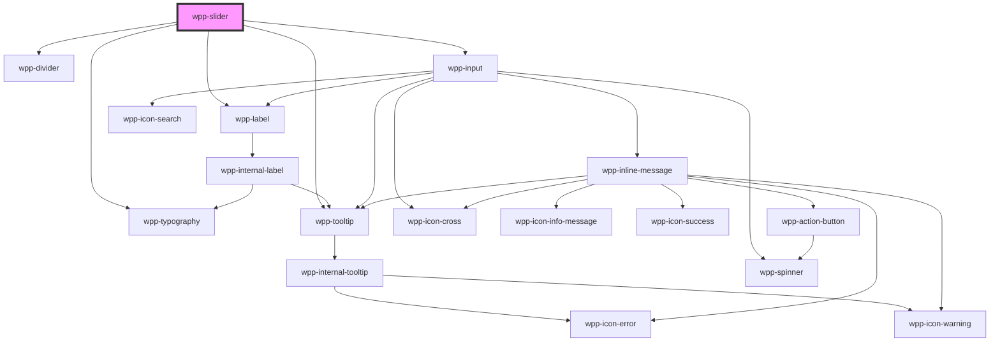

# wpp-slider

Create a control that allows users to input a value within a fixed range.

> **Note:** For the time being, works with integer values only. You cannot change the `min` and `max` props in runtime because this breaks the layout.

<!-- Auto Generated Below -->


## Usage

### Angular

```ts
@Component({
  ...
})
export class SliderExample {
  public value: number = 5

  public handleSliderChange(event: Event): void {
    this.value = (event as CustomEvent<SliderChangeEventDetail>).detail.value
  }
}
```

```html
<wpp-slider size="s" [value]="value" (wppChange)="handleSliderChange($event)"></wpp-slider>
```


### React

```tsx
import React, { useState } from 'react'
import { WppSlider, WppTypography } from '@platform-ui-kit/components-library-react'

import styles from './SlidersVC.module.css'

export const SliderExample = () => {
  const initiallySingleValue = 1
  const initiallyRangeValue = [3, 5]
  const marks = [
    {
      label: 'low',
      value: 1,
    },
    {
      label: 'medium',
      value: 2,
    },
    {
      label: 'rare',
      value: 3,
    },
  ]

  const [singleValue, setSingleValue] = useState(initiallySingleValue)
  const [rangeValue, setRangeValue] = useState(initiallyRangeValue)

  const handleSingleSliderChange = (event: CustomEvent) => {
    setSingleValue(event.detail.value)
  }

  const handleRangeSliderChange = (event: CustomEvent) => {
    setRangeValue(event.detail.value)
  }

  return (
    <div>
      <div>
        <WppTypography>Range slider with generated marks</WppTypography>
        <WppSlider size="s" type="range" value={rangeValue} max={7} step={2} marks onWppChange={handleRangeSliderChange} />
        <WppTypography>
          Result of range slider: {rangeValue[0]} - {rangeValue[1]}
        </WppTypography>
      </div>

      <div>
        <WppTypography>Single slider with custom marks</WppTypography>
        <WppSlider size="s" value={singleValue} max={3} marks={marks} onWppChange={handleSingleSliderChange} />
        <WppTypography>Result of single slider: {singleValue}</WppTypography>
      </div>
    </div>
  )
}
```


### Vue

```vue
<script setup lang="ts">
import { ref } from "vue";

import {
  WppSlider,
  WppTypography,
} from "@platform-ui-kit/components-library-vue";

const initiallySingleValue = 1;
const initiallyRangeValue = [3, 5];
const marks = [
  {
    label: "low",
    value: 1,
  },
  {
    label: "medium",
    value: 2,
  },
  {
    label: "rare",
    value: 3,
  },
];

const singleValue = ref(initiallySingleValue);
const rangeValue = ref(initiallyRangeValue);

const handleSingleSliderChange = (event: CustomEvent) => {
  console.log("single slider data =>", event.detail);

  singleValue.value = event.detail.value;
};

const handleRangeSliderChange = (event: CustomEvent) => {
  console.log("range slider data =>", event.detail);

  rangeValue.value = event.detail.value;
};
</script>

<template>
  <div class="range">
    <h2>Range Slider</h2>
    <div class="slider">
      <WppSlider
        size="s"
        type="range"
        :value="rangeValue"
        max="7"
        step="2"
        marks
        @wppChange="handleRangeSliderChange"
        :labelConfig="{
          icon: 'wpp-icon-info',
          text: 'Range slider with stepped selection',
          description: 'Description',
          locales: {
            optional: 'Optional',
          },
        }"
        required
      />
      <WppTypography class="result">
        Result of range slider: {{ rangeValue[0] }} - {{ rangeValue[1] }}
      </WppTypography>
    </div>
  </div>

  <div class="single">
    <h2>Single Slider</h2>
    <div class="slider">
      <WppSlider
        size="s"
        :value="singleValue"
        max="3"
        :marks="marks"
        @wppChange="handleSingleSliderChange"
        :labelConfig="{ text: 'Single slider with custom marks' }"
        required
      />
      <WppTypography class="result">
        Result of single slider: {{ singleValue }}
      </WppTypography>
    </div>
  </div>
</template>
```


## Properties

| Property             | Attribute     | Description                                                                                                                                                                                         | Type                                                      | Default                                           |
| -------------------- | ------------- | --------------------------------------------------------------------------------------------------------------------------------------------------------------------------------------------------- | --------------------------------------------------------- | ------------------------------------------------- |
| `ariaProps`          | --            | Contains the slider `aria-` props.                                                                                                                                                                  | `AriaProps`                                               | `{}`                                              |
| `continuous`         | `continuous`  | If the slider is continuous.                                                                                                                                                                        | `boolean`                                                 | `false`                                           |
| `disabled`           | `disabled`    | If the slider is disabled.                                                                                                                                                                          | `boolean`                                                 | `false`                                           |
| `inputWidth`         | `input-width` | Defines the width of the inputs in "px". Same width will apply to both inputs in the range slider. The default value is "68px".                                                                     | ``${number}px``                                           | `DEFAULT_INPUT_WIDTH`                             |
| `labelConfig`        | --            | Indicates label config                                                                                                                                                                              | `LabelConfig \| undefined`                                | `undefined`                                       |
| `labelTooltipConfig` | --            | Tooltip config for label, under the hood tooltip using tippy.js, all information about this library and available props you can see via this link `https://atomiks.github.io/tippyjs/v6/all-props/` | `DropdownConfig`                                          | `{     popperOptions: { strategy: 'fixed' },   }` |
| `marks`              | `marks`       | Defines the marker values between which users can move the slider.                                                                                                                                  | `MarkState[] \| boolean`                                  | `false`                                           |
| `maskOptions`        | --            | Defines the mask options for the inputs.                                                                                                                                                            | `DecimalMaskOptions \| DecimalMaskOptions[] \| undefined` | `undefined`                                       |
| `max`                | `max`         | Defines the the maximum allowed slider value.                                                                                                                                                       | `number`                                                  | `100`                                             |
| `min`                | `min`         | Defines the minimum allowed slider value.                                                                                                                                                           | `number`                                                  | `1`                                               |
| `name`               | `name`        | Defines the slider name.                                                                                                                                                                            | `string \| undefined`                                     | `undefined`                                       |
| `required`           | `required`    | If the slider is required.                                                                                                                                                                          | `boolean`                                                 | `false`                                           |
| `size`               | `size`        | Defines the size of the slider.                                                                                                                                                                     | `"m" \| "s" \| undefined`                                 | `'m'`                                             |
| `step`               | `step`        | Defines the interval between slider markers.                                                                                                                                                        | `number`                                                  | `1`                                               |
| `type`               | `type`        | Defines the slider type.                                                                                                                                                                            | `"range" \| "single" \| undefined`                        | `'single'`                                        |
| `value` _(required)_ | `value`       | Defines the default slider value.                                                                                                                                                                   | `number \| number[]`                                      | `undefined`                                       |
| `withInput`          | `with-input`  | If the slider has an input field that allows users to enter a value for the slider to display.                                                                                                      | `boolean`                                                 | `false`                                           |
| `withValue`          | `with-value`  | If the slider displays its current value.                                                                                                                                                           | `boolean`                                                 | `false`                                           |


## Events

| Event       | Description                            | Type                                                                                     |
| ----------- | -------------------------------------- | ---------------------------------------------------------------------------------------- |
| `wppBlur`   | Emitted when the slider loses focus.   | `CustomEvent<FocusEvent>`                                                                |
| `wppChange` | Emitted when the slider value changes. | `CustomEvent<BaseFormControlEventDetail<SliderValue> & { name?: string \| undefined; }>` |
| `wppFocus`  | Emitted when the slider is in focus.   | `CustomEvent<FocusEvent>`                                                                |


## Methods

### `setFocus() => Promise<void>`

Sets focus on native input

#### Returns

Type: `Promise<void>`


## Shadow Parts

| Part                       | Description                             |
| -------------------------- | --------------------------------------- |
| `"control-wrapper"`        | controls wrapper element                |
| `"divider"`                | divider element                         |
| `"editable-input-wrapper"` | controls editable input wrapper element |
| `"input-max"`              | input-max element                       |
| `"input-min"`              | input-min element                       |
| `"input-number"`           | input number element                    |
| `"input-slider-max"`       | input-slider-max element                |
| `"input-slider-min"`       | input-slider-min element                |
| `"input-wrapper"`          | input wrapper element                   |
| `"label"`                  | Label text element                      |
| `"mark"`                   | mark element                            |
| `"mark-circle"`            | mark bg circle element                  |
| `"mark-inner"`             | mark inner element                      |
| `"marks-list"`             | marks list element                      |
| `"slider"`                 | slider element                          |
| `"value"`                  | slider value text element               |
| `"value-divider"`          | value-divider element                   |
| `"value-wrapper"`          | value-wrapper element                   |


## CSS Custom Properties

| Name                                            | Description |
| ----------------------------------------------- | ----------- |
| `--wpp-slider-clickable-wrapper-height`         |             |
| `--wpp-slider-divider-bg-color`                 |             |
| `--wpp-slider-divider-bg-color-disabled`        |             |
| `--wpp-slider-divider-height`                   |             |
| `--wpp-slider-divider-width`                    |             |
| `--wpp-slider-handle-bg-color`                  |             |
| `--wpp-slider-handle-bg-color-active`           |             |
| `--wpp-slider-handle-bg-color-disabled`         |             |
| `--wpp-slider-handle-bg-color-hover`            |             |
| `--wpp-slider-handle-border-color`              |             |
| `--wpp-slider-handle-border-color-active`       |             |
| `--wpp-slider-handle-border-color-disabled`     |             |
| `--wpp-slider-handle-border-color-hover`        |             |
| `--wpp-slider-handle-border-radius`             |             |
| `--wpp-slider-handle-border-style`              |             |
| `--wpp-slider-handle-border-width`              |             |
| `--wpp-slider-handle-first-border-color-focus`  |             |
| `--wpp-slider-handle-second-border-color-focus` |             |
| `--wpp-slider-handle-size`                      |             |
| `--wpp-slider-input-bg-color`                   |             |
| `--wpp-slider-input-bg-color-active`            |             |
| `--wpp-slider-input-bg-color-disabled`          |             |
| `--wpp-slider-input-bg-color-hover`             |             |
| `--wpp-slider-input-border-color`               |             |
| `--wpp-slider-input-border-color-active`        |             |
| `--wpp-slider-input-border-color-disabled`      |             |
| `--wpp-slider-input-border-color-hover`         |             |
| `--wpp-slider-input-border-style`               |             |
| `--wpp-slider-input-border-width`               |             |
| `--wpp-slider-input-padding`                    |             |
| `--wpp-slider-input-text-color-disabled`        |             |
| `--wpp-slider-input-wrapper-divider-margin`     |             |
| `--wpp-slider-label-margin`                     |             |
| `--wpp-slider-mark-border-radius`               |             |
| `--wpp-slider-mark-color`                       |             |
| `--wpp-slider-mark-color-active`                |             |
| `--wpp-slider-mark-color-active-disabled`       |             |
| `--wpp-slider-mark-color-disabled`              |             |
| `--wpp-slider-mark-label-color`                 |             |
| `--wpp-slider-mark-label-margin`                |             |
| `--wpp-slider-mark-size`                        |             |
| `--wpp-slider-range-input-width`                |             |
| `--wpp-slider-single-input-width`               |             |
| `--wpp-slider-track-bg-color`                   |             |
| `--wpp-slider-track-bg-color-active`            |             |
| `--wpp-slider-track-bg-color-disabled`          |             |
| `--wpp-slider-track-border-radius`              |             |
| `--wpp-slider-track-height`                     |             |
| `--wpp-slider-value-wrapper-divider-margin`     |             |
| `--wpp-slider-value-wrapper-margin`             |             |
| `--wpp-slider-width`                            |             |


## Dependencies

### Depends on

- [wpp-label](../wpp-label)
- [wpp-typography](../wpp-typography)
- [wpp-divider](../wpp-divider)
- [wpp-input](../wpp-input)
- [wpp-tooltip](../wpp-tooltip)

### Graph


----------------------------------------------

*Built with [StencilJS](https://stenciljs.com/)*
