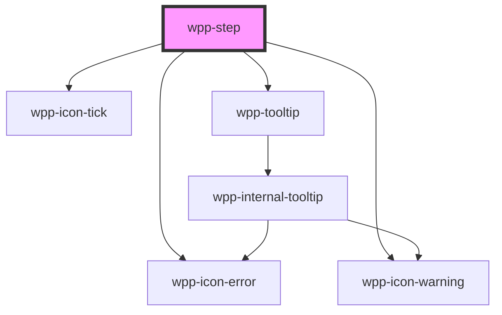

# wpp-step

Step is element that can contain text, show number of step, error step, also include substep if it's needed. Generally they are placed in a Stepper component with other steps.

<!-- Auto Generated Below -->

## Properties

| Property          | Attribute          | Description                                                                                                                                                | Type                         | Default                           |
| ----------------- | ------------------ | ---------------------------------------------------------------------------------------------------------------------------------------------------------- | ---------------------------- | --------------------------------- |
| `active`          | `active`           | If the current active step is indicated. Do not use this prop in specific steps, as it is automaticly passed from the `Stepper` component.                 | `boolean`                    | `false`                           |
| `completed`       | `completed`        | If a specific step is complete. Do not use this prop in specific steps, as it is automaticly passed from the `Stepper` component.                          | `boolean`                    | `false`                           |
| `completedLine`   | `completed-line`   | If a step has a substep that must be completed. Do not use this prop in specific steps, as it is automaticly passed from the `Stepper` component.          | `boolean`                    | `false`                           |
| `error`           | `error`            | Defines If a step is styled as an error.                                                                                                                   | `boolean`                    | `false`                           |
| `iconDescription` | `icon-description` | Indicates iconDescription when hover on warning or error icons                                                                                             | `string`                     | `undefined`                       |
| `index`           | `index`            | Defines the current step index. Do not use this prop in specific steps, as it is automaticly passed from the `Stepper` component.                          | `number \| undefined`        | `undefined`                       |
| `lastStep`        | `last-step`        | If a step is the last step. Do not use this prop in specific steps, as it is automaticly passed from the `Stepper` component.                              | `boolean`                    | `false`                           |
| `locales`         | --                 | **[DEPRECATED]** this prop will be deleted in version 4.0.0  Indicates locales for step component                   | `StepLocales`                | `{     optional: 'Optional',   }` |
| `optional`        | `optional`         | **[DEPRECATED]** this prop will be deleted in version 4.0.0  If a step is optional.                                 | `boolean \| undefined`       | `false`                           |
| `orientation`     | `orientation`      | Defines the step orientation. Do not use this prop in specific steps, as it is automaticly passed from the `Stepper` component.                            | `"horizontal" \| "vertical"` | `'vertical'`                      |
| `step`            | `step`             | Defines the current step number. Do not use this prop in specific steps, as it is automaticly passed from the `Stepper` component.                         | `number \| undefined`        | `undefined`                       |
| `substep`         | `substep`          | If a step is a substep.                                                                                                                                    | `boolean`                    | `false`                           |
| `warning`         | `warning`          | If `true`, step indicates warning                                                                                                                          | `boolean`                    | `false`                           |
| `width`           | `width`            | Defines the step width. This prop is used in horizontal steppers only. When the `stepAmount` prop is used in `Stepper`, this prop is passed automatically. | `number \| undefined`        | `undefined`                       |

## Events

| Event           | Description                        | Type                                 |
| --------------- | ---------------------------------- | ------------------------------------ |
| `wppStepChange` | Emitted when the step was selected | `CustomEvent<StepChangeEventDetail>` |

## Slots

| Slot            | Description                                                                                        |
| --------------- | -------------------------------------------------------------------------------------------------- |
|                 | Can be used to display substeps for a specific step. The default slot, without the name attribute. |
| `"description"` | Text displayed as the description of the step, right below the title.                              |
| `"label"`       | Text content displayed within the cell.                                                            |

## Shadow Parts

| Part               | Description                  |
| ------------------ | ---------------------------- |
| `"icon"`           | step icon (warning, error)   |
| `"last-step"`      | last step wrapper element    |
| `"last-step-text"` | last step text element       |
| `"optional"`       | optional text element        |
| `"step"`           | step content wrapper element |
| `"step-bg"`        | step bg element              |
| `"step-index"`     | step index text element      |
| `"step-label"`     | step label text element      |
| `"wrapper"`        | component wrapper element    |

## CSS Custom Properties

| Name                                                  | Description |
| ----------------------------------------------------- | ----------- |
| `--wpp-step-bg-color`                                 |             |
| `--wpp-step-bg-color-completed`                       |             |
| `--wpp-step-border-color`                             |             |
| `--wpp-step-border-color-active`                      |             |
| `--wpp-step-border-color-completed`                   |             |
| `--wpp-step-border-width`                             |             |
| `--wpp-step-connector-line-border-color`              |             |
| `--wpp-step-connector-line-border-color-completed`    |             |
| `--wpp-step-container-width`                          |             |
| `--wpp-step-height`                                   |             |
| `--wpp-step-horizontal-icon-margin-left`              |             |
| `--wpp-step-horizontal-line-width`                    |             |
| `--wpp-step-horizontal-step-index-bg-color`           |             |
| `--wpp-step-horizontal-step-index-bg-color-active`    |             |
| `--wpp-step-horizontal-step-index-bg-color-hover`     |             |
| `--wpp-step-horizontal-step-index-bg-color-pressed`   |             |
| `--wpp-step-horizontal-text-color`                    |             |
| `--wpp-step-horizontal-text-color-active`             |             |
| `--wpp-step-horizontal-text-wrapper-bg-color`         |             |
| `--wpp-step-horizontal-text-wrapper-bg-color-active`  |             |
| `--wpp-step-horizontal-text-wrapper-bg-color-hover`   |             |
| `--wpp-step-horizontal-text-wrapper-bg-color-pressed` |             |
| `--wpp-step-horizontal-text-wrapper-margin`           |             |
| `--wpp-step-horizontal-text-wrapper-padding`          |             |
| `--wpp-step-line-min-height`                          |             |
| `--wpp-step-optional-text-font-weight`                |             |
| `--wpp-step-substep-height`                           |             |
| `--wpp-step-substep-width`                            |             |
| `--wpp-step-text-color`                               |             |
| `--wpp-step-text-color-active`                        |             |
| `--wpp-step-text-color-completed`                     |             |
| `--wpp-step-vertical-bg-color`                        |             |
| `--wpp-step-vertical-bg-color-active`                 |             |
| `--wpp-step-vertical-bg-color-hover`                  |             |
| `--wpp-step-vertical-bg-color-pressed`                |             |
| `--wpp-step-vertical-icon-margin-right`               |             |
| `--wpp-step-vertical-line-width`                      |             |
| `--wpp-step-vertical-text-color`                      |             |
| `--wpp-step-vertical-text-color-active`               |             |
| `--wpp-step-vertical-text-margin`                     |             |
| `--wpp-step-vertical-text-margin-left`                |             |
| `--wpp-step-vertical-text-margin-right`               |             |
| `--wpp-step-width`                                    |             |

## Dependencies

### Depends on

- [wpp-icon-tick](../../../wpp-icon/components/system/controls/wpp-icon-tick)
- [wpp-icon-error](../../../wpp-icon/components/status/status/wpp-icon-error)
- [wpp-icon-warning](../../../wpp-icon/components/status/status/wpp-icon-warning)
- [wpp-tooltip](../../../wpp-tooltip)

### Graph

----------------------------------------------

*Built with [StencilJS](https://stenciljs.com/)*
