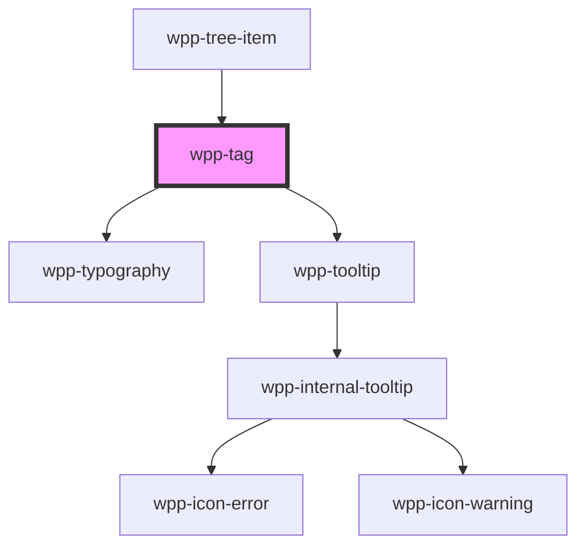

# wpp-tag


<!-- Auto Generated Below -->


## Usage

### Angular

```html
<wpp-tag [label]="text" [variant]="variant"></wpp-tag>
```

**component.ts**

```tsx
import { Component } from '@angular/core';

@Component({…})

export class TagExample {
  text = 'Title'
  variant = 'positive'
}
```


### React

```tsx
import { WppTag } from '@platform-ui-kit/components-library-react'

export const TagExample = () => (
  <WppTag
    label="Title"
    variant="positive"
  />
)
```


### Vue

```vue

<script setup lang="ts">
import { WppTag } from '@platform-ui-kit/components-library-vue'
</script>

<template>
  <WppTag
    label="Title"
    variant="positive"
  />
</template>


```


## Properties

| Property                | Attribute                 | Description                                                                                                                                                                                                                                                                                   | Type                                                                                                                                                                 | Default     |
| ----------------------- | ------------------------- | --------------------------------------------------------------------------------------------------------------------------------------------------------------------------------------------------------------------------------------------------------------------------------------------- | -------------------------------------------------------------------------------------------------------------------------------------------------------------------- | ----------- |
| `categoricalColorIndex` | `categorical-color-index` | <span style="color:red">**[DEPRECATED]**</span> - This property will be removed in v4.0.0. Use `variant` instead.<br/><br/>Selects the tag color from categorical palette. This property has lower priority than `variant`. If `variant` is set, the `categoricalColorIndex` will be ignored. | `1 \| 2 \| 3 \| 4 \| 5 \| 6 \| 7 \| 8 \| 9 \| undefined`                                                                                                             | `undefined` |
| `label`                 | `label`                   | Defines the tag label.                                                                                                                                                                                                                                                                        | `string \| undefined`                                                                                                                                                | `undefined` |
| `maxLabelLength`        | `max-label-length`        | Maximum label length (in characters) of single item                                                                                                                                                                                                                                           | `number`                                                                                                                                                             | `30`        |
| `tooltipConfig`         | --                        | Defines the dropdown configuration. Under the hood dropdown using tippy.js, all information about this library and available props you can see via this link `https://atomiks.github.io/tippyjs/v6/all-props/`                                                                                | `DropdownConfig`                                                                                                                                                     | `{}`        |
| `variant`               | `variant`                 | Defines the tag style. This property has higher priority than `categoricalColorIndex`. If `variant` is set, the `categoricalColorIndex` will be ignored.                                                                                                                                      | `"Cat-1" \| "Cat-2" \| "Cat-3" \| "Cat-4" \| "Cat-5" \| "Cat-6" \| "Cat-7" \| "Cat-8" \| "Cat-9" \| "negative" \| "neutral" \| "positive" \| "warning" \| undefined` | `undefined` |
| `withIcon`              | `with-icon`               | <span style="color:red">**[DEPRECATED]**</span> - this prop will be deleted in version 4.0.0. If you want tag with icon, you can add slot with some icon inside tag component<br/><br/>Defines the if the tag icon displayed.                                                                 | `boolean \| undefined`                                                                                                                                               | `false`     |


## Slots

| Slot           | Description                                                                        |
| -------------- | ---------------------------------------------------------------------------------- |
| `"icon-start"` | Can contain an icon that will be placed before the main content, e.g. a user icon. |


## Shadow Parts

| Part             | Description         |
| ---------------- | ------------------- |
| `"label"`        | Label text element  |
| `"overlay"`      | tag overlay         |
| `"tooltip"`      | tag wrapper content |
| `"tooltip-text"` | tag text component  |


## CSS Custom Properties

| Name                            | Description |
| ------------------------------- | ----------- |
| `--wpp-tag-bg-opacity`          |             |
| `--wpp-tag-border-radius`       |             |
| `--wpp-tag-height`              |             |
| `--wpp-tag-icon-margin`         |             |
| `--wpp-tag-icon-padding`        |             |
| `--wpp-tag-negative-bg-color`   |             |
| `--wpp-tag-negative-bg-opacity` |             |
| `--wpp-tag-negative-color`      |             |
| `--wpp-tag-neutral-bg-color`    |             |
| `--wpp-tag-neutral-bg-opacity`  |             |
| `--wpp-tag-neutral-color`       |             |
| `--wpp-tag-padding`             |             |
| `--wpp-tag-positive-bg-color`   |             |
| `--wpp-tag-positive-bg-opacity` |             |
| `--wpp-tag-positive-color`      |             |
| `--wpp-tag-warning-bg-color`    |             |
| `--wpp-tag-warning-bg-opacity`  |             |
| `--wpp-tag-warning-color`       |             |
| `--wpp-tag-with-icon-padding`   |             |


## Dependencies

### Used by

 - [wpp-tree-item](../wpp-tree/components/wpp-tree-item)

### Depends on

- [wpp-typography](../wpp-typography)
- [wpp-tooltip](../wpp-tooltip)

### Graph


----------------------------------------------

*Built with [StencilJS](https://stenciljs.com/)*
