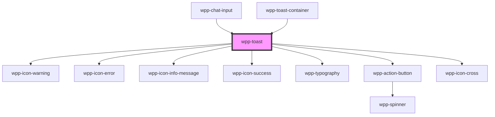

# wpp-toast

Create a lightweight and easily customizable alert message.

<!-- Auto Generated Below -->


## Usage

### Angular

```ts
@Component({
  ...
})
export class ToastExample {
  @ViewChild('toastContainer')
  private readonly toastContainer!: WppToastContainer;

  public addToast(): void {
    this.toastContainer.addToast({
      message: 'Message',
      type: 'success'
    });
  }
}
```

```html
<wpp-button (click)="addToast()">Add Toast</wpp-button>
<wpp-toast-container #toastContainer [maxToastsToDisplay]="5"></wpp-toast-container>
```


### React

```tsx
import React, { useRef, useEffect, useState } from 'react'
import { WppToastContainer, WppButton } from '@platform-ui-kit/components-library-react'

export const useToast = () => {
  const [toastRef, setToastRef] = useState<HTMLWppToastContainerElement | null>()

  const showToast = (config: any) => {
    toastRef?.addToast(config)
  }

  useEffect(() => {
    setToastRef(document.querySelector('wpp-toast-container'))
  })

  return {
    showToast,
  }
}

export const ToastExample = () => {
  const childRef = useRef(null)

  const { showToast } = useToast()

  const handleAddToast = () => {
    showToast({
      message: `Successful message`,
      type: 'success',
      header: 'Title',
      duration: 4000,
      primaryBtn: {
        label: 'Button',
        variant: 'tertiary',
        disabled: false,
        loading: false,
        onClick: () => console.log('primaryBtn'),
      },
      maxMessageLines: 2,
      icon: {
        name: 'wpp-icon-phone'
      }
    })
  }

  return (
    <>
      <WppButton variant="secondary" onClick={handleAddToast}>
        Add Toast
      </WppButton>
      <WppToastContainer maxToastsToDisplay={5} ref={childRef} />
    </>
  )
}
```


### Vue

```vue

<script setup lang="ts">
import { ref, onMounted } from "vue";

import {
  WppToastContainer,
  WppButton,
  WppToast,
} from "@platform-ui-kit/components-library-vue";

const childRef = ref(null);
const toastRef = ref<any>(null);

onMounted(() => {
  setTimeout(() => {
    toastRef.value = document.querySelector(".wpp-toast-container");
  }, 0);
});

const primaryButton = {
  label: "Button",
  variant: "inverted" as const,
  disabled: false,
  loading: false,
  onClick: () => console.log("Clicked"),
};

const showToast = (config: any) => {
  toastRef.value?.addToast(config);
};

const handleAddToast = () => {
  showToast({
    text: `Successful message`,
    type: "success",
    header: "Title",
    duration: 4000,
    primaryBtn: {
      label: "Button",
      variant: "inverted" as const,
      disabled: false,
      loading: false,
      onClick: () => console.log(":primaryBtn"),
    },
  });
};
</script>

<template>
  <div>
    <WppButton variant="secondary" @click="handleAddToast">
      Add Toast
    </WppButton>
    <WppToastContainer :ref="childRef" maxToastsToDisplay="5" />

    <div class="toasts-container">
      <div class="items">
        <h3>Default Message Toasts</h3>
        <WppToast
          class="item"
          header="Error Header Text"
          message="Error Message Text"
          type="error"
          duration="60000"
        />

        <WppToast
          class="item"
          header="Warning Header Text"
          message="Warning Message Text"
          type="warning"
          duration="60000"
        />

        <WppToast
          class="item"
          header="Info Header"
          message="Info Message Text"
          type="information"
          duration="60000"
        />

        <WppToast
          class="item"
          header="Success Header Text"
          message="Success Message Text"
          type="success"
          duration="60000"
        />

        <WppToast
          class="item"
          message="Text without header"
          type="error"
          duration="60000"
        />

        <WppToast
          class="item"
          header="Header text without message text"
          message=""
          type="warning"
          duration="60000"
        />

        <WppToast
          class="item"
          header="Very long header message Very long header message Very long header message Very long header message "
          message="Very long message Very long message Very long message Very long message Very long message Very long message "
          type="information"
          duration="60000"
        />

        <WppToast
          class="item"
          message="Very long message Very long message Very long message Very long message Very long message Very long message "
          type="information"
          duration="60000"
        />
      </div>

      <div class="items">
        <h3>Message Toasts with Action Button</h3>
        <WppToast
          class="item"
          header="Error Header Text"
          message="Error Message Text"
          type="error"
          :primaryBtn="primaryButton"
          duration="60000"
        />

        <WppToast
          class="item"
          header="Warning Header Text"
          message="Warning Message Text"
          type="warning"
          :primaryBtn="primaryButton"
          duration="60000"
        />

        <WppToast
          class="item"
          header="Info Header"
          message="Info Message Text"
          type="information"
          :primaryBtn="primaryButton"
          duration="60000"
        />

        <WppToast
          class="item"
          header="Success Header Text"
          message="Success Message Text"
          type="success"
          :primaryBtn="primaryButton"
          duration="60000"
        />

        <WppToast
          class="item"
          message="Text without header"
          type="error"
          :primaryBtn="primaryButton"
          duration="60000"
        />

        <WppToast
          class="item"
          header="Header text without message text"
          message=""
          type="warning"
          :primaryBtn="primaryButton"
          duration="60000"
        />

        <WppToast
          class="item"
          header="Very long header message Very long header message Very long header message Very long header message "
          message="Very long message Very long message Very long message Very long message Very long message Very long message "
          type="information"
          :primaryBtn="primaryButton"
          duration="60000"
        />

        <WppToast
          class="item"
          message="Very long message Very long message Very long message Very long message Very long message Very long message "
          type="information"
          :primaryBtn="primaryButton"
          duration="60000"
        />
      </div>
    </div>
  </div>
</template>

<style scoped>
.items {
  margin-bottom: 50px;
}

.item {
  margin-right: 15px;
}
</style>


```


## Properties

| Property               | Attribute           | Description                                                                                                                                                                                                  | Type                                                                                                                                             | Default     |
| ---------------------- | ------------------- | ------------------------------------------------------------------------------------------------------------------------------------------------------------------------------------------------------------ | ------------------------------------------------------------------------------------------------------------------------------------------------ | ----------- |
| `ariaProps`            | --                  | Contains the `aria-` props of the wpp-action-button.                                                                                                                                                         | `AriaProps`                                                                                                                                      | `{}`        |
| `duration`             | `duration`          | Defines for how long the toast is displayed.                                                                                                                                                                 | `number`                                                                                                                                         | `5000`      |
| `header`               | `header`            | Defines the toast header.                                                                                                                                                                                    | `string \| undefined`                                                                                                                            | `undefined` |
| `icon`                 | --                  | If you only provide the ‘name’ key, you should use an icon from the CL (e.g., ‘wpp-icon-user’). Alternatively, if you provide the ‘URL’ key, you can pass an icon using a URL (e.g., ‘https://avatar/1.jpg’) | `undefined \| { name: string; styles?: Record<string, string> \| undefined; } \| { url: string; styles?: Record<string, string> \| undefined; }` | `undefined` |
| `index`                | `index`             | Defines the toast index.                                                                                                                                                                                     | `string \| undefined`                                                                                                                            | `undefined` |
| `maxMessageLines`      | `max-message-lines` | Defines the toast max message lines, by default it's 3                                                                                                                                                       | `number \| undefined`                                                                                                                            | `3`         |
| `message` _(required)_ | `message`           | Defines the toast text.                                                                                                                                                                                      | `string`                                                                                                                                         | `undefined` |
| `primaryBtn`           | --                  | Defines the toast primary action button.                                                                                                                                                                     | `ButtonState \| undefined`                                                                                                                       | `undefined` |
| `type`                 | `type`              | Defines the toast style based on the available types.                                                                                                                                                        | `"error" \| "information" \| "success" \| "warning"`                                                                                             | `'error'`   |
| `variant`              | `variant`           | Defines the toast style variant. This property is primarily intended for internal use in the chat component.                                                                                                 | `"chat" \| "default" \| undefined`                                                                                                               | `'default'` |


## Events

| Event              | Description                                | Type                               |
| ------------------ | ------------------------------------------ | ---------------------------------- |
| `wppToastComplete` | Emitted when the toast index is displayed. | `CustomEvent<ToastCompleteDetail>` |


## Shadow Parts

| Part              | Description            |
| ----------------- | ---------------------- |
| `"action-button"` | action button element  |
| `"actions"`       | Action buttons wrapper |
| `"body"`          | Main content wrapper   |
| `"header"`        | Header text            |
| `"icon"`          |                        |
| `"icon-start"`    | icon-start element     |
| `"icon-wrapper"`  | icon-wrapper element   |
| `"info-wrapper"`  | info wrapper element   |
| `"message"`       | Message text           |


## CSS Custom Properties

| Name                                            | Description |
| ----------------------------------------------- | ----------- |
| `--wpp-toast-actions-block-margin`              |             |
| `--wpp-toast-border-radius`                     |             |
| `--wpp-toast-custom-icon-color`                 |             |
| `--wpp-toast-custom-icon-wrapper-bg-color`      |             |
| `--wpp-toast-custom-logo-border-radius`         |             |
| `--wpp-toast-custom-logo-height`                |             |
| `--wpp-toast-custom-logo-object-fit`            |             |
| `--wpp-toast-custom-logo-width`                 |             |
| `--wpp-toast-custom-logo-wrapper-bg-color`      |             |
| `--wpp-toast-custom-logo-wrapper-height`        |             |
| `--wpp-toast-custom-logo-wrapper-padding`       |             |
| `--wpp-toast-custom-logo-wrapper-width`         |             |
| `--wpp-toast-icon-wrapper-bg-color`             |             |
| `--wpp-toast-icon-wrapper-error-bg-color`       |             |
| `--wpp-toast-icon-wrapper-information-bg-color` |             |
| `--wpp-toast-icon-wrapper-margin`               |             |
| `--wpp-toast-icon-wrapper-padding`              |             |
| `--wpp-toast-icon-wrapper-success-bg-color`     |             |
| `--wpp-toast-icon-wrapper-warning-bg-color`     |             |
| `--wpp-toast-icon-wrapper-warning-padding`      |             |
| `--wpp-toast-message-color`                     |             |
| `--wpp-toast-padding`                           |             |
| `--wpp-toast-width`                             |             |
| `--wpp-toast-with-header-message-color`         |             |


## Dependencies

### Used by

 - [wpp-chat-input](../wpp-chat/components/wpp-chat-input)
 - [wpp-toast-container](./components/wpp-toast-container)

### Depends on

- [wpp-icon-warning](../wpp-icon/components/status/status/wpp-icon-warning)
- [wpp-icon-error](../wpp-icon/components/status/status/wpp-icon-error)
- [wpp-icon-info-message](../wpp-icon/components/status/status/wpp-icon-info-message)
- [wpp-icon-success](../wpp-icon/components/status/status/wpp-icon-success)
- [wpp-typography](../wpp-typography)
- [wpp-action-button](../wpp-action-button)
- [wpp-icon-cross](../wpp-icon/components/add-and-remove/wpp-icon-cross)

### Graph


----------------------------------------------

*Built with [StencilJS](https://stenciljs.com/)*
