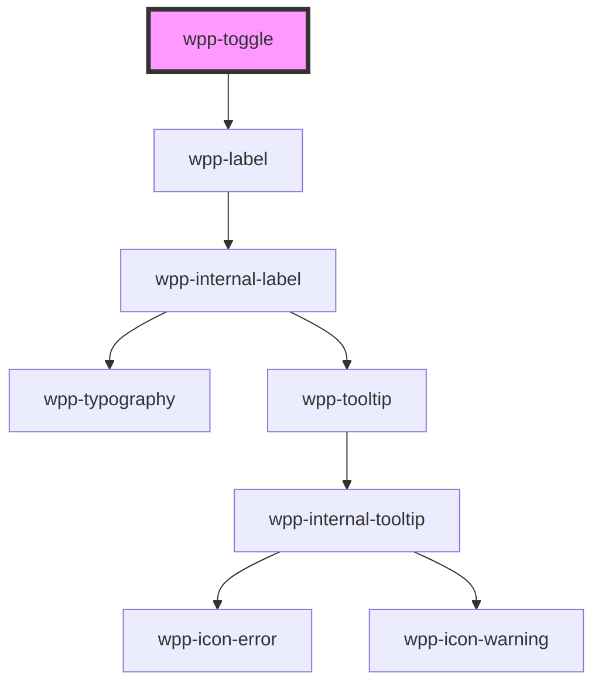

# wpp-toggle


<!-- Auto Generated Below -->


## Usage

### Angular

```html
<wpp-toggle
  [disabled]='disabled'
  value="value"
  [checked]='checked'
  [labelConfig]="labelConfig"
  name='options'
  (wppChange)="handleChange($event)"
/>

<wpp-toggle [labelConfig]="labelConfig" [(ngModel)]='checked'></wpp-toggle>

<form [formGroup]="form" (ngSubmit)="submit()">
  <wpp-toggle formControlName="options" [labelConfig]="labelConfig" name='options'></wpp-toggle>
</form>
```


### React

```tsx
import { WppToggle } from '@platform-ui-kit/components-library-react'

export const ToggleExample = () => {
  const toggleLabelConfig={
    text: 'Email',
    icon: 'wpp-icon-info'
  }

  return (
    <>
      <WppToggle
        disabled={isDisabled}
        value={toggleValue}
        labelConfig={labelConfig}
        checked={isChecked}
        onWppChange={({ detail: { checked } }) => setChecked(checked)}
      />

      <form onSubmit={handleSubmit}>
        <WppToggle
          checked={isChecked}
          labelConfig={labelConfig}
          name="options"
          onWppChange={({ detail: { checked } }) => setChecked(checked)}
        />
      </form>
    </>
  )
}
```


### Vue

```vue
<script setup>
import { WppToggle } from "@platform-ui-kit/components-library-vue";

const labelConfig = {
  text: "Label Text",
};
</script>

<template>
  <WppToggle
    class="item"
    :labelConfig="labelConfig"
    required
    autoFocus
    data-testid="focus-toggle"
  />
</template>
```


## Properties

| Property             | Attribute    | Description                                                                                                                                                                                         | Type                       | Default                                           |
| -------------------- | ------------ | --------------------------------------------------------------------------------------------------------------------------------------------------------------------------------------------------- | -------------------------- | ------------------------------------------------- |
| `ariaProps`          | --           | Contains the toggle `aria-` props.                                                                                                                                                                  | `AriaProps`                | `{}`                                              |
| `autoFocus`          | `auto-focus` | If `true`, the toggle should be focused on page load                                                                                                                                                | `boolean`                  | `false`                                           |
| `checked`            | `checked`    | If the toggle is on.                                                                                                                                                                                | `boolean`                  | `false`                                           |
| `controlled`         | `controlled` | If the toggle works as controlled component.                                                                                                                                                        | `boolean`                  | `false`                                           |
| `disabled`           | `disabled`   | If the toggle is disabled.                                                                                                                                                                          | `boolean`                  | `false`                                           |
| `labelConfig`        | --           | Indicates label config                                                                                                                                                                              | `LabelConfig \| undefined` | `undefined`                                       |
| `labelTooltipConfig` | --           | Tooltip config for label, under the hood tooltip using tippy.js, all information about this library and available props you can see via this link `https://atomiks.github.io/tippyjs/v6/all-props/` | `DropdownConfig`           | `{     popperOptions: { strategy: 'fixed' },   }` |
| `name`               | `name`       | Defines the toggle name.                                                                                                                                                                            | `string \| undefined`      | `undefined`                                       |
| `required`           | `required`   | If the toggle is required.                                                                                                                                                                          | `boolean`                  | `false`                                           |
| `size`               | `size`       | Defines the toggle size.                                                                                                                                                                            | `"m" \| "s"`               | `'m'`                                             |
| `value`              | `value`      | Defines the toggle value.                                                                                                                                                                           | `number \| string`         | `undefined`                                       |


## Events

| Event       | Description                          | Type                                                                                        |
| ----------- | ------------------------------------ | ------------------------------------------------------------------------------------------- |
| `wppBlur`   | Emitted when the toggle loses focus. | `CustomEvent<FocusEvent>`                                                                   |
| `wppChange` | Emitted when toggle state changes.   | `CustomEvent<BooleanFormControlEventDetail<ToggleValue> & { name?: string \| undefined; }>` |
| `wppFocus`  | Emitted when the toggle is in focus. | `CustomEvent<FocusEvent>`                                                                   |


## Methods

### `setFocus() => Promise<void>`

Method that sets focus on the native input.

#### Returns

Type: `Promise<void>`


## Shadow Parts

| Part      | Description        |
| --------- | ------------------ |
| `"input"` | input element      |
| `"label"` | Label text element |


## CSS Custom Properties

| Name                                        | Description |
| ------------------------------------------- | ----------- |
| `--wpp-counter-first-border-color-focus`    |             |
| `--wpp-counter-second-border-color-focus`   |             |
| `--wpp-toggle-bg-color`                     |             |
| `--wpp-toggle-bg-color-active`              |             |
| `--wpp-toggle-bg-color-checked`             |             |
| `--wpp-toggle-bg-color-checked-active`      |             |
| `--wpp-toggle-bg-color-checked-disabled`    |             |
| `--wpp-toggle-bg-color-checked-hover`       |             |
| `--wpp-toggle-bg-color-disabled`            |             |
| `--wpp-toggle-bg-color-hover`               |             |
| `--wpp-toggle-border-radius`                |             |
| `--wpp-toggle-height`                       |             |
| `--wpp-toggle-inside-circle-bg-color`       |             |
| `--wpp-toggle-inside-circle-margin-left`    |             |
| `--wpp-toggle-inside-circle-size`           |             |
| `--wpp-toggle-label-color-checked-disabled` |             |
| `--wpp-toggle-label-color-disabled`         |             |
| `--wpp-toggle-label-margin`                 |             |
| `--wpp-toggle-width`                        |             |


## Dependencies

### Depends on

- [wpp-label](../wpp-label)

### Graph


----------------------------------------------

*Built with [StencilJS](https://stenciljs.com/)*
