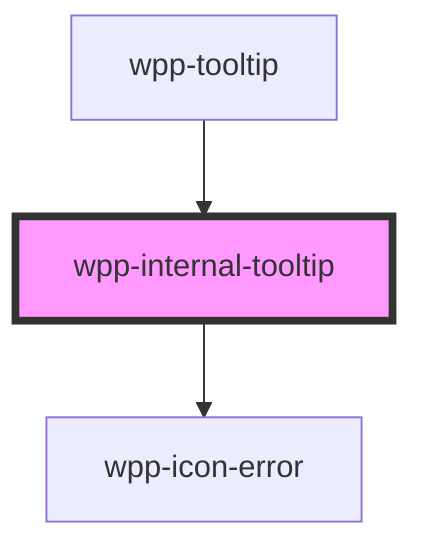

# wpp-internal-tooltip

This is internal component that is used in `wpp-tooltip` component

<!-- Auto Generated Below -->

## Properties

| Property        | Attribute        | Description                                                                                                                                                                                                                                                                             | Type                  | Default     |
| --------------- | ---------------- | --------------------------------------------------------------------------------------------------------------------------------------------------------------------------------------------------------------------------------------------------------------------------------------- | --------------------- | ----------- |
| `error`         | `error`          | If `true`, the tooltip is displayed in an error state                                                                                                                                                                                                                                   | `boolean`             | `false`     |
| `externalClass` | `external-class` | Add an external class to the tooltip wrapper. This class will be applied to the wrapper that placed in tippy box that appended to the body. To add some properties to this class you have to add this class to global styles, for example .tooltip-wrapper.external-class-name {  ... } | `string`              | `''`        |
| `header`        | `header`         | Indicates tooltip title                                                                                                                                                                                                                                                                 | `string \| undefined` | `undefined` |
| `text`          | `text`           | Sets the main tooltip message                                                                                                                                                                                                                                                           | `string \| undefined` | `undefined` |
| `theme`         | `theme`          | Tooltip theme, can be `dark` or `light`, default value is `dark`, not related to the WPP theme                                                                                                                                                                                          | `"dark" \| "light"`   | `'dark'`    |
| `value`         | `value`          | When set, adds a value row below the main message                                                                                                                                                                                                                                       | `string \| undefined` | `undefined` |

## Shadow Parts

| Part                | Description                     |
| ------------------- | ------------------------------- |
| `"header"`          | header component                |
| `"icon-error"`      | icon error element              |
| `"text"`            | Main text content               |
| `"tooltip-content"` | tooltip content wrapper element |
| `"value"`           | value text element              |

## Dependencies

### Used by

 - [wpp-tooltip](../..)

### Depends on

- [wpp-icon-error](../../../wpp-icon/components/status/status/wpp-icon-error)

### Graph

----------------------------------------------

*Built with [StencilJS](https://stenciljs.com/)*
