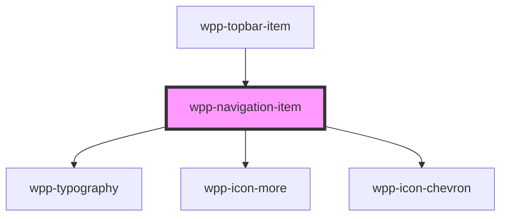

# wpp-navigation-item

<!-- Auto Generated Below -->

## Properties

| Property       | Attribute       | Description                                                                                                                                                                                                                                                                                                | Type                  | Default     |
| -------------- | --------------- | ---------------------------------------------------------------------------------------------------------------------------------------------------------------------------------------------------------------------------------------------------------------------------------------------------------- | --------------------- | ----------- |
| `active`       | `active`        | If `true`, the component is active                                                                                                                                                                                                                                                                         | `boolean`             | `false`     |
| `chevronOnly`  | `chevron-only`  | If `true`, the component will render only a chevron icon without label.                                                                                                                                                                                                                                    | `boolean`             | `false`     |
| `extended`     | `extended`      | If `true`, the component has nested items                                                                                                                                                                                                                                                                  | `boolean`             | `false`     |
| `label`        | `label`         | Indicates navigation item label                                                                                                                                                                                                                                                                            | `string \| undefined` | `undefined` |
| `menu`         | `menu`          | If `true`, the component has only icon menu with nested items                                                                                                                                                                                                                                              | `boolean`             | `false`     |
| `menuExpanded` | `menu-expanded` | Indicates navigation item label                                                                                                                                                                                                                                                                            | `boolean`             | `false`     |
| `nativeLink`   | `native-link`   | If `true`, the navigation link will be have native behaviour `a` tag. If app using `client side render` you need to leave `nativeLink` false, if `server side render`, then better to use this prop This is not dynamic prop, so in Storybook when change value of this prop, need you to refresh the page | `boolean`             | `false`     |
| `nestedItem`   | `nested-item`   | If `true`, the navigation item is nested item in list context, don't need to pass this prop, it pass automatically from Topbar component                                                                                                                                                                   | `boolean`             | `false`     |
| `path`         | `path`          | Indicates navigation item path                                                                                                                                                                                                                                                                             | `string \| undefined` | `undefined` |
| `value`        | `value`         | Indicates navigation item value                                                                                                                                                                                                                                                                            | `string`              | `undefined` |

## Events

| Event                     | Description                              | Type                                     |
| ------------------------- | ---------------------------------------- | ---------------------------------------- |
| `wppActiveNavItemChanged` | Emitted when navigation item was clicked | `CustomEvent<NavigationItemEventDetail>` |

## Shadow Parts

| Part             | Description |
| ---------------- | ----------- |
| `"chevron-icon"` |             |
| `"list-item"`    |             |

## CSS Custom Properties

| Name                                                          | Description |
| ------------------------------------------------------------- | ----------- |
| `--wpp-navigation-item-bg-color`                              |             |
| `--wpp-navigation-item-bg-color-active`                       |             |
| `--wpp-navigation-item-bg-color-hover`                        |             |
| `--wpp-navigation-item-bg-color-selected`                     |             |
| `--wpp-navigation-item-bg-color-selected-active`              |             |
| `--wpp-navigation-item-bg-color-selected-hover`               |             |
| `--wpp-navigation-item-border-radius`                         |             |
| `--wpp-navigation-item-expanded-bg-color`                     |             |
| `--wpp-navigation-item-expanded-bg-color-active`              |             |
| `--wpp-navigation-item-expanded-extended-icon-color`          |             |
| `--wpp-navigation-item-expanded-extended-icon-color-selected` |             |
| `--wpp-navigation-item-expanded-menu-bg-color`                |             |
| `--wpp-navigation-item-expanded-menu-bg-color-selected`       |             |
| `--wpp-navigation-item-expanded-menu-icon-color`              |             |
| `--wpp-navigation-item-expanded-menu-icon-color-selected`     |             |
| `--wpp-navigation-item-expanded-text-color`                   |             |
| `--wpp-navigation-item-expanded-text-color-selected`          |             |
| `--wpp-navigation-item-extended-icon-color`                   |             |
| `--wpp-navigation-item-extended-icon-color-active`            |             |
| `--wpp-navigation-item-extended-icon-color-hover`             |             |
| `--wpp-navigation-item-extended-icon-color-selected`          |             |
| `--wpp-navigation-item-extended-icon-color-selected-active`   |             |
| `--wpp-navigation-item-extended-icon-color-selected-hover`    |             |
| `--wpp-navigation-item-extended-icon-margin`                  |             |
| `--wpp-navigation-item-extended-padding`                      |             |
| `--wpp-navigation-item-link-margin`                           |             |
| `--wpp-navigation-item-menu-bg-color`                         |             |
| `--wpp-navigation-item-menu-bg-color-active`                  |             |
| `--wpp-navigation-item-menu-bg-color-hover`                   |             |
| `--wpp-navigation-item-menu-bg-color-selected`                |             |
| `--wpp-navigation-item-menu-bg-color-selected-active`         |             |
| `--wpp-navigation-item-menu-bg-color-selected-hover`          |             |
| `--wpp-navigation-item-menu-icon-color`                       |             |
| `--wpp-navigation-item-menu-icon-color-active`                |             |
| `--wpp-navigation-item-menu-icon-color-hover`                 |             |
| `--wpp-navigation-item-menu-icon-color-selected`              |             |
| `--wpp-navigation-item-menu-icon-color-selected-active`       |             |
| `--wpp-navigation-item-menu-icon-color-selected-hover`        |             |
| `--wpp-navigation-item-menu-padding`                          |             |
| `--wpp-navigation-item-nested-text-color`                     |             |
| `--wpp-navigation-item-padding`                               |             |
| `--wpp-navigation-item-text-color`                            |             |
| `--wpp-navigation-item-text-color-active`                     |             |
| `--wpp-navigation-item-text-color-hover`                      |             |
| `--wpp-navigation-item-text-color-selected`                   |             |
| `--wpp-navigation-item-text-color-selected-active`            |             |
| `--wpp-navigation-item-text-color-selected-hover`             |             |
| `--wpp-topbar-menu-item-first-border-color-focus`             |             |
| `--wpp-topbar-menu-item-second-border-color-focus`            |             |

## Dependencies

### Used by

 - [wpp-topbar-item](../wpp-topbar-item)

### Depends on

- [wpp-typography](../../../wpp-typography)
- [wpp-icon-more](../../../wpp-icon/components/system/menu/wpp-icon-more)
- [wpp-icon-chevron](../../../wpp-icon/components/arrows/arrows/wpp-icon-chevron)

### Graph

----------------------------------------------

*Built with [StencilJS](https://stenciljs.com/)*
