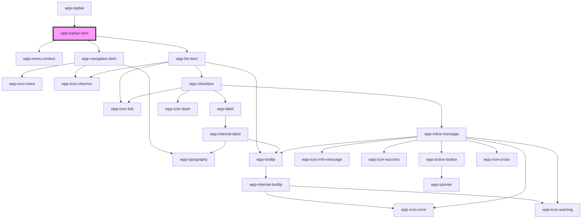

# wpp-topbar-item

<!-- Auto Generated Below -->

## Properties

| Property      | Attribute     | Description                                                                                                                                                                                                                                                                                                | Type              | Default     |
| ------------- | ------------- | ---------------------------------------------------------------------------------------------------------------------------------------------------------------------------------------------------------------------------------------------------------------------------------------------------------- | ----------------- | ----------- |
| `active`      | `active`      | If `true`, the component is active                                                                                                                                                                                                                                                                         | `boolean`         | `undefined` |
| `activeItems` | --            | Indicates list of values of the items that are active, where each value represents particular navigation item                                                                                                                                                                                              | `string[]`        | `undefined` |
| `firstLevel`  | `first-level` | If `true`, the component placed on the first level of topbar                                                                                                                                                                                                                                               | `boolean`         | `false`     |
| `menu`        | `menu`        | If `true`, the component has menu icon                                                                                                                                                                                                                                                                     | `boolean`         | `false`     |
| `nativeLink`  | `native-link` | If `true`, the navigation link will be have native behaviour `a` tag. If app using `client side render` you need to leave `nativeLink` false, if `server side render`, then better to use this prop This is not dynamic prop, so in Storybook when change value of this prop, need you to refresh the page | `boolean`         | `false`     |
| `navigation`  | --            | Indicates navigation items                                                                                                                                                                                                                                                                                 | `NavigationState` | `undefined` |

## Events

| Event                       | Description                          | Type                                     |
| --------------------------- | ------------------------------------ | ---------------------------------------- |
| `wppActiveTopbarItemChange` | Emitted when topbar item was changed | `CustomEvent<NavigationItemEventDetail>` |

## Dependencies

### Used by

 - [wpp-topbar](../..)

### Depends on

- [wpp-menu-context](../../../wpp-menu-context)
- [wpp-navigation-item](../wpp-navigation-item)
- [wpp-list-item](../../../wpp-list-item)

### Graph

----------------------------------------------

*Built with [StencilJS](https://stenciljs.com/)*
