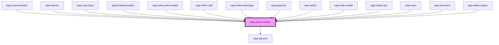

# wpp-action-button

The action button is used when the user is expected to perform some action.

<!-- Auto Generated Below -->


## Usage

### Angular

```html
<wpp-action-button>Primary</wpp-action-button>
<wpp-action-button variant='secondary'>Secondary</wpp-action-button>
<wpp-action-button variant='destructive'>Destructive</wpp-action-button>
<wpp-action-button>
  <wpp-icon-plus slot='icon-start'></wpp-icon-plus>
  Left Icon
</wpp-action-button>
<wpp-action-button>
  Right Icon
  <wpp-icon-plus slot='icon-end'></wpp-icon-plus>
</wpp-action-button>

<wpp-action-button
  [disabled]='disabled'
  [loading]='loading'
>Button</wpp-action-button>

<form [formGroup]="form" (ngSubmit)="submit()">
  <wpp-action-button type="submit">Submit</wpp-action-button>
</form>
```


### React

```tsx
import { WppActionButton, WppIconAddCircle } from '@wppopen/components-library-react'

export const ActionButtonExample = () => (
  <>
    <WppActionButton>Primary</WppActionButton>
    <WppActionButton variant='secondary'>Secondary</WppActionButton>
    <WppActionButton variant='destructive'>Destructive</WppActionButton>
    <WppActionButton>
      <WppIconAddCircle slot='icon-start' />
      Left Icon
    </WppActionButton>
    <WppActionButton>
      Right Icon
      <WppIconAddCircle slot='icon-end' />
    </WppActionButton>

    <WppActionButton
      disabled={isDisabled}
      loading={loading}
    />

    <form onSubmit={handleSubmit}>
      <WppActionButton type='submit'>Submit</WppActionButton>
    </form>
  </>
)
```


### Vue

```vue

<script setup lang="ts">
import { WppActionButton, WppIconPlus } from "@wppopen/components-library-vue"

// ...
</script>

<template>
  <WppActionButton>Primary</WppActionButton>
  <WppActionButton variant="secondary">Secondary</WppActionButton>
  <WppActionButton>
    <WppIconPlus slot="icon-start" />
    Left Icon
  </WppActionButton>
  <WppActionButton>
    Right Icon
    <WppIconPlus slot="icon-end" />
  </WppActionButton>

  <WppActionButton
    :disabled="isDisabled"
    :loading="loading"
  />

  <form @submit="handleSubmit">
    <WppActionButton type="submit">Submit</WppActionButton>
  </form>
</template>


```


## Properties

| Property    | Attribute    | Description                                                                               | Type                                                                   | Default     |
| ----------- | ------------ | ----------------------------------------------------------------------------------------- | ---------------------------------------------------------------------- | ----------- |
| `ariaProps` | --           | Contains the button `aria-` props.                                                        | `AriaProps`                                                            | `{}`        |
| `autoFocus` | `auto-focus` | If the button should be in focus on page load.                                            | `boolean`                                                              | `false`     |
| `disabled`  | `disabled`   | If the component is disabled.                                                             | `boolean`                                                              | `false`     |
| `form`      | `form`       | Defines the form to which the button belongs. Accepts id of form or FormElement reference | `HTMLFormElement \| string \| undefined`                               | `undefined` |
| `loading`   | `loading`    | If the component is in loading state.                                                     | `boolean`                                                              | `false`     |
| `name`      | `name`       | Defines the button name.                                                                  | `string \| undefined`                                                  | `undefined` |
| `type`      | `type`       | Defines the button type.                                                                  | `"button" \| "reset" \| "submit"`                                      | `'button'`  |
| `value`     | `value`      | Defines the button value.                                                                 | `string \| undefined`                                                  | `undefined` |
| `variant`   | `variant`    | Defines the button style.                                                                 | `"destructive" \| "inverted" \| "primary" \| "secondary" \| undefined` | `'primary'` |


## Methods

### `setFocus() => Promise<void>`

Method that sets focus on the native button.

#### Returns

Type: `Promise<void>`


## Slots

| Slot           | Description                                                                        |
| -------------- | ---------------------------------------------------------------------------------- |
|                | Contains the main text content. The default slot, without the name attribute.      |
| `"icon-end"`   | Can contain an icon that will be placed after the main content, e.g. a plus icon.  |
| `"icon-start"` | Can contain an icon that will be placed before the main content, e.g. a plus icon. |


## Shadow Parts

| Part                   | Description                |
| ---------------------- | -------------------------- |
| `"body"`               | Main content wrapper       |
| `"button"`             | Button element             |
| `"icon-end"`           | icon-end element           |
| `"icon-end-wrapper"`   | icon-end wrapper element   |
| `"icon-start"`         | icon-start element         |
| `"icon-start-wrapper"` | icon-start wrapper element |
| `"inner"`              | Content slot element       |
| `"overlay"`            | overlay element            |
| `"spinner"`            | Spinner element            |
| `"spinner-wrapper"`    | Spinner wrapper element    |


## CSS Custom Properties

| Name                                                     | Description |
| -------------------------------------------------------- | ----------- |
| `--wpp-action-border-radius`                             |             |
| `--wpp-action-button-bg-color`                           |             |
| `--wpp-action-button-bg-color-active`                    |             |
| `--wpp-action-button-bg-color-disabled`                  |             |
| `--wpp-action-button-bg-color-hover`                     |             |
| `--wpp-action-button-bg-color-loading`                   |             |
| `--wpp-action-button-destructive-bg-color-active`        |             |
| `--wpp-action-button-destructive-bg-color-disabled`      |             |
| `--wpp-action-button-destructive-bg-color-hover`         |             |
| `--wpp-action-button-destructive-bg-color-loading`       |             |
| `--wpp-action-button-destructive-icon-color`             |             |
| `--wpp-action-button-destructive-icon-color-active`      |             |
| `--wpp-action-button-destructive-icon-color-disabled`    |             |
| `--wpp-action-button-destructive-icon-color-hover`       |             |
| `--wpp-action-button-destructive-text-color`             |             |
| `--wpp-action-button-destructive-text-color-active`      |             |
| `--wpp-action-button-destructive-text-color-disabled`    |             |
| `--wpp-action-button-destructive-text-color-hover`       |             |
| `--wpp-action-button-first-border-color-focus`           |             |
| `--wpp-action-button-font-size`                          |             |
| `--wpp-action-button-font-weight`                        |             |
| `--wpp-action-button-icon-only-padding`                  |             |
| `--wpp-action-button-inverted-bg-color-active`           |             |
| `--wpp-action-button-inverted-bg-color-disabled`         |             |
| `--wpp-action-button-inverted-bg-color-hover`            |             |
| `--wpp-action-button-inverted-bg-color-loading`          |             |
| `--wpp-action-button-inverted-first-border-color-focus`  |             |
| `--wpp-action-button-inverted-icon-color`                |             |
| `--wpp-action-button-inverted-icon-color-active`         |             |
| `--wpp-action-button-inverted-icon-color-disabled`       |             |
| `--wpp-action-button-inverted-icon-color-hover`          |             |
| `--wpp-action-button-inverted-second-border-color-focus` |             |
| `--wpp-action-button-inverted-text-color`                |             |
| `--wpp-action-button-inverted-text-color-active`         |             |
| `--wpp-action-button-inverted-text-color-disabled`       |             |
| `--wpp-action-button-inverted-text-color-hover`          |             |
| `--wpp-action-button-line-height`                        |             |
| `--wpp-action-button-padding`                            |             |
| `--wpp-action-button-primary-icon-color`                 |             |
| `--wpp-action-button-primary-icon-color-active`          |             |
| `--wpp-action-button-primary-icon-color-disabled`        |             |
| `--wpp-action-button-primary-icon-color-hover`           |             |
| `--wpp-action-button-primary-text-color`                 |             |
| `--wpp-action-button-primary-text-color-active`          |             |
| `--wpp-action-button-primary-text-color-disabled`        |             |
| `--wpp-action-button-primary-text-color-hover`           |             |
| `--wpp-action-button-second-border-color-focus`          |             |
| `--wpp-action-button-secondary-icon-color`               |             |
| `--wpp-action-button-secondary-icon-color-active`        |             |
| `--wpp-action-button-secondary-icon-color-disabled`      |             |
| `--wpp-action-button-secondary-icon-color-hover`         |             |
| `--wpp-action-button-secondary-text-color`               |             |
| `--wpp-action-button-secondary-text-color-active`        |             |
| `--wpp-action-button-secondary-text-color-disabled`      |             |
| `--wpp-action-button-secondary-text-color-hover`         |             |


## Dependencies

### Used by

 - [wpp-autocomplete](../wpp-autocomplete)
 - [wpp-banner](../wpp-banner)
 - [wpp-chat-input](../wpp-chat/components/wpp-chat-input)
 - [wpp-floating-toolbar](../wpp-floating-toolbar)
 - [wpp-full-screen-modal](../wpp-full-screen-modal)
 - [wpp-inline-edit](../wpp-inline-edit)
 - [wpp-inline-message](../wpp-inline-message)
 - [wpp-popover](../wpp-popover)
 - [wpp-select](../wpp-select)
 - [wpp-side-modal](../wpp-side-modal)
 - [wpp-sticky-bar](../wpp-sticky-bar)
 - [wpp-toast](../wpp-toast)
 - [wpp-tree-item](../wpp-tree/components/wpp-tree-item)
 - [wpp-video-player](../wpp-video-player)

### Depends on

- [wpp-spinner](../wpp-spinner)

### Graph


----------------------------------------------

*Built with [StencilJS](https://stenciljs.com/)*
