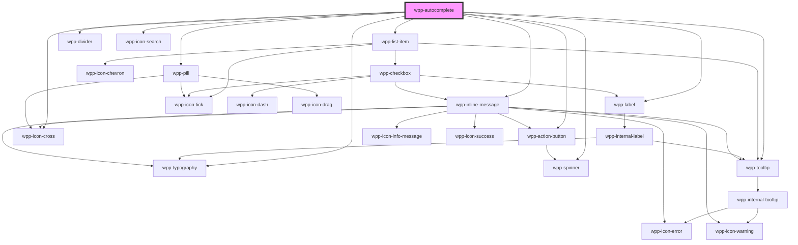

# wpp-autocomplete

Create a component that combines the search input, a multiselect dropdown with available options, and chip tags to help users autocomplete the function of an input field.

<!-- Auto Generated Below -->


## Usage

### Angular

### autocomplete-example.page.html
```html
<wpp-autocomplete
  ngDefaultControl
  name='value'
  ngModel
  [value]='basicExampleValue'
  [labelConfig]="getLabelConfig('Extended autocomplete with suggestions')"
  (wppChange)='handleExampleValueChange($event, "basicExampleValue")'
  type='extended'
  placeholder='Select items'
  class='example-item'
  [getOptionId]='getOptionId'
  [getOptionLabel]='getOptionLabel'
  [suggestions]='suggestions'
  multiple
  show-create-new-element
  simple-search
>
  <wpp-list-item *ngFor="let option of options" [value]="option" [label]="option.name">
    <p slot="label">{{ option.name }}</p>
  </wpp-list-item>
  <div slot="selected-values" class='selected-values extended'>
    <wpp-pill
      *ngFor='let selectedValue of basicExampleValue'
      [label]='selectedValue.name'
      [value]='selectedValue.name'
      type="display"
      (wppClose)='handleExamplePillCloseClick(selectedValue.name, "basicExampleValue")'
      removable
    >
      {{ selectedValue.name }}
    </wpp-pill>
  </div>
</wpp-autocomplete>

<wpp-autocomplete
  ngDefaultControl
  [value]='customOptionsExampleValue'
  [labelConfig]="getLabelConfig('Required Regular with Custom options and suggestions')"
  (wppChange)='handleExampleValueChange($event, "customOptionsExampleValue")'
  placeholder='Select items'
  class='example-item'
  required
  [suggestions]='suggestions'
  multiple
  show-create-new-element
  simple-search
>
  <wpp-list-item *ngFor="let option of countriesOptions" [value]="option" [label]="option.label">
    <div slot="label">
      <div class="primary">
        <span class="flag">{{ option.flag }}</span> {{ option.label }}
      </div>
    </div>
    <div class="secondary" slot="caption">
      {{ option.nativeName }}
    </div>
  </wpp-list-item>
  <div slot="selected-values" class='selected-values'>
    <wpp-pill
      *ngFor='let selectedValue of customOptionsExampleValue'
      [label]='selectedValue.label'
      [value]='selectedValue.label'
      type="display"
      (wppClose)='handleExamplePillCloseClick(selectedValue.id, "customOptionsExampleValue")'
      removable
    >
      {{ selectedValue.label }}
    </wpp-pill>
  </div>
</wpp-autocomplete>
```

### autocomplete-example.page.ts
```tsx
import { ChangeDetectionStrategy, Component } from '@angular/core'
import {
  LoadMoreHandler,
  AutocompleteChangeEventDetail,
  AutocompleteDefaultOption,
} from '@wppopen/components-library'
import periodicTable from '../../dummy-data/periodic-table'
import countriesOptions from '../../dummy-data/countries'

@Component({
  selector: 'app-autocomplete-example',
  templateUrl: './autocomplete-example.page.html',
  styleUrls: ['./autocomplete-example.page.scss'],
  changeDetection: ChangeDetectionStrategy.OnPush,
})
export class AutocompleteExamplePage {
  public basicExampleValue: AutocompleteDefaultOption[] = []
  public customOptionsExampleValue: AutocompleteDefaultOption[] = []

  public readonly options = periodicTable
  public readonly countriesOptions = countriesOptions

  public readonly suggestions = [
    { id: 101, name: 'Avocado' },
    { id: 102, name: 'Blueberry' },
    { id: 103, name: 'Cherry' },
    { id: 104, name: 'Durian' },
    { id: 105, name: 'Elderberry' },
  ]

  public readonly loadMore: LoadMoreHandler = async () => {
    console.log('Triggered loadMore() handler')
  }

  public handleExampleValueChange = (event: Event, fieldName: 'basicExampleValue' | 'customOptionsExampleValue') => {
    this[fieldName] = (event as CustomEvent<AutocompleteChangeEventDetail>).detail.value as AutocompleteDefaultOption[]
  }

  public getOptionId = (option: typeof periodicTable[0]) => option.name
  public getOptionLabel = (option: typeof periodicTable[0]) => option.name

  public handleExamplePillCloseClick = (
    value: string | number,
    fieldName: 'basicExampleValue' | 'customOptionsExampleValue',
  ) => {
    this[fieldName] = this[fieldName].filter(
      i => i[fieldName === 'customOptionsExampleValue' ? 'id' : 'name'] !== value,
    )
  }

  public getLabelConfig = (text: string) => ({
    text,
  })
}
```


### React

```tsx
import React, { useState } from 'react'
import { AutocompleteDefaultOption } from '@wppopen/components-library'
import { WppAccordion, WppAutocomplete, WppTypography, WppListItem } from '@wppopen/components-library-react'

import { countryOptions, fruitOptions, hugeListOptions } from './options'

import { ResultsView } from './ResultsView'
import { SelectedValues } from './SelectedValues'
import { SingleSelectInfiniteScrollWithLazyLoad } from './Examples/SingleSelectInfiniteScrollWithLazyLoad'
import { ServerSearch } from './Examples/ServerSearch'

import styles from './Autocomplete.module.css'

export const Autocomplete = () => {
  const [basicValue, setBasicValue] = useState<AutocompleteDefaultOption[]>([
    {
      id: 5,
      label: 'Pineapple',
    },
    {
      id: 3,
      label: 'Kiwi',
    },
    {
      id: 13,
      label: 'Pear',
    },
  ])
  const [customOptionsValue, setCustomOptionsValue] = useState<AutocompleteDefaultOption[]>([])
  const [hugeListValue, setHugeListValue] = useState<AutocompleteDefaultOption[]>([])
  const suggestions = [
    { id: 101, label: 'Avocado' },
    { id: 102, label: 'Blueberry' },
    { id: 103, label: 'Cherry' },
    { id: 104, label: 'Durian' },
    { id: 105, label: 'Elderberry' },
  ]

  return (
    <>
      <div className={styles.wrapper} data-testid="autocompletes">
        <div className={styles.item}>
          <WppAutocomplete
            required
            name="basic"
            suggestions={staticSuggestions}
            labelConfig={{
              icon: 'wpp-icon-info',
              text: 'Basic with initial values and suggestions',
              description: 'Description',
              locales: {
                optional: 'Optional',
              },
            }}
            placeholder="Select fruits"
            value={basicValue}
            onWppChange={e => setBasicValue(e.detail.value as AutocompleteDefaultOption[])}
            data-testid="basic-autocomplete"
            multiple
            showCreateNewElement
            simpleSearch
          >
            {fruitOptions.map(option => (
              <WppListItem key={option.id} value={option} label={option.label}>
                <p slot="label">{option.label}</p>
              </WppListItem>
            ))}
            <SelectedValues
              values={basicValue}
              onCloseClick={value => setBasicValue(basicValue.filter(i => i.id !== value))}
            />
          </WppAutocomplete>
        </div>
        <div className={styles.item}>
          <WppAutocomplete
            required
            name="custom-option-labels"
            labelConfig={{ text: 'Custom option labels and modified number of tags shown when idle and suggestions' }}
            placeholder="Select countries"
            value={customOptionsValue}
            onWppChange={e => setCustomOptionsValue(e.detail.value as AutocompleteDefaultOption[])}
            data-testid="custom-autocomplete"
            suggestions={staticSuggestions}
            autoFocus
            multiple
            showCreateNewElement
            simpleSearch
          >
            {countryOptions.map(option => (
              <WppListItem key={option.id} value={option} label={option.label}>
                <div slot="label">
                  <div className={styles.primary}>
                    <span className={styles.flag}>{option.flag}</span> {option.label}
                  </div>
                </div>
                <div className={styles.secondary} slot="caption">
                  {option.nativeName}
                </div>
              </WppListItem>
            ))}
            <SelectedValues
              values={customOptionsValue}
              onCloseClick={value => setCustomOptionsValue(customOptionsValue.filter(i => i.id !== value))}
            />
          </WppAutocomplete>

          <ResultsView value={customOptionsValue.map(i => i.id)} />
        </div>
      </div>
    </>
  )
}
```

#### Related components with additional examples
**ResultView.tsx**

```tsx
import styles from './Autocomplete.module.scss'
import { WppTypography } from '@wppopen/components-library-react'
import React from 'react'

export const ResultsView = ({ value }: { value: (string | number)[] | string }) => (
  <div className={styles.results}>
    <WppTypography type="s-body">Selected values:</WppTypography>
    <pre className={styles.mono}>{JSON.stringify(value, null, 2)}</pre>
  </div>
)
```

**SelectedValues.tsx**

```tsx
import { WppPill } from '@wppopen/components-library-react'
import { AutocompleteDefaultOption } from '@wppopen/components-library'

import styles from './Autocomplete.module.scss'
import React from 'react'

interface SelectedValuesComponent {
  values: AutocompleteDefaultOption[]
  onCloseClick: (a: number | string) => void
}

export const SelectedValues = ({ values, onCloseClick }: SelectedValuesComponent) => (
  <div slot="selected-values">
    {values.map(value => (
      <WppPill
        label={value.label}
        removable
        value={value.id}
        onWppClose={() => onCloseClick(value.id)}
        type="display"
        className={styles.pill}
        key={value.id}
      >
        {value.label}
      </WppPill>
    ))}
  </div>
)
```

**Infinite scroll with lazy load**

```tsx
import React, { useEffect, useRef, useState } from 'react'
import { AutocompleteDefaultOption, LoadMoreHandler } from '@wppopen/components-library'
import { WppAutocomplete, WppListItem } from '@wppopen/components-library-react'

import { BasicOption, generateInfiniteResults, isInfiniteLastPage } from '../options'

import styles from '../Autocomplete.module.scss'
import { SelectedValues } from '../SelectedValues'
import { ResultsView } from '../ResultsView'

export const SingleSelectInfiniteScrollWithLazyLoad = () => {
  const [infiniteValue, setInfiniteValue] = useState<AutocompleteDefaultOption[]>([])

  const isInfiniteFirstLoadSkipped = useRef(false)
  const infiniteLoadMoreTimer = useRef<ReturnType<typeof setTimeout>>()
  const [infiniteSearchPage, setInfiniteSearchPage] = useState(0)
  const [isSearchingInfinite, setIsSearchingInfinite] = useState(false)
  const [infiniteSearchValue, setInfiniteSearchValue] = useState('')
  const [infiniteSearchResults, setInfiniteSearchResults] = useState<BasicOption[]>([])

  const infiniteSearchValueTrimmed = infiniteSearchValue.trim()
  const infiniteSearchLoadMore: LoadMoreHandler = () =>
    new Promise(resolve => {
      const timeout = 300 + Math.round(Math.random() * 700)
      const page = infiniteSearchResults.length ? infiniteSearchPage + 1 : infiniteSearchPage

      infiniteLoadMoreTimer.current = setTimeout(() => {
        infiniteLoadMoreTimer.current = undefined
        setInfiniteSearchResults(current => [...current, ...generateInfiniteResults(infiniteSearchValueTrimmed, page)])
        setInfiniteSearchPage(page)

        resolve()
      }, timeout)
    })

  // Load infinite options based on search
  useEffect(() => {
    if (isInfiniteFirstLoadSkipped.current) {
      if (infiniteLoadMoreTimer.current) {
        clearTimeout(infiniteLoadMoreTimer.current)
        infiniteLoadMoreTimer.current = undefined
      }

      setIsSearchingInfinite(true)

      const timeout = 700 + Math.round(Math.random() * 1300)
      const timer = setTimeout(() => {
        setInfiniteSearchResults(() => [...generateInfiniteResults(infiniteSearchValueTrimmed, 0)])
        setInfiniteSearchPage(0)
        setIsSearchingInfinite(false)
      }, timeout)

      return () => clearTimeout(timer)
    } else {
      isInfiniteFirstLoadSkipped.current = true
    }
  }, [infiniteSearchValueTrimmed])

  return (
    <div className={styles.item}>
      <WppAutocomplete
        required
        infinite
        infiniteLastPage={isInfiniteLastPage(infiniteSearchValueTrimmed, infiniteSearchPage)}
        loading={isSearchingInfinite}
        name="infinite-list"
        labelConfig={{ text: 'Infinite scroll with lazy load' }}
        placeholder="Scroll me"
        value={infiniteValue}
        loadMore={infiniteSearchLoadMore}
        onWppSearchValueChange={e => setInfiniteSearchValue(e.detail)}
        onWppChange={e => setInfiniteValue(e.detail.value as AutocompleteDefaultOption[])}
        multiple
        showCreateNewElement
        simpleSearch
      >
        {infiniteSearchResults.map(option => (
          <WppListItem key={option.id} value={option} label={option.label}>
            <p slot="label">{option.label}</p>
          </WppListItem>
        ))}
        <SelectedValues
          values={infiniteValue}
          onCloseClick={value => setInfiniteValue(infiniteValue.filter(i => i.id !== value))}
        />
      </WppAutocomplete>

      <ResultsView value={infiniteValue.map(i => i.id)} />
    </div>
  )
}
```

**Autocomplete.css**

```css
.wrapper {
  box-sizing: border-box;
  width: 650px;
  margin: 24px auto;
  padding: 40px;
  border: 1px solid var(--wpp-grey-color-600);
  border-radius: 8px;
}

.item + .item {
  margin-top: 32px;
}

.results {
  margin-top: 16px;
}

.mono {
  margin: 0;
  padding: 8px;
  overflow: hidden;
  white-space: pre-wrap;
  background-color: #faf9f5;
  border: 1px solid var(--wpp-grey-color-600);
  border-radius: 4px;
}
```


### Vue

```vue
<script setup lang="ts">
import { ref } from "vue";

import {
  WppAutocomplete,
  WppTypography,
  WppListItem,
  WppPill,
} from "@wppopen/components-library-vue";

import type { CountryOption } from "./options";
import { countryOptions } from "./options";

const customOptionsValue = ref<CountryOption[]>([]);

const handleCustomOptionsValue = (event: CustomEvent) => {
  customOptionsValue.value = event.detail.value;
};

const suggestions = [
  { id: 101, label: 'Avocado' },
  { id: 102, label: 'Blueberry' },
  { id: 103, label: 'Cherry' },
  { id: 104, label: 'Durian' },
  { id: 105, label: 'Elderberry' },
];

const handleCustomValuePillCloseClick = (selectedValue: CountryOption) => {
  customOptionsValue.value = customOptionsValue.value.filter(
    (i) => i.id !== selectedValue.id
  );
};

</script>

<template>
  <WppAutocomplete
    required
    name="custom-option-labels"
    :labelConfig="{
            text: 'Custom option labels and modified number of tags shown when idle and with suggestions',
          }"
    placeholder="Select countries"
    :value="customOptionsValue"
    @wppChange="handleCustomOptionsValue"
    data-testid="custom-autocomplete"
    :suggestions="suggestions"
    autoFocus
    multiple
    showCreateNewElement
  >
    <WppListItem
      v-for="option in countryOptions"
      :key="option.id"
      :value="option"
      :label="option.label"
    >
      <div slot="label">
        <div class="primary">
          <span class="flag">{{ option.flag }}</span> {{ option.label }}
        </div>
      </div>
      <div class="secondary" slot="caption">
        {{ option.nativeName }}
      </div>
    </WppListItem>
    <div slot="selected-values" class="selected-values">
      <WppPill
        v-for="selectedValue in customOptionsValue"
        :label="selectedValue.label"
        :value="selectedValue.id"
        :key="selectedValue.id"
        type="display"
        @wppClose="() => handleCustomValuePillCloseClick(selectedValue)"
        removable
      >
        {{ selectedValue.label }}
      </WppPill>
    </div>
  </WppAutocomplete>
</template>

<style>
</style>

```


## Properties

| Property                  | Attribute                     | Description                                                                                                                                                                                                     | Type                                                                                                                                                                                                                                                                                                 | Default                                                                   |
| ------------------------- | ----------------------------- | --------------------------------------------------------------------------------------------------------------------------------------------------------------------------------------------------------------- | ---------------------------------------------------------------------------------------------------------------------------------------------------------------------------------------------------------------------------------------------------------------------------------------------------- | ------------------------------------------------------------------------- |
| `autoFocus`               | `auto-focus`                  | If `true`, the component should be focused on page load                                                                                                                                                         | `boolean`                                                                                                                                                                                                                                                                                            | `false`                                                                   |
| `disabled`                | `disabled`                    | If the component is disabled.                                                                                                                                                                                   | `boolean`                                                                                                                                                                                                                                                                                            | `false`                                                                   |
| `displayBtnWhenListEmpty` | `display-btn-when-list-empty` | Controls when the "Create new element" button is displayed. By default, it is true, meaning that it will be displayed only when the list is empty. If set to "false", then the button will always be displayed. | `boolean`                                                                                                                                                                                                                                                                                            | `true`                                                                    |
| `dropdownConfig`          | --                            | Defines the dropdown configuration. Under the hood dropdown using tippy.js, all information about this library and available props you can see via this link `https://atomiks.github.io/tippyjs/v6/all-props/`  | `DropdownConfig`                                                                                                                                                                                                                                                                                     | `{}`                                                                      |
| `dropdownWidth`           | `dropdown-width`              | Defines the dropdown width.                                                                                                                                                                                     | `string`                                                                                                                                                                                                                                                                                             | `'auto'`                                                                  |
| `getOptionId`             | --                            | Helper that gets ID values from the autocomplete options.                                                                                                                                                       | `(item: AutocompleteOption) => AutocompleteOptionId`                                                                                                                                                                                                                                                 | `item => (item as AutocompleteDefaultOption).id`                          |
| `getOptionLabel`          | --                            | Helper that gets a label from the autocomplete options.                                                                                                                                                         | `(item: AutocompleteOption) => string`                                                                                                                                                                                                                                                               | `item => (item as AutocompleteDefaultOption).label`                       |
| `infinite`                | `infinite`                    | If the autocomplete options list has infinite scroll. This overrides the `simpleSearch` prop and considers it as `false`. This prop shouldn't change after the component is rendered.                           | `boolean`                                                                                                                                                                                                                                                                                            | `false`                                                                   |
| `infiniteLastPage`        | `infinite-last-page`          | If infinite scroll can request more pages to load.                                                                                                                                                              | `boolean`                                                                                                                                                                                                                                                                                            | `true`                                                                    |
| `labelConfig`             | --                            | Indicates label config                                                                                                                                                                                          | `LabelConfig \| undefined`                                                                                                                                                                                                                                                                           | `undefined`                                                               |
| `labelTooltipConfig`      | --                            | Tooltip config for label, under the hood tooltip using tippy.js, all information about this library and available props you can see via this link `https://atomiks.github.io/tippyjs/v6/all-props/`             | `DropdownConfig`                                                                                                                                                                                                                                                                                     | `{     popperOptions: { strategy: 'fixed' },   }`                         |
| `limitSelectedItems`      | `limit-selected-items`        | Maximum number of options that can be selected. Allowed only in case when 'multiple' prop is set to 'true'. Zero or fewer means there is no limit on number of selected items.                                  | `number`                                                                                                                                                                                                                                                                                             | `0`                                                                       |
| `loadMore`                | --                            | Helper that requests to load more options on infinite scroll. This request is considered done when the returned `Promise` is settled. This prop is required when `infinite` is set to `true`.                   | `(() => Promise<void>) \| undefined`                                                                                                                                                                                                                                                                 | `undefined`                                                               |
| `loading`                 | `loading`                     | If the component is loading.                                                                                                                                                                                    | `boolean`                                                                                                                                                                                                                                                                                            | `false`                                                                   |
| `locales`                 | --                            | Indicates locales for autocomplete component                                                                                                                                                                    | `{ nothingFound?: string \| undefined; beginTyping?: string \| undefined; more?: string \| undefined; showMore?: string \| undefined; showLess?: string \| undefined; selected?: ((count: number) => string) \| undefined; loading?: string \| undefined; createNewElement?: string \| undefined; }` | `{}`                                                                      |
| `maxMessageLength`        | `max-message-length`          | Defines the input message maximum length.                                                                                                                                                                       | `number \| undefined`                                                                                                                                                                                                                                                                                | `undefined`                                                               |
| `message`                 | `message`                     | Defines the input message.                                                                                                                                                                                      | `string \| undefined`                                                                                                                                                                                                                                                                                | `undefined`                                                               |
| `messageType`             | `message-type`                | Defines the input message type.                                                                                                                                                                                 | `"error" \| "warning" \| undefined`                                                                                                                                                                                                                                                                  | `undefined`                                                               |
| `multiple`                | `multiple`                    | If `true`, the autocomplete will give possibility to select multiple options                                                                                                                                    | `boolean`                                                                                                                                                                                                                                                                                            | `false`                                                                   |
| `name`                    | `name`                        | Defines the autocomplete name.                                                                                                                                                                                  | `string \| undefined`                                                                                                                                                                                                                                                                                | `undefined`                                                               |
| `persistentSearch`        | `persistent-search`           | If `true`, the search will be persistent and will not be cleared on losing the focus.                                                                                                                           | `boolean`                                                                                                                                                                                                                                                                                            | `false`                                                                   |
| `pillTooltipConfig`       | --                            | Tooltip config for WppPill's, under the hood tooltip using tippy.js, all information about this library and available props you can see via this link `https://atomiks.github.io/tippyjs/v6/all-props/`         | `DropdownConfig`                                                                                                                                                                                                                                                                                     | `{     popperOptions: { strategy: 'fixed' },     placement: 'right',   }` |
| `placeholder`             | `placeholder`                 | Defines the input placeholder.                                                                                                                                                                                  | `string \| undefined`                                                                                                                                                                                                                                                                                | `undefined`                                                               |
| `required`                | `required`                    | If `true`, the input is required                                                                                                                                                                                | `boolean`                                                                                                                                                                                                                                                                                            | `false`                                                                   |
| `showCreateNewElement`    | `show-create-new-element`     | If `true`, the autocomplete will show the "Create new element" button. 'displayBtnWhenListEmpty' prop controls when it will be displayed.                                                                       | `boolean`                                                                                                                                                                                                                                                                                            | `false`                                                                   |
| `simpleSearch`            | `simple-search`               | If `true`, autocomplete automatically filters options on search instead of relying on updates of the slotted options list. This prop shouldn't change after the component is rendered.                          | `boolean`                                                                                                                                                                                                                                                                                            | `false`                                                                   |
| `size`                    | `size`                        | Defines the input size.                                                                                                                                                                                         | `"m" \| "s"`                                                                                                                                                                                                                                                                                         | `'m'`                                                                     |
| `suggestions`             | --                            | List of suggestion options to display when the input is focused or clicked.                                                                                                                                     | `AutocompleteExtendedOption[] \| AutocompleteOption[]`                                                                                                                                                                                                                                               | `[]`                                                                      |
| `suggestionsTitle`        | `suggestions-title`           | Title displayed above the suggestions list when the input is focused or clicked.                                                                                                                                | `string \| undefined`                                                                                                                                                                                                                                                                                | `'Suggestions'`                                                           |
| `type`                    | `type`                        | Defines the autocomplete type.                                                                                                                                                                                  | `"extended" \| "regular" \| undefined`                                                                                                                                                                                                                                                               | `'regular'`                                                               |
| `value`                   | --                            | Defines the selected items.                                                                                                                                                                                     | `AutocompleteOption[]`                                                                                                                                                                                                                                                                               | `[]`                                                                      |


## Events

| Event                  | Description                                             | Type                                                                                                                                                                                                                                                                                                 |
| ---------------------- | ------------------------------------------------------- | ---------------------------------------------------------------------------------------------------------------------------------------------------------------------------------------------------------------------------------------------------------------------------------------------------- |
| `wppBlur`              | Emitted when the autocomplete loses focus               | `CustomEvent<void>`                                                                                                                                                                                                                                                                                  |
| `wppChange`            | Emitted when the autocomplete value changes             | `CustomEvent<SelectOptionChangeEventDetail & { reason: "selectOption"; } & { name?: string \| undefined; } \| { value: AutocompleteOptionList; reason: AutocompleteChangeReason; } & { name?: string \| undefined; } \| { value: null; reason: "removeOption"; } & { name?: string \| undefined; }>` |
| `wppCreateNewOption`   | Emitted when the "Create new element" button is clicked | `CustomEvent<string>`                                                                                                                                                                                                                                                                                |
| `wppFocus`             | Emitted when the autocomplete receives focus            | `CustomEvent<FocusEvent>`                                                                                                                                                                                                                                                                            |
| `wppSearchValueChange` | Emitted when the autocomplete search value changes      | `CustomEvent<string>`                                                                                                                                                                                                                                                                                |


## Methods

### `setFocus() => Promise<void>`

Sets focus on native input

#### Returns

Type: `Promise<void>`


## Slots

| Slot | Description                                                                                                                                         |
| ---- | --------------------------------------------------------------------------------------------------------------------------------------------------- |
|      | Should contain a list of `wpp-autocomplete-option` elements that represents the current options list. The default slot, without the name attribute. |


## Shadow Parts

| Part                | Description                         |
| ------------------- | ----------------------------------- |
| `"dropdown"`        | Dropdown container                  |
| `"input"`           | Autocomplete input element          |
| `"options"`         | Options list container              |
| `"selected-values"` | Dropdown values for selected values |
| `"tooltip"`         |                                     |


## CSS Custom Properties

| Name                                                  | Description |
| ----------------------------------------------------- | ----------- |
| `--wpp-autocomplete-bg-color`                         |             |
| `--wpp-autocomplete-bg-color-active`                  |             |
| `--wpp-autocomplete-bg-color-disabled`                |             |
| `--wpp-autocomplete-bg-color-focused`                 |             |
| `--wpp-autocomplete-bg-color-hover`                   |             |
| `--wpp-autocomplete-border-color`                     |             |
| `--wpp-autocomplete-border-color-active`              |             |
| `--wpp-autocomplete-border-color-disabled`            |             |
| `--wpp-autocomplete-border-color-focused`             |             |
| `--wpp-autocomplete-border-color-hover`               |             |
| `--wpp-autocomplete-border-radius`                    |             |
| `--wpp-autocomplete-border-style`                     |             |
| `--wpp-autocomplete-border-width`                     |             |
| `--wpp-autocomplete-box-shadow`                       |             |
| `--wpp-autocomplete-create-new-element-color`         |             |
| `--wpp-autocomplete-dropdown-bg-color`                |             |
| `--wpp-autocomplete-dropdown-border-radius`           |             |
| `--wpp-autocomplete-dropdown-checkbox-margin`         |             |
| `--wpp-autocomplete-dropdown-max-height`              |             |
| `--wpp-autocomplete-first-border-color-focus`         |             |
| `--wpp-autocomplete-height-m`                         |             |
| `--wpp-autocomplete-height-s`                         |             |
| `--wpp-autocomplete-hidden-count-text-color-disabled` |             |
| `--wpp-autocomplete-inline-message-margin`            |             |
| `--wpp-autocomplete-item-margin-bottom`               |             |
| `--wpp-autocomplete-label-margin`                     |             |
| `--wpp-autocomplete-limit-lines`                      |             |
| `--wpp-autocomplete-line-height`                      |             |
| `--wpp-autocomplete-nothing-found-message-color`      |             |
| `--wpp-autocomplete-padding-m`                        |             |
| `--wpp-autocomplete-padding-s`                        |             |
| `--wpp-autocomplete-placeholder-color`                |             |
| `--wpp-autocomplete-placeholder-color-disabled`       |             |
| `--wpp-autocomplete-search-icon-margin-right`         |             |
| `--wpp-autocomplete-second-border-color-focus`        |             |
| `--wpp-autocomplete-single-border-color-disabled`     |             |
| `--wpp-autocomplete-trigger-actions-right-position`   |             |
| `--wpp-autocomplete-trigger-icon-color-active`        |             |
| `--wpp-autocomplete-trigger-icon-color-disabled`      |             |
| `--wpp-autocomplete-trigger-icon-color-hover`         |             |


## Dependencies

### Depends on

- [wpp-typography](../wpp-typography)
- [wpp-spinner](../wpp-spinner)
- [wpp-list-item](../wpp-list-item)
- [wpp-tooltip](../wpp-tooltip)
- [wpp-pill](../wpp-pill-group/components/wpp-pill)
- [wpp-action-button](../wpp-action-button)
- [wpp-divider](../wpp-divider)
- [wpp-label](../wpp-label)
- [wpp-icon-search](../wpp-icon/components/actions/content actions/wpp-icon-search)
- [wpp-icon-cross](../wpp-icon/components/add-and-remove/wpp-icon-cross)
- [wpp-inline-message](../wpp-inline-message)

### Graph


----------------------------------------------

*Built with [StencilJS](https://stenciljs.com/)*
