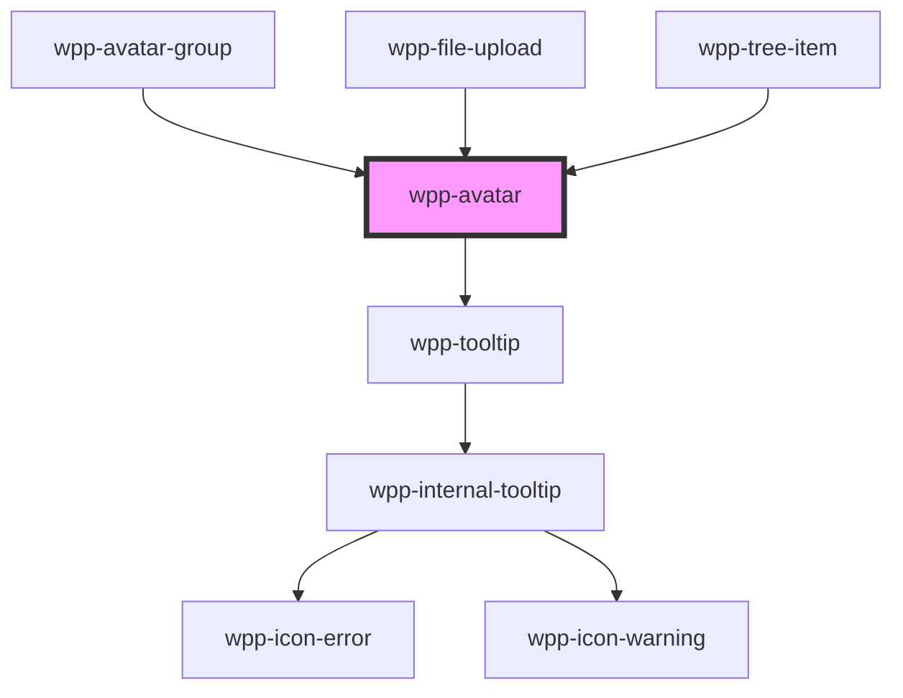

# wpp-avatar


<!-- Auto Generated Below -->


## Usage

### Angular

```html
<wpp-avatar
  [name]='name'
  [tooltipPlacement]='tooltipPlacement'
  [withTooltip]='withTooltip'
  [src]='src'
></wpp-avatar>
```

**component.ts**

```tsx
import { Component } from '@angular/core';

@Component({…})

export class AvatarExample {
  name = 'Voise Nueke'
  tooltipPlacement = 'bottom'
  withTooltip = true
  src = 'https://encrypted-tbn0.gstatic.com/images?q=tbn:ANd9GcQmijLXXeVuoV8O4bTS2DTFK1e8zsIeo_7H8w&usqp=CAU'
}
```


### React

```tsx
import { WppAvatar } from '@wppopen/components-library-react'

export const AvatarExample = () => (
  <WppAvatar
    name="Citlalli Tuva"
    tooltipPlacement="bottom"
    withTooltip
    src="https://encrypted-tbn0.gstatic.com/images?q=tbn:ANd9GcTiB6O_lfxeRec_iL5xnCkXpYVSKcbR2ouoMA&usqp=CAU"
  />
)
```


### Vue

```vue

<script setup lang="ts">
import { WppAvatar } from '@wppopen/components-library-vue'
</script>

<template>
  <WppAvatar
    name="Citlalli Tuva"
    tooltipPlacement="bottom"
    withTooltip
    src="https://encrypted-tbn0.gstatic.com/images?q=tbn:ANd9GcTiB6O_lfxeRec_iL5xnCkXpYVSKcbR2ouoMA&usqp=CAU"
  />
</template>


```


## Properties

| Property                | Attribute                  | Description                                                                                                                                                                                                     | Type                                                           | Default                          |
| ----------------------- | -------------------------- | --------------------------------------------------------------------------------------------------------------------------------------------------------------------------------------------------------------- | -------------------------------------------------------------- | -------------------------------- |
| `amountOfHiddenAvatars` | `amount-of-hidden-avatars` | Defines and displays the number of hidden avatars.                                                                                                                                                              | `number \| undefined`                                          | `undefined`                      |
| `ariaProps`             | --                         | Contains the button `aria-` props.                                                                                                                                                                              | `AriaProps`                                                    | `{}`                             |
| `color`                 | `color`                    | Defines the avatar background color.                                                                                                                                                                            | `string \| undefined`                                          | `undefined`                      |
| `icon`                  | `icon`                     | Defines the avatar icon. This prop will work if variant='circle', and you can pass icon as wpp-icon-premium.                                                                                                    | `string \| undefined`                                          | `undefined`                      |
| `interactable`          | `interactable`             | If `true`, the avatar is interactable (have hover effect).                                                                                                                                                      | `boolean`                                                      | `false`                          |
| `name`                  | `name`                     | Defines a username that is abbreviated if the image source is not provided.                                                                                                                                     | `string`                                                       | `''`                             |
| `role`                  | `role`                     | Role of the avatar component.                                                                                                                                                                                   | `string`                                                       | `'button'`                       |
| `size`                  | `size`                     | Defines the avatar size.                                                                                                                                                                                        | `"2xl" \| "3xl" \| "4xl" \| "l" \| "m" \| "s" \| "xl" \| "xs"` | `'xs'`                           |
| `src`                   | `src`                      | Defines the avatar image path.                                                                                                                                                                                  | `string \| undefined`                                          | `undefined`                      |
| `tooltipConfig`         | --                         | Defines the dropdown configuration. Under the hood dropdown using tippy.js, all information about this library and available props you can see via this link `https://atomiks.github.io/tippyjs/v6/all-props/`. | `DropdownConfig`                                               | `{     placement: 'bottom',   }` |
| `variant`               | `variant`                  | Defines the avatar type.                                                                                                                                                                                        | `"circle" \| "square"`                                         | `'circle'`                       |
| `withTooltip`           | `with-tooltip`             | If the avatar has a tooltip that displays the full username on hover.                                                                                                                                           | `boolean`                                                      | `false`                          |


## Events

| Event      | Description                              | Type                                   |
| ---------- | ---------------------------------------- | -------------------------------------- |
| `wppClick` | Emitted when the avatar item is clicked. | `CustomEvent<AvatarChangeEventDetail>` |


## Shadow Parts

| Part        | Description             |
| ----------- | ----------------------- |
| `"content"` | content wrapper element |
| `"icon"`    | Icon element            |
| `"image"`   | Image element           |
| `"tooltip"` | tooltip wrapper content |


## CSS Custom Properties

| Name                                         | Description |
| -------------------------------------------- | ----------- |
| `--wpp-avatar-circle-border-radius`          |             |
| `--wpp-avatar-circle-counter-border-radius`  |             |
| `--wpp-avatar-counter-bg-color`              |             |
| `--wpp-avatar-counter-bg-color-active`       |             |
| `--wpp-avatar-counter-bg-color-hover`        |             |
| `--wpp-avatar-counter-text-color`            |             |
| `--wpp-avatar-counter-text-color-active`     |             |
| `--wpp-avatar-counter-text-color-hover`      |             |
| `--wpp-avatar-first-border-color-focus`      |             |
| `--wpp-avatar-icon-bg-color`                 |             |
| `--wpp-avatar-icon-border-radius`            |             |
| `--wpp-avatar-icon-color`                    |             |
| `--wpp-avatar-second-border-color-focus`     |             |
| `--wpp-avatar-size-2xl`                      |             |
| `--wpp-avatar-size-2xl-square-border-radius` |             |
| `--wpp-avatar-size-l`                        |             |
| `--wpp-avatar-size-l-square-border-radius`   |             |
| `--wpp-avatar-size-m`                        |             |
| `--wpp-avatar-size-m-square-border-radius`   |             |
| `--wpp-avatar-size-s`                        |             |
| `--wpp-avatar-size-s-square-border-radius`   |             |
| `--wpp-avatar-size-xl`                       |             |
| `--wpp-avatar-size-xl-square-border-radius`  |             |
| `--wpp-avatar-size-xs`                       |             |
| `--wpp-avatar-size-xs-square-border-radius`  |             |
| `--wpp-avatar-square-counter-border-radius`  |             |
| `--wpp-avatar-without-image-border-radius`   |             |
| `--wpp-avatar-without-image-text-color`      |             |


## Dependencies

### Used by

 - [wpp-avatar-group](../..)
 - [wpp-file-upload](../../../wpp-file-upload)
 - [wpp-tree-item](../../../wpp-tree/components/wpp-tree-item)

### Depends on

- [wpp-tooltip](../../../wpp-tooltip)

### Graph


----------------------------------------------

*Built with [StencilJS](https://stenciljs.com/)*
