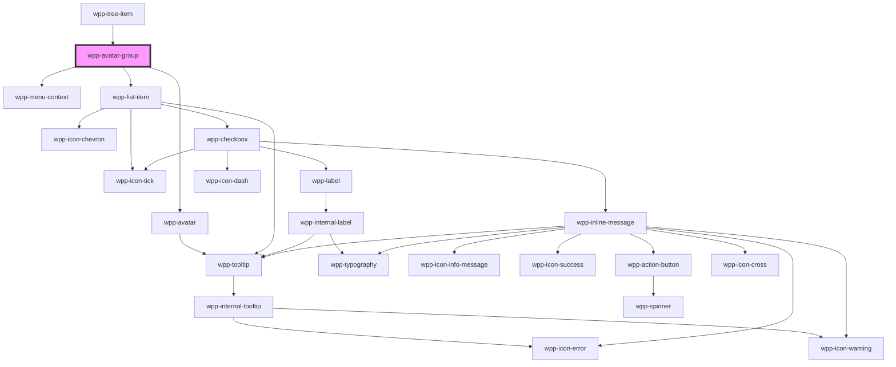

# wpp-avatar-group

## Interfaces

### User

```typescript
interface User {
  name: string
  src: string
  color?: string
}
```


<!-- Auto Generated Below -->


## Usage

### Angular

```html
<wpp-avatar-group
  [avatars]='avatars'
  [maxAvatarsToDisplay]='maxAvatarsToDisplay'
  size='s'
  withTooltip='bottom'
></wpp-avatar-group>
```

**component.ts**

```tsx
import { Component } from '@angular/core';

@Component({…})

export class AvatarGroupExample {
  avatars = [
    {
      name: 'Rose Langworth MD',
      src: '',
    },
    {
      name: 'Ryan Kozey',
      src: 'https://encrypted-tbn0.gstatic.com/images?q=tbn:ANd9GcQmijLXXeVuoV8O4bTS2DTFK1e8zsIeo_7H8w&usqp=CAU',
    },
    {
      name: 'Shawna Paucek',
      src: '',
    },
    {
      name: 'Rikard Linn',
      color: 'var(--wpp-dataviz-color-cat-neutral-10)',
    },
  ]
  maxAvatarsToDisplay = 2
}
```


### React

```tsx
import { WppAvatarGroup } from '@wppopen/components-library-react'

export const AvatarGroupExample = () => (
  <WppAvatarGroup
    maxAvatarsToDisplay={2}
    size="xs"
    withTooltip
    avatars={[
      {
        name: 'Wickaninnish Harald',
        src: '',
      },
      {
        name: 'Gustaf Marcus',
        src: 'https://encrypted-tbn0.gstatic.com/images?q=tbn:ANd9GcQ38ON2VKzlUNfxV-K_4J5fiGYFmi1PcER8ig&usqp=CAU',
      },
      {
        name: 'Helga Karla',
        src: '',
      },
      {
        name: 'Rikard Linn',
        color: 'var(--wpp-dataviz-color-cat-neutral-10)',
      },
    ]}
  />
)
```


### Vue

```vue

<script setup lang="ts">
import { WppAvatarGroup } from '@wppopen/components-library-vue'
</script>

<template>
  <WppAvatarGroup
    maxAvatarsToDisplay="2"
    size="xs"
    withTooltip
    :avatars="[
      {
        name: 'Wickaninnish Harald',
        src: '',
      },
      {
        name: 'Gustaf Marcus',
        src: 'https://encrypted-tbn0.gstatic.com/images?q=tbn:ANd9GcQ38ON2VKzlUNfxV-K_4J5fiGYFmi1PcER8ig&usqp=CAU',
      },
      {
        name: 'Helga Karla',
        src: '',
      },
    ]"
  />
</template>


```


## Properties

| Property              | Attribute                | Description                                                                                                                                                                                                                                                                          | Type                   | Default                          |
| --------------------- | ------------------------ | ------------------------------------------------------------------------------------------------------------------------------------------------------------------------------------------------------------------------------------------------------------------------------------ | ---------------------- | -------------------------------- |
| `avatars`             | --                       | Defines a list of avatars with specific attributes, such as name, src, color, and so on: `avatars={[{name: '', src: ''}]}`                                                                                                                                                           | `AvatarState[]`        | `[]`                             |
| `dropdownConfig`      | --                       | Defines the dropdown configuration. Under the hood dropdown using tippy.js, all information about this library and available props you can see via this link `https://atomiks.github.io/tippyjs/v6/all-props/`                                                                       | `DropdownConfig`       | `{}`                             |
| `maxAvatarsToDisplay` | `max-avatars-to-display` | Defines how many avatars to show before `+x`, where `x` is the number of hidden avatars.                                                                                                                                                                                             | `number`               | `6`                              |
| `size`                | `size`                   | Defines the avatar size.                                                                                                                                                                                                                                                             | `"s" \| "xs"`          | `'xs'`                           |
| `tooltipConfig`       | --                       | Defines the tooltip configuration. Under the hood tooltip using tippy.js, all information about this library and available props you can see via this link `https://atomiks.github.io/tippyjs/v6/all-props/`                                                                         | `DropdownConfig`       | `{     placement: 'bottom',   }` |
| `users`               | --                       | <span style="color:red">**[DEPRECATED]**</span> - this prop will be deleted in version 4.0.0. If you want to use this prop, use avatars prop instead<br/><br/>Defines a list of users with specific attributes, such as name, src, color, and so on: `users={[{name: '', src: ''}]}` | `AvatarState[]`        | `[]`                             |
| `variant`             | `variant`                | Defines the avatar variant.                                                                                                                                                                                                                                                          | `"circle" \| "square"` | `'circle'`                       |
| `withTooltip`         | `with-tooltip`           | If the avatar has a tooltip that displays the full name on hover.                                                                                                                                                                                                                    | `boolean`              | `false`                          |


## Events

| Event           | Description                              | Type                                        |
| --------------- | ---------------------------------------- | ------------------------------------------- |
| `wppSelectItem` | Emitted when the avatar item is clicked. | `CustomEvent<AvatarGroupChangeEventDetail>` |


## Shadow Parts

| Part                        | Description                         |
| --------------------------- | ----------------------------------- |
| `"avatar"`                  | Avatar element                      |
| `"hidden-item"`             | hidden-item wrapper element         |
| `"hidden-item-avatar"`      | hidden-item avatar element          |
| `"hidden-item-name"`        | hidden-item name element            |
| `"hidden-item-with-avatar"` | hidden-item content wrapper element |
| `"item"`                    | Avatar group item element           |
| `"list"`                    | Avatar group list element           |
| `"menu"`                    | Avatar group context menu element   |


## CSS Custom Properties

| Name                                            | Description |
| ----------------------------------------------- | ----------- |
| `--wpp-avatar-circle-group-margin-left-size-s`  |             |
| `--wpp-avatar-circle-group-margin-left-size-xs` |             |
| `--wpp-avatar-square-group-margin-left-size-s`  |             |
| `--wpp-avatar-square-group-margin-left-size-xs` |             |
| `--wpp-avatar-stroke-color`                     |             |
| `--wpp-avatar-stroke-width`                     |             |


## Dependencies

### Used by

 - [wpp-tree-item](../wpp-tree/components/wpp-tree-item)

### Depends on

- [wpp-avatar](./components/wpp-avatar)
- [wpp-menu-context](../wpp-menu-context)
- [wpp-list-item](../wpp-list-item)

### Graph


----------------------------------------------

*Built with [StencilJS](https://stenciljs.com/)*
