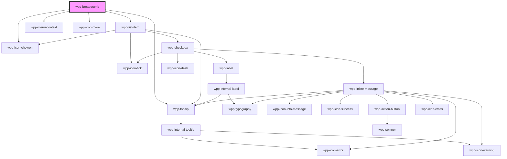

# wpp-breadcrumb


<!-- Auto Generated Below -->


## Usage

### Angular

```ts
@Component({
  ...
})
export class BreadcrumbExample {
  public readonly items: BreadcrumbItem[] = [
    {
      label: 'Home',
      path: '/'
    },

    {
      label: 'Alfa',
      path: '/alfa'
    },

    {
      label: 'Bravo (International Radiotelephony Spelling Alphabet)',
      path: '/alfa/bravo'
    },

    {
      label: 'Charlie',
      path: '/alfa/bravo/charlie'
    },

    {
      label: 'Delta (International Radiotelephony Spelling Alphabet)',
      path: '/alfa/bravo/charlie/delta'
    },

    {
      label: 'Echo',
      path: '/alfa/bravo/charlie/delta/echo'
    },

    {
      label: 'Foxtrot',
      path: '/alfa/bravo/charlie/delta/echo/foxtrot'
    }
  ];

  constructor(
    private readonly router: Router
  ) { }

  public handleRouteChange(event: Event): void {
    this.router.navigateByUrl((event as CustomEvent<string>).detail);
  }
}
```

```html
<wpp-breadcrumb [items]="items" middleTruncation (wppChange)="handleRouteChange($event)"></wpp-breadcrumb>
```


### React

```tsx
import { WppBreadcrumb } from '@wppopen/components-library-react';
import { useNavigate } from 'react-router-dom';

const items = [
  {
    label: 'Home',
    path: '/'
  },

  {
    label: 'Alfa',
    path: '/alfa'
  },

  {
    label: 'Bravo (International Radiotelephony Spelling Alphabet)',
    path: '/alfa/bravo'
  },

  {
    label: 'Charlie',
    path: '/alfa/bravo/charlie'
  },

  {
    label: 'Delta (International Radiotelephony Spelling Alphabet)',
    path: '/alfa/bravo/charlie/delta'
  },

  {
    label: 'Echo',
    path: '/alfa/bravo/charlie/delta/echo'
  },

  {
    label: 'Foxtrot',
    path: '/alfa/bravo/charlie/delta/echo/foxtrot'
  }
];

export const BreadcrumbExample = () => {
  const navigate = useNavigate();

  const handleRouteChange = (event: CustomEvent) => {
    navigate(event.detail);
  };

  return (
    <WppBreadcrumb items={items} middleTruncation onWppChange={handleRouteChange} />
  );
};
```


### Vue

```vue

<script setup lang="ts">
import { useRoute } from 'vue-router'

import { WppBreadcrumb } from '@wppopen/components-library-vue';

const items = [
  {
    label: 'Home',
    path: '/'
  },

  {
    label: 'Alfa',
    path: '/alfa'
  },

  {
    label: 'Bravo (International Radiotelephony Spelling Alphabet)',
    path: '/alfa/bravo'
  },

  {
    label: 'Charlie',
    path: '/alfa/bravo/charlie'
  },

  {
    label: 'Delta (International Radiotelephony Spelling Alphabet)',
    path: '/alfa/bravo/charlie/delta'
  },

  {
    label: 'Echo',
    path: '/alfa/bravo/charlie/delta/echo'
  },

  {
    label: 'Foxtrot',
    path: '/alfa/bravo/charlie/delta/echo/foxtrot'
  }
];

const router = useRoute()

const handleRouteChange = (event: CustomEvent) => {
  router.push(event.detail);
};
</script>

<template>
  <WppBreadcrumb :items="items" middleTruncation @wppChange="handleRouteChange" />
</template>


```


## Properties

| Property           | Attribute           | Description                                                                                                                                                                                                                                                                         | Type                    | Default     |
| ------------------ | ------------------- | ----------------------------------------------------------------------------------------------------------------------------------------------------------------------------------------------------------------------------------------------------------------------------------- | ----------------------- | ----------- |
| `backBtnLabel`     | `back-btn-label`    | If provided, renders a back button with the specified label instead of the breadcrumb. If undefined, renders the default breadcrumb.                                                                                                                                                | `string \| undefined`   | `undefined` |
| `dropdownConfig`   | --                  | Defines the dropdown configuration. Under the hood dropdown using tippy.js, all information about this library and available props you can see via this link `https://atomiks.github.io/tippyjs/v6/all-props/`                                                                      | `DropdownConfig`        | `{}`        |
| `items`            | --                  | Defines an array of breadcrumb items.                                                                                                                                                                                                                                               | `BreadcrumbItemState[]` | `[]`        |
| `maxLabelLength`   | `max-label-length`  | Defines the maximum label length (in characters) of a single item.                                                                                                                                                                                                                  | `number`                | `30`        |
| `middleTruncation` | `middle-truncation` | If the alternative truncation mode is enabled (items are truncated evenly with an ellipsis in the middle of the title).                                                                                                                                                             | `boolean`               | `false`     |
| `nativeLink`       | `native-link`       | If the navigation link behaves as an `a` tag. If the app uses `client side render`, leave as `false`, and if the app uses `server side render`, change to `true`. This prop is not dynamic, so, when changing its value in Storybook, refresh the page to see the change reflected. | `boolean`               | `false`     |


## Events

| Event       | Description                                                                                                                                   | Type                                      |
| ----------- | --------------------------------------------------------------------------------------------------------------------------------------------- | ----------------------------------------- |
| `wppChange` | Emitted when route changes, return object like { path: '/home', label: 'Home' } For back variant, emits { path: 'back', label: backBtnLabel } | `CustomEvent<BreadcrumbItemEventDetails>` |


## Shadow Parts

| Part                | Description                  |
| ------------------- | ---------------------------- |
| `"icon"`            |                              |
| `"icon-more"`       | icon more element            |
| `"item-text"`       | item text element            |
| `"item-tooltip"`    | item tooltip element         |
| `"menu"`            | menu context element         |
| `"menu-item"`       | menu item element            |
| `"menu-item-label"` | menu item label text element |
| `"slash"`           | slash element                |


## CSS Custom Properties

| Name                                              | Description |
| ------------------------------------------------- | ----------- |
| `--wpp-breadcrumb-color`                          |             |
| `--wpp-breadcrumb-item-border-radius-focus`       |             |
| `--wpp-breadcrumb-item-first-border-color-focus`  |             |
| `--wpp-breadcrumb-item-second-border-color-focus` |             |
| `--wpp-breadcrumb-item-text-active-color`         |             |
| `--wpp-breadcrumb-item-text-color`                |             |
| `--wpp-breadcrumb-item-text-hover-color`          |             |
| `--wpp-breadcrumb-menu-trigger-color`             |             |
| `--wpp-breadcrumb-menu-trigger-color-active`      |             |
| `--wpp-breadcrumb-menu-trigger-color-hover`       |             |
| `--wpp-breadcrumb-slash-margin`                   |             |


## Dependencies

### Depends on

- [wpp-tooltip](../wpp-tooltip)
- [wpp-list-item](../wpp-list-item)
- [wpp-icon-chevron](../wpp-icon/components/arrows/arrows/wpp-icon-chevron)
- [wpp-menu-context](../wpp-menu-context)
- [wpp-icon-more](../wpp-icon/components/system/menu/wpp-icon-more)

### Graph


----------------------------------------------

*Built with [StencilJS](https://stenciljs.com/)*
