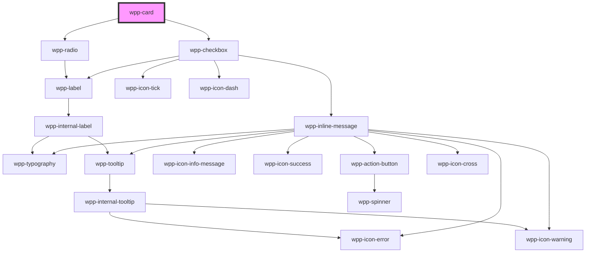

# wpp-card


<!-- Auto Generated Below -->


## Usage

### Angular

```html
<wpp-card header="Title">
  <div slot="header">
    <wpp-icon-user></wpp-icon-user>
    <wpp-typography>Header</wpp-typography>
  </div>
  <div slot="actions">
    <wpp-action-button variant="secondary">
      <wpp-icon-more slot="icon-start" direction='horizontal'></wpp-icon-plus>
    </wpp-action-button>
  </div>
  <div>Some content</div>
</wpp-card
```


### React

```tsx
import { WppCard, WppActionButton, WppIconMore, WppTypography } from '@wppopen/components-library-react'

export const CardExample = () => (
  <WppCard>
    <div slot="header">
      <WppIconMore />
      <WppTypography>Header</WppTypography>
    </div>
    <div slot="actions">
      <WppActionButton variant="secondary">
        <WppIconMore slot="icon-start" direction='horizontal'/>
      </WppActionButton>
    </div>
    <div>Some content</div>
  </WppCard>
)
```


### Vue

```vue
<script setup lang="ts">
import {
  WppCard,
  WppActionButton,
  WppIconMore,
  WppTypography
} from '@wppopen/components-library-vue'
</script>

<template>
  <WppCard>
    <div slot="header">
      <WppIconMore />
      <WppTypography>Header</WppTypography>
    </div>
    <div slot="actions">
      <WppActionButton variant="secondary">
        <WppIconMore slot="icon-start" direction='horizontal' />
      </WppActionButton>
    </div>
    <div>Some content</div>
  </WppCard>
</template>
```


## Properties

| Property      | Attribute     | Description                                                                                                                                                      | Type                                  | Default     |
| ------------- | ------------- | ---------------------------------------------------------------------------------------------------------------------------------------------------------------- | ------------------------------------- | ----------- |
| `ariaProps`   | --            | Contains the card `aria-` props.                                                                                                                                 | `AriaProps`                           | `{}`        |
| `background`  | `background`  | Accepts CSS background property values to control the component's background appearance. This can include colors, images, gradients, and positioning parameters. | `string \| undefined`                 | `undefined` |
| `checked`     | `checked`     | If `true`, the card is checked                                                                                                                                   | `boolean`                             | `false`     |
| `disabled`    | `disabled`    | If `true`, the card is disabled                                                                                                                                  | `boolean`                             | `false`     |
| `interactive` | `interactive` | If `true`, then on hover and on pressed card appropriate styles will be applied                                                                                  | `boolean`                             | `false`     |
| `name`        | `name`        | Indicates the name of the card                                                                                                                                   | `string \| undefined`                 | `undefined` |
| `size`        | `size`        | Indicates the size of the card                                                                                                                                   | `"2xl" \| "l" \| "m" \| "s" \| "xl"`  | `'m'`       |
| `type`        | `type`        | Indicates the type of the card                                                                                                                                   | `"multiple" \| "single" \| undefined` | `undefined` |
| `value`       | `value`       | Indicates the value of the card                                                                                                                                  | `number \| string \| undefined`       | `undefined` |
| `variant`     | `variant`     | Indicates the variant of the card.                                                                                                                               | `"primary" \| "secondary"`            | `'primary'` |


## Events

| Event      | Description                            | Type                                 |
| ---------- | -------------------------------------- | ------------------------------------ |
| `wppBlur`  | Emitted when the card loses focus      | `CustomEvent<FocusEvent>`            |
| `wppClick` | Emitted when the checked state changes | `CustomEvent<CardChangeEventDetail>` |
| `wppFocus` | Emitted when the card receives focus   | `CustomEvent<FocusEvent>`            |


## Methods

### `setFocus() => Promise<void>`

Method that sets focus on the card element.

#### Returns

Type: `Promise<void>`


## Slots

| Slot        | Description                                                                           |
| ----------- | ------------------------------------------------------------------------------------- |
|             | Content that is placed inside the card. The default slot, without the name attribute. |
| `"actions"` | Content is placed inside the `.actions` element and add content to actions.           |
| `"header"`  | Content that is placed inside the header section.                                     |


## Shadow Parts

| Part                     | Description          |
| ------------------------ | -------------------- |
| `"actions"`              | actions container    |
| `"card"`                 | card container       |
| `"checkbox"`             | Checkbox element     |
| `"header"`               | card header          |
| `"header-outer-wrapper"` |                      |
| `"header-wrapper"`       | card header wrapper  |
| `"inner"`                | Content slot element |
| `"radio"`                | input radio element  |


## CSS Custom Properties

| Name                                                  | Description |
| ----------------------------------------------------- | ----------- |
| `--wpp-card-actions-first-border-color-focus`         |             |
| `--wpp-card-actions-second-border-color-focus`        |             |
| `--wpp-card-actions-wrapper-left-margin`              |             |
| `--wpp-card-border-color`                             |             |
| `--wpp-card-border-radius`                            |             |
| `--wpp-card-border-style`                             |             |
| `--wpp-card-border-width`                             |             |
| `--wpp-card-choosable-bg-color`                       |             |
| `--wpp-card-choosable-border-color`                   |             |
| `--wpp-card-choosable-border-color-active`            |             |
| `--wpp-card-choosable-border-color-disabled`          |             |
| `--wpp-card-choosable-border-color-hover`             |             |
| `--wpp-card-choosable-border-style`                   |             |
| `--wpp-card-choosable-border-width`                   |             |
| `--wpp-card-choosable-first-border-color-focus`       |             |
| `--wpp-card-choosable-padding-2xl`                    |             |
| `--wpp-card-choosable-padding-l`                      |             |
| `--wpp-card-choosable-padding-m`                      |             |
| `--wpp-card-choosable-padding-s`                      |             |
| `--wpp-card-choosable-padding-xl`                     |             |
| `--wpp-card-choosable-second-border-color-focus`      |             |
| `--wpp-card-choosable-selected-border-color`          |             |
| `--wpp-card-choosable-selected-border-color-active`   |             |
| `--wpp-card-choosable-selected-border-color-disabled` |             |
| `--wpp-card-choosable-selected-border-color-hover`    |             |
| `--wpp-card-choosable-selected-border-width`          |             |
| `--wpp-card-choosable-selected-padding-2xl`           |             |
| `--wpp-card-choosable-selected-padding-l`             |             |
| `--wpp-card-choosable-selected-padding-m`             |             |
| `--wpp-card-choosable-selected-padding-s`             |             |
| `--wpp-card-choosable-selected-padding-xl`            |             |
| `--wpp-card-header-height`                            |             |
| `--wpp-card-header-margin-2xl`                        |             |
| `--wpp-card-header-margin-l`                          |             |
| `--wpp-card-header-margin-m`                          |             |
| `--wpp-card-header-margin-s`                          |             |
| `--wpp-card-header-margin-xl`                         |             |
| `--wpp-card-interactive-bg-color`                     |             |
| `--wpp-card-interactive-box-shadow-color`             |             |
| `--wpp-card-interactive-box-shadow-color-active`      |             |
| `--wpp-card-interactive-box-shadow-color-hover`       |             |
| `--wpp-card-interactive-first-border-color-focus`     |             |
| `--wpp-card-interactive-second-border-color-focus`    |             |
| `--wpp-card-padding-2xl`                              |             |
| `--wpp-card-padding-l`                                |             |
| `--wpp-card-padding-m`                                |             |
| `--wpp-card-padding-s`                                |             |
| `--wpp-card-padding-xl`                               |             |
| `--wpp-card-primary-bg-color`                         |             |
| `--wpp-card-primary-box-shadow`                       |             |
| `--wpp-card-secondary-bg-color`                       |             |
| `--wpp-card-tertiary-bg-color`                        |             |


## Dependencies

### Depends on

- [wpp-radio](../../../wpp-radio)
- [wpp-checkbox](../../../wpp-checkbox)

### Graph


----------------------------------------------

*Built with [StencilJS](https://stenciljs.com/)*
