# wpp-chat-input


<!-- Auto Generated Below -->


## Usage

### Angular

```html

<wpp-chat-input
  (wppSend)="onMessageSend($event)"
  (wppMessageChanged)="onMessageChanged($event)"
  [textValue]="chatValue"
  placeholder="Type your message..."
></wpp-chat-input>

<wpp-chat-input
  placeholder="Type your message..."
  enableAttach="true"
  [charactersLimit]="500"
  [fileUploadConfig]="{
    maxFiles: 5,
    size: 100,
    accept: ['.jpg', '.png', '.pdf']
  }"
  (wppChange)="onFileUploadChange($event)"
  (wppMessageChanged)="onMessageChanged($event)"
  (wppSend)="onMessageSend($event)"
  [textValue]="chatValue"
></wpp-chat-input>
```

```ts
import { Component } from '@angular/core'

@Component({
  selector: 'app-chat-input',
  templateUrl: './chat-input.page.html',
  styleUrls: ['./chat-input.page.scss'],
})
export class ChatInputPage {
  chatValue: string = ''

  onFileUploadChange(event: Event) {
    console.log('Files uploaded:', event.detail.value)
  }

  onMessageSend(event: Event) {
    console.log('Message Sent:', event.detail.message)
    console.log('Attachments:', event.detail.attachments)

    this.chatValue = ''
  }

  onMessageChanged(event: Event) {
    console.log('Message changed:', event.detail.value)

    this.chatValue = event.detail.value
  }
}
```


### React

```tsx
import { WppChatInput } from '@wppopen/components-library-react'

export const ChatInputExample = () => {
  const [chatValue, setChatValue] = useState('')
  const handleFileUploadChange = ({ detail }) => {
    console.log('Files uploaded:', detail.value)
  }

  const handleSend = ({ detail }) => {
    console.log('Message Sent:', detail.message)
    console.log('Attachments:', detail.attachments)

    setChatValue('')
  }

  const handleMessageChanged = (event) => {
    console.log('Message changed:', event.detail.value)

    setChatValue(event.detail.value)
  }

  return (
    <>
      {/* Basic Usage */}
      <WppChatInput onWppSend={handleSend}
                    onWppMessageChanged={handleMessageChanged}
                    textValue={chatValue}
                    placeholder="Type your message..." />

      {/* Chat Input with Attachments */}
      <WppChatInput
        onWppMessageChanged={handleMessageChanged}
        enableAttach={true}
        charactersLimit={500}
        fileUploadConfig={{
          maxFiles: 5,
          size: 100,
          accept: ['.jpg', '.png', '.pdf']
        }}
        onWppChange={handleFileUploadChange}
        onWppSend={handleSend}
        textValue={chatValue}
      />
    </>
  )
}
```


### Vue

```vue
<template>
  <div>
    <wpp-chat-input
      @wppSend="handleSend"
      @wppMessageChanged="handleMessageChanged"
      :textValue="chatValue"
      placeholder="Type your message..."
    />

    <wpp-chat-input
      placeholder="Type your message..."
      :enableAttach="true"
      :charactersLimit="500"
      :fileUploadConfig="{
        maxFiles: 5,
        size: 100,
        accept: ['.jpg', '.png', '.pdf']
      }"
      @wppChange="handleFileUploadChange"
      @wppMessageChanged="handleMessageChanged"
      @wppSend="handleSend"
      :textValue="chatValue"
    />
  </div>
</template>

<script>
export default {
  data() {
    return {
      chatValue: ''
    }
  },
  methods: {
    handleFileUploadChange(event) {
      console.log('Files uploaded:', event.detail.value)
    },
    handleSend(event) {
      console.log('Message Sent:', event.detail.message)
      console.log('Attachments:', event.detail.attachments)

      this.chatValue = ''
    },
    handleMessageChanged(event) {
      console.log('Message changed:', event.detail.value)

      this.chatValue = event.detail.value
    }
  }
}
</script>
```


## Properties

| Property           | Attribute          | Description                                                                                                                                                                                                           | Type                                                                                                                                                                                                                                                                                                                                                                                                                                                                                  | Default                                                                                                                                                                                                                                                                                                                                                                                                                                                                                                                                                                                                                                                                                                                                                                                                                                                                                                                                                                                                                                                                                                                                                                                                                                                                                                                                                                                                                                                                                                                                                                                                                                                                                                                                                                                                                                                                                                                                                                                                                                                                                                                                                                                                                                                                   |
| ------------------ | ------------------ | --------------------------------------------------------------------------------------------------------------------------------------------------------------------------------------------------------------------- | ------------------------------------------------------------------------------------------------------------------------------------------------------------------------------------------------------------------------------------------------------------------------------------------------------------------------------------------------------------------------------------------------------------------------------------------------------------------------------------- | ------------------------------------------------------------------------------------------------------------------------------------------------------------------------------------------------------------------------------------------------------------------------------------------------------------------------------------------------------------------------------------------------------------------------------------------------------------------------------------------------------------------------------------------------------------------------------------------------------------------------------------------------------------------------------------------------------------------------------------------------------------------------------------------------------------------------------------------------------------------------------------------------------------------------------------------------------------------------------------------------------------------------------------------------------------------------------------------------------------------------------------------------------------------------------------------------------------------------------------------------------------------------------------------------------------------------------------------------------------------------------------------------------------------------------------------------------------------------------------------------------------------------------------------------------------------------------------------------------------------------------------------------------------------------------------------------------------------------------------------------------------------------------------------------------------------------------------------------------------------------------------------------------------------------------------------------------------------------------------------------------------------------------------------------------------------------------------------------------------------------------------------------------------------------------------------------------------------------------------------------------------------------- |
| `attachments`      | --                 | Defines the files list                                                                                                                                                                                                | `FileItemType[]`                                                                                                                                                                                                                                                                                                                                                                                                                                                                      | `[]`                                                                                                                                                                                                                                                                                                                                                                                                                                                                                                                                                                                                                                                                                                                                                                                                                                                                                                                                                                                                                                                                                                                                                                                                                                                                                                                                                                                                                                                                                                                                                                                                                                                                                                                                                                                                                                                                                                                                                                                                                                                                                                                                                                                                                                                                      |
| `charactersLimit`  | `characters-limit` | Maximum number of allowed characters.                                                                                                                                                                                 | `number \| undefined`                                                                                                                                                                                                                                                                                                                                                                                                                                                                 | `undefined`                                                                                                                                                                                                                                                                                                                                                                                                                                                                                                                                                                                                                                                                                                                                                                                                                                                                                                                                                                                                                                                                                                                                                                                                                                                                                                                                                                                                                                                                                                                                                                                                                                                                                                                                                                                                                                                                                                                                                                                                                                                                                                                                                                                                                                                               |
| `debounceDelay`    | `debounce-delay`   | Debounce delay in milliseconds.                                                                                                                                                                                       | `number`                                                                                                                                                                                                                                                                                                                                                                                                                                                                              | `300`                                                                                                                                                                                                                                                                                                                                                                                                                                                                                                                                                                                                                                                                                                                                                                                                                                                                                                                                                                                                                                                                                                                                                                                                                                                                                                                                                                                                                                                                                                                                                                                                                                                                                                                                                                                                                                                                                                                                                                                                                                                                                                                                                                                                                                                                     |
| `debounceEnabled`  | `debounce-enabled` | If set to `true`, enable debounce for onInput event.                                                                                                                                                                  | `boolean`                                                                                                                                                                                                                                                                                                                                                                                                                                                                             | `true`                                                                                                                                                                                                                                                                                                                                                                                                                                                                                                                                                                                                                                                                                                                                                                                                                                                                                                                                                                                                                                                                                                                                                                                                                                                                                                                                                                                                                                                                                                                                                                                                                                                                                                                                                                                                                                                                                                                                                                                                                                                                                                                                                                                                                                                                    |
| `disabled`         | `disabled`         | If `true`, the chat input is disabled.                                                                                                                                                                                | `boolean`                                                                                                                                                                                                                                                                                                                                                                                                                                                                             | `false`                                                                                                                                                                                                                                                                                                                                                                                                                                                                                                                                                                                                                                                                                                                                                                                                                                                                                                                                                                                                                                                                                                                                                                                                                                                                                                                                                                                                                                                                                                                                                                                                                                                                                                                                                                                                                                                                                                                                                                                                                                                                                                                                                                                                                                                                   |
| `enableAttach`     | `enable-attach`    | Whether the attach button is enabled.                                                                                                                                                                                 | `boolean`                                                                                                                                                                                                                                                                                                                                                                                                                                                                             | `false`                                                                                                                                                                                                                                                                                                                                                                                                                                                                                                                                                                                                                                                                                                                                                                                                                                                                                                                                                                                                                                                                                                                                                                                                                                                                                                                                                                                                                                                                                                                                                                                                                                                                                                                                                                                                                                                                                                                                                                                                                                                                                                                                                                                                                                                                   |
| `fileUploadConfig` | --                 | Configuration object for file upload functionality.                                                                                                                                                                   | `undefined \| ({ format?: FileUploadResultFormaType \| undefined; maxLabelLength?: number \| undefined; multiple?: boolean \| undefined; maxFiles?: number \| undefined; size?: number \| undefined; accept?: string[] \| undefined; acceptConfig?: AcceptConfig \| undefined; validator?: ((file: FileItemType) => string \| null) \| undefined; showOnlyNewErrors?: boolean \| undefined; controlled?: boolean \| undefined; locales?: ChatInputFileUploadLocales \| undefined; })` | `{     /**      * Format of the file upload result.      */     format: 'base64',      /**      * Maximum label length (in characters) of single item      */     maxLabelLength: 30,      /**      * If `true`, allows multiple files to be uploaded at once.      */     multiple: true,      /**      * Maximum number of files allowed for upload.      * Set to `0` for no restriction.      */     maxFiles: 0,      /**      * Maximum allowed size of each file in MB.      */     size: 150,      /**      * Accept file format, you can pass any format you want download, by default is `.jpg, .jpeg, .png`      *      * @deprecated - this prop will be deleted in 4.0.0 version as it is not flexible enough to handle different      * cases with files validations, for example based on mimetype and extension at the same time.      * This property handle only a few extensions: ['.jpg', '.jpeg', '.png', '.txt', '.text', '.doc', '.docx', '.mov'],      * and list will NOT be extended.      *      * If you want to use this prop, use "acceptConfig" property instead.      * Note: "acceptConfig" property will have a higher priority in case if both "acceptConfig" and "accept" props will be provided      */     accept: ['.jpg', '.jpeg', '.png'],      /**      * Object defining accepted MIME types and their corresponding extensions.      * Example: `{ 'image/png': ['.png'], 'application/pdf': ['.pdf'] }`.      * Overrides `accept` if both are provided.      */     acceptConfig: {},      /**      * Defines custom validation function for uploaded files.      * Should return `null` if the file is valid, or a string error message otherwise.      */     validator: () => null,      /**      * If `true`, replaces existing error messages with new ones for failed uploads.      * If `false`, retains existing errors and appends new ones.      */     showOnlyNewErrors: false,      /**      * If `true`, the file upload works as controlled component.      */     controlled: false,      /**      * Indicates locales for file upload component      */     locales: {       sizeError: 'File exceeds size limit',       formatError: 'Wrong format',       limitError: 'Files limit reached',     },   }` |
| `placeholder`      | `placeholder`      | Placeholder text for the input field.                                                                                                                                                                                 | `string`                                                                                                                                                                                                                                                                                                                                                                                                                                                                              | `'Type your message...'`                                                                                                                                                                                                                                                                                                                                                                                                                                                                                                                                                                                                                                                                                                                                                                                                                                                                                                                                                                                                                                                                                                                                                                                                                                                                                                                                                                                                                                                                                                                                                                                                                                                                                                                                                                                                                                                                                                                                                                                                                                                                                                                                                                                                                                                  |
| `size`             | `size`             | Size of the component.                                                                                                                                                                                                | `"m" \| "s"`                                                                                                                                                                                                                                                                                                                                                                                                                                                                          | `'m'`                                                                                                                                                                                                                                                                                                                                                                                                                                                                                                                                                                                                                                                                                                                                                                                                                                                                                                                                                                                                                                                                                                                                                                                                                                                                                                                                                                                                                                                                                                                                                                                                                                                                                                                                                                                                                                                                                                                                                                                                                                                                                                                                                                                                                                                                     |
| `textValue`        | `text-value`       | Text value used to set the input message content. When user input occurs, a `wppMessageChanged` event is emitted. The new value should be assigned to this property to maintain synchronization with the input field. | `string`                                                                                                                                                                                                                                                                                                                                                                                                                                                                              | `''`                                                                                                                                                                                                                                                                                                                                                                                                                                                                                                                                                                                                                                                                                                                                                                                                                                                                                                                                                                                                                                                                                                                                                                                                                                                                                                                                                                                                                                                                                                                                                                                                                                                                                                                                                                                                                                                                                                                                                                                                                                                                                                                                                                                                                                                                      |
| `withSelect`       | `with-select`      | If set to true, displays `Select` in left actions. The Select must placed in the `.select` slot.                                                                                                                      | `boolean`                                                                                                                                                                                                                                                                                                                                                                                                                                                                             | `false`                                                                                                                                                                                                                                                                                                                                                                                                                                                                                                                                                                                                                                                                                                                                                                                                                                                                                                                                                                                                                                                                                                                                                                                                                                                                                                                                                                                                                                                                                                                                                                                                                                                                                                                                                                                                                                                                                                                                                                                                                                                                                                                                                                                                                                                                   |
| `zIndex`           | `z-index`          | Defines the z-index of the WppChatInput.                                                                                                                                                                              | `number`                                                                                                                                                                                                                                                                                                                                                                                                                                                                              | `Z_INDEX.CHAT`                                                                                                                                                                                                                                                                                                                                                                                                                                                                                                                                                                                                                                                                                                                                                                                                                                                                                                                                                                                                                                                                                                                                                                                                                                                                                                                                                                                                                                                                                                                                                                                                                                                                                                                                                                                                                                                                                                                                                                                                                                                                                                                                                                                                                                                            |


## Events

| Event               | Description                                            | Type                                 |
| ------------------- | ------------------------------------------------------ | ------------------------------------ |
| `wppChange`         | Emitted when the value of the input changes.           | `CustomEvent<FileUploadEventDetail>` |
| `wppMessageChanged` | Emitted when the message in the input message changes. | `CustomEvent<{ value: string; }>`    |
| `wppSend`           | Emitted when the user clicks the "Send" button.        | `CustomEvent<SendEventDetail>`       |


## Shadow Parts

| Part                     | Description |
| ------------------------ | ----------- |
| `"actions-bar"`          |             |
| `"attachments"`          |             |
| `"chat-input-container"` |             |
| `"file-item"`            |             |
| `"input-area"`           |             |
| `"left-actions"`         |             |
| `"minimized-input"`      |             |
| `"right-actions"`        |             |
| `"text-input"`           |             |
| `"toast"`                |             |


## Dependencies

### Depends on

- [wpp-toast](../../../wpp-toast)
- [wpp-file-upload-item](../../../wpp-file-upload/components)
- [wpp-typography](../../../wpp-typography)
- [wpp-action-button](../../../wpp-action-button)
- [wpp-icon-send](../../../wpp-icon/components/communication/communication/wpp-icon-send)
- [wpp-icon-attach](../../../wpp-icon/components/actions/content actions/wpp-icon-attach)
- [wpp-icon-mic-on](../../../wpp-icon/components/media/media/wpp-icon-mic-on)
- [wpp-icon-document](../../../wpp-icon/components/content/files/wpp-icon-document)
- [wpp-icon-file-zip](../../../wpp-icon/components/content/files/wpp-icon-file-zip)
- [wpp-icon-image](../../../wpp-icon/components/media/media/wpp-icon-image)
- [wpp-icon-video-clip](../../../wpp-icon/components/media/media/wpp-icon-video-clip)
- [wpp-icon-music](../../../wpp-icon/components/media/media/wpp-icon-music)
- [wpp-icon-database](../../../wpp-icon/components/content/charts/wpp-icon-database)
- [wpp-icon-pitch](../../../wpp-icon/components/content/content/wpp-icon-pitch)
- [wpp-icon-spreadsheet](../../../wpp-icon/components/content/files/wpp-icon-spreadsheet)
- [wpp-icon-file](../../../wpp-icon/components/content/files/wpp-icon-file)

### Graph

```mermaid
graph TD;
  wpp-chat-input --> wpp-toast
  wpp-chat-input --> wpp-file-upload-item
  wpp-chat-input --> wpp-typography
  wpp-chat-input --> wpp-action-button
  wpp-chat-input --> wpp-icon-send
  wpp-chat-input --> wpp-icon-attach
  wpp-chat-input --> wpp-icon-mic-on
  wpp-chat-input --> wpp-icon-document
  wpp-chat-input --> wpp-icon-file-zip
  wpp-chat-input --> wpp-icon-image
  wpp-chat-input --> wpp-icon-video-clip
  wpp-chat-input --> wpp-icon-music
  wpp-chat-input --> wpp-icon-database
  wpp-chat-input --> wpp-icon-pitch
  wpp-chat-input --> wpp-icon-spreadsheet
  wpp-chat-input --> wpp-icon-file
  wpp-toast --> wpp-icon-warning
  wpp-toast --> wpp-icon-error
  wpp-toast --> wpp-icon-info-message
  wpp-toast --> wpp-icon-success
  wpp-toast --> wpp-typography
  wpp-toast --> wpp-action-button
  wpp-toast --> wpp-icon-cross
  wpp-action-button --> wpp-spinner
  wpp-file-upload-item --> wpp-spinner
  wpp-file-upload-item --> wpp-inline-message
  wpp-file-upload-item --> wpp-icon-cross
  wpp-file-upload-item --> wpp-tooltip
  wpp-file-upload-item --> wpp-typography
  wpp-file-upload-item --> wpp-icon-document
  wpp-file-upload-item --> wpp-icon-file-zip
  wpp-file-upload-item --> wpp-icon-image
  wpp-file-upload-item --> wpp-icon-video-clip
  wpp-file-upload-item --> wpp-icon-music
  wpp-file-upload-item --> wpp-icon-database
  wpp-file-upload-item --> wpp-icon-pitch
  wpp-file-upload-item --> wpp-icon-spreadsheet
  wpp-file-upload-item --> wpp-icon-file
  wpp-inline-message --> wpp-icon-warning
  wpp-inline-message --> wpp-icon-error
  wpp-inline-message --> wpp-icon-info-message
  wpp-inline-message --> wpp-icon-success
  wpp-inline-message --> wpp-typography
  wpp-inline-message --> wpp-tooltip
  wpp-inline-message --> wpp-action-button
  wpp-inline-message --> wpp-icon-cross
  wpp-tooltip --> wpp-internal-tooltip
  wpp-internal-tooltip --> wpp-icon-error
  wpp-internal-tooltip --> wpp-icon-warning
  style wpp-chat-input fill:#f9f,stroke:#333,stroke-width:4px
```


----------------------------------------------

*Built with [StencilJS](https://stenciljs.com/)*
