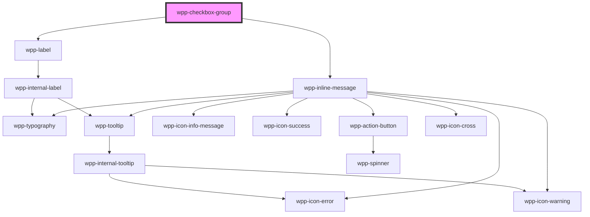

# wpp-checkbox-group

<!-- Auto Generated Below -->


## Usage

### Angular

```html
<div>
  <wpp-typography type="xl-heading">Checkbox Group</wpp-typography>
  <wpp-checkbox-group
    [labelConfig]="labelConfigGroup"
    class="checkboxGroup"
    [value]="value"
    (wppChange)="handleWppChange($event)"
  >
    <wpp-checkbox
      *ngFor="let checkbox of checkboxes"
      [key]="checkbox.value"
      required
      [value]="checkbox.value"
      message="Warning message"
      [messageType]="warningType"
      [maxMessageLength]="maxMessageLength"
      [labelConfig]="{ text: checkbox.text }"
    >
    </wpp-checkbox>
  </wpp-checkbox-group>

  <wpp-button [style]="{ marginTop: '10px' }" [disabled]="checkboxes.length === 5" (click)="handleAddOption()">
    Add option
  </wpp-button>

  <wpp-button [style]="{ marginTop: '10px' }" (click)="selectAllOptions()"> Select All options </wpp-button>
</div>
```

**component.ts**

```tsx
import { CheckboxGroupValue } from '@wppopen/components-library'

@Component({…})

export class CheckboxExamplePage {
  public warningType = 'warning'
  public maxMessageLength = 10
  public checkboxes = [
    {
      value: 'option-1',
      text: 'Option 1',
    },
    {
      value: 'option-2',
      text: 'Option 2',
    },
    {
      value: 'option-3',
      text: 'Option 3',
    },
  ]
  public value: CheckboxGroupValue[] = ['option-1', 'option-2', 'option-3']
  public labelConfigGroup = { text: 'Checkbox Group', description: 'Checkbox Group description', icon: 'wpp-icon-info' }

  public handleWppChange = event => {
    const eventValue = event.detail.value as CheckboxGroupValue[]

    this.value = eventValue
  }

  public handleAddOption = () => {
    if (this.checkboxes.length < 5) {
      this.checkboxes = [
        ...this.checkboxes,
        { value: `option-${this.checkboxes.length + 1}`, text: `Option ${this.checkboxes.length + 1}` },
      ]
    }
  }

  public selectAllOptions = () => {
    this.value = ['option-1', 'option-2', 'option-3', 'option-4', 'option-5']
  }
}
```


### React

```tsx
import { WppButton, WppCheckbox, WppCheckboxGroup, WppTypography } from '@wppopen/components-library-react'
import { WppCheckboxGroupCustomEvent } from '@wppopen/components-library/dist/types/components'
import { CheckboxGroupChangeEvent } from '@wppopen/components-library'
import { useState } from 'react'
import { CheckboxGroupValue } from '@wppopen/components-library'

export const CheckboxesPage = () => {
  const [checkboxes, setCheckboxes] = useState([
    {
      value: 'option-1',
      text: 'Option 1',
    },
    {
      value: 'option-2',
      text: 'Option 2',
    },
    {
      value: 'option-3',
      text: 'Option 3',
    },
  ])
  const [value, setValue] = useState<CheckboxGroupValue[]>(['option-1', 'option-2', 'option-3'])

  const handleWppChange = (event: WppCheckboxGroupCustomEvent<CheckboxGroupChangeEvent>) => {
    const eventValue = event.detail.value as CheckboxGroupValue[]

    setValue(eventValue)
  }

  const handleAddOption = () => {
    if (checkboxes.length < 5) {
      setCheckboxes([
        ...checkboxes,
        { value: `option-${checkboxes.length + 1}`, text: `Option ${checkboxes.length + 1}` },
      ])
    }
  }

  return (
    <div>
      <WppTypography type={'xl-heading'}>With 3 items</WppTypography>
      <WppCheckboxGroup
        labelConfig={{ text: 'Checkbox Group', description: 'Checkbox Group description', icon: 'wpp-icon-info' }}
        className={styles.checkboxGroup}
        value={value}
        onWppChange={handleWppChange}
      >
        {checkboxes.map(checkbox => (
          <WppCheckbox key={checkbox.value} required value={checkbox.value} labelConfig={{ text: checkbox.text }} />
        ))}
      </WppCheckboxGroup>

      <WppButton style={{ marginTop: '10px' }} disabled={checkboxes.length === 5} onClick={handleAddOption}>
        Add option
      </WppButton>
      <WppButton
        style={{ marginTop: '10px' }}
        onClick={() => setValue(['option-1', 'option-2', 'option-3', 'option-4', 'option-5'])}
      >
        Select All options
      </WppButton>
    </div>
  )
}
```


### Vue

```vue
<script setup lang="ts">
import type { CheckboxGroupChangeEvent, CheckboxGroupValue } from '@wppopen/components-library'
import { WppCheckbox, WppTypography, WppCheckboxGroup, WppButton } from '@wppopen/components-library-vue'
import type { WppCheckboxGroupCustomEvent } from '@wppopen/components-library/src/components'
import { ref } from 'vue'

const checkboxes = ref([
  {
    value: 'option-1',
    text: 'Option 1',
  },
  {
    value: 'option-2',
    text: 'Option 2',
  },
  {
    value: 'option-3',
    text: 'Option 3',
  },
])
const valueRef = ref<CheckboxGroupValue[]>(['option-1', 'option-2', 'option-3'])

const handleWppChange = (event: WppCheckboxGroupCustomEvent<CheckboxGroupChangeEvent>) => {
  const eventValue = event.detail.value as CheckboxGroupValue[]

  valueRef.value = eventValue
}

const handleAddOption = () => {
  if (checkboxes.value.length < 5) {
    checkboxes.value = [
      ...checkboxes.value,
      { value: `option-${checkboxes.value.length + 1}`, text: `Option ${checkboxes.value.length + 1}` },
    ]
  }
}

const selectAllOptions = () => {
  valueRef.value = ['option-1', 'option-2', 'option-3', 'option-4', 'option-5']
}
</script>

<template>
  <div class="checkboxes">
    <WppTypography type="xl-heading">With 3 items</WppTypography>
    <WppCheckboxGroup
      :labelConfig="{ text: 'Checkbox Group', description: 'Checkbox Group description', icon: 'wpp-icon-info' }"
      class="checkboxGroup"
      :value="valueRef"
      @wppChange="handleWppChange"
    >
      <WppCheckbox
        v-for="checkbox in checkboxes"
        :key="checkbox.value"
        required
        :value="checkbox.value"
        :labelConfig="{ text: checkbox.text }"
      />
    </WppCheckboxGroup>

    <WppButton :style="{ marginTop: '10px' }" :disabled="checkboxes.length === 5" @click="handleAddOption">
      Add option
    </WppButton>
    <WppButton :style="{ marginTop: '10px' }" @click="selectAllOptions"> Select All options </WppButton>
  </div>
</template>
```


## Properties

| Property             | Attribute            | Description                                                                                                                                                                                         | Type                                | Default                                                                |
| -------------------- | -------------------- | --------------------------------------------------------------------------------------------------------------------------------------------------------------------------------------------------- | ----------------------------------- | ---------------------------------------------------------------------- |
| `ariaProps`          | --                   | Contains the checkbox group `aria-` props.                                                                                                                                                          | `AriaProps`                         | `{     labelledby: 'label-id',     describedby: 'description-id',   }` |
| `direction`          | `direction`          | Defines the direction in which the checkbox items are displayed. By default, the items are displayed vertically (in a column).                                                                      | `"column" \| "row"`                 | `'column'`                                                             |
| `labelConfig`        | --                   | Indicates the label configuration for the checkbox group.                                                                                                                                           | `LabelConfig \| undefined`          | `undefined`                                                            |
| `labelTooltipConfig` | --                   | Tooltip config for label, under the hood tooltip using tippy.js, all information about this library and available props you can see via this link `https://atomiks.github.io/tippyjs/v6/all-props/` | `DropdownConfig`                    | `{     popperOptions: { strategy: 'fixed' },   }`                      |
| `maxMessageLength`   | `max-message-length` | Defines the message's maximum length. If the length of the message is greater than the value of this property, the message will be truncated and a tooltip will display the whole text upon hover.  | `number \| undefined`               | `undefined`                                                            |
| `message`            | `message`            | Defines the message that is going to be displayed below the checkbox group. This property should be used in case there is an error / warning that needs to be displayed on the component.           | `string \| undefined`               | `undefined`                                                            |
| `messageType`        | `message-type`       | Defines the message's type and can take one of the following values: "error" / "warning". The icon displayed for the message will change based on this property.                                    | `"error" \| "warning" \| undefined` | `undefined`                                                            |
| `required`           | `required`           | If `true`, the group is required                                                                                                                                                                    | `boolean`                           | `false`                                                                |
| `value`              | --                   | Defines the checkbox group value.                                                                                                                                                                   | `CheckboxGroupValue[]`              | `[]`                                                                   |


## Events

| Event       | Description                                    | Type                                                                                              |
| ----------- | ---------------------------------------------- | ------------------------------------------------------------------------------------------------- |
| `wppBlur`   | Emitted when the group loses focus             | `CustomEvent<FocusEvent>`                                                                         |
| `wppChange` | Emitted when the checkbox group value changes. | `CustomEvent<BaseFormControlEventDetail<CheckboxGroupValue[]> & { name?: string \| undefined; }>` |
| `wppFocus`  | Emitted when the group receives focus          | `CustomEvent<FocusEvent>`                                                                         |


## Slots

| Slot | Description                                                                                                                                                                                                             |
| ---- | ----------------------------------------------------------------------------------------------------------------------------------------------------------------------------------------------------------------------- |
|      | Can contain only the `wpp-checkbox` components that are displayed in `checkbox-group`. The default slot, without the name attribute. A maximum of 5 checkbox elements are allowed in this component and a minimum of 2. |


## Shadow Parts

| Part      | Description          |
| --------- | -------------------- |
| `"inner"` | Content slot element |


## Dependencies

### Depends on

- [wpp-label](../wpp-label)
- [wpp-inline-message](../wpp-inline-message)

### Graph


----------------------------------------------

*Built with [StencilJS](https://stenciljs.com/)*
