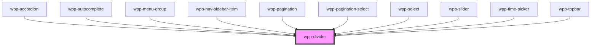

# wpp-divider


<!-- Auto Generated Below -->


## Usage

### Angular

```html
<wpp-divider></wpp-divider>
<wpp-divider vertical></wpp-divider>
```


### React

```tsx
import {  WppDivider } from '@wppopen/components-library-react'

export const DividerExample = () => (
  <WppDivider></WppDivider>
)

export const VerticalDividerExample = () => (
  <WppDivider vertical></WppDivider>
)
```


### Vue

```vue
<script setup lang="ts">
import { WppDivider } from '@wppopen/components-library-vue'
</script>

<template>
  <WppDivider />
  <WppDivider vertical/>
</template>
```


## Properties

| Property    | Attribute   | Description                                                                               | Type      | Default |
| ----------- | ----------- | ----------------------------------------------------------------------------------------- | --------- | ------- |
| `resizable` | `resizable` | If true, the divider will be interactive and can be dragged to resize. Defaults to false. | `boolean` | `false` |
| `vertical`  | `vertical`  | If true, the divider will be vertical. Defaults to false.                                 | `boolean` | `false` |


## Shadow Parts

| Part     | Description          |
| -------- | -------------------- |
| `"body"` | Main content element |


## CSS Custom Properties

| Name                          | Description |
| ----------------------------- | ----------- |
| `--wpp-divider-bg-color`      |             |
| `--wpp-divider-border-radius` |             |
| `--wpp-divider-height`        |             |
| `--wpp-divider-width`         |             |


## Dependencies

### Used by

 - [wpp-accordion](../wpp-accordion)
 - [wpp-autocomplete](../wpp-autocomplete)
 - [wpp-menu-group](../wpp-menu-context/components/wpp-menu-group)
 - [wpp-nav-sidebar-item](../wpp-nav-sidebar/components/wpp-nav-sidebar-item)
 - [wpp-pagination](../wpp-pagination)
 - [wpp-pagination-select](../wpp-pagination/components/wpp-pagination-select)
 - [wpp-select](../wpp-select)
 - [wpp-slider](../wpp-slider)
 - [wpp-time-picker](../wpp-time-picker)
 - [wpp-topbar](../wpp-topbar)

### Graph


----------------------------------------------

*Built with [StencilJS](https://stenciljs.com/)*
