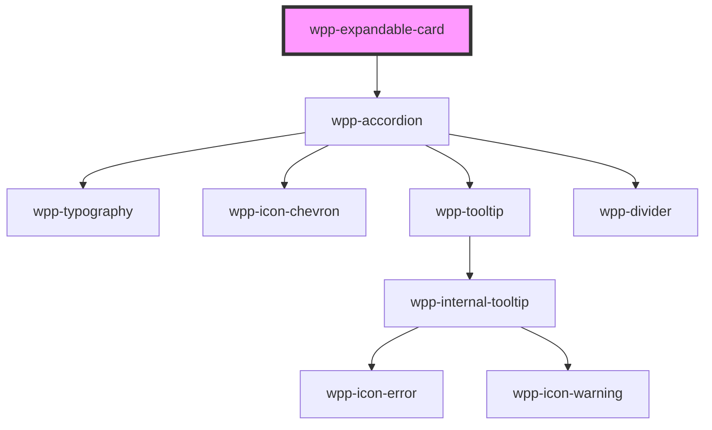

# wpp-expandable-card


<!-- Auto Generated Below -->


## Usage

### Angular

```html
<wpp-expandable-card expanded>
  <wpp-typography type="m-strong" slot="header">Governance & Ethics</wpp-typography>
  <wpp-typography>
    Having a proactive Board and strong leadership that is deeply committed to high ethical standards is a business
    imperative for ensuring sustainable success
  </wpp-typography>
</wpp-expandable-card>

<wpp-expandable-card>
  <wpp-typography type="m-strong" slot="header">What's next</wpp-typography>
  <div>
    <wpp-typography>
      Having a proactive Board and strong leadership that is deeply committed to high ethical standards is a
      business imperative for ensuring sustainable success
    </wpp-typography>
    <wpp-input></wpp-input>
  </div>
  <wpp-action-button variant="secondary" slot="actions">
    Action
    <wpp-icon-edit slot="icon-start"></wpp-icon-edit>
  </wpp-action-button>
</wpp-expandable-card>
```


### React

```tsx
import React from 'react'
import {
  WppExpandableCard,
  WppProgressIndicator,
  WppInput,
  WppTypography,
} from '@platform-ui-kit/components-library-react'
import { ExpandableCardSectionChangeEventDetail } from '@platform-ui-kit/components-library'

export const ExpandableCardExample = () => {
  const handleChange = (event: CustomEvent<ExpandableCardSectionChangeEventDetail>) => {
    console.log('e ====>', event.detail.expanded)
  }

  return (
    <>
      <WppExpandableCard expanded onWppChange={handleChange}>
        <WppTypography type="m-strong" slot="header">Governance & Ethics</WppTypography>
        <WppTypography>
          Having a proactive Board and strong leadership that is deeply committed to high ethical standards is a
          business imperative for ensuring sustainable success
        </WppTypography>
      </WppExpandableCard>

      <WppExpandableCard>
        <WppTypography type="m-strong" slot="header">What's next</WppTypography>
        <div>
          <WppTypography>
            Having a proactive Board and strong leadership that is deeply committed to high ethical standards is a
            business imperative for ensuring sustainable success
          </WppTypography>
          <WppInput />
        </div>
        <WppActionButton variant="secondary" slot="actions">
          Action
          <WppIconEdit slot="icon-start" />
        </WppActionButton>
      </WppExpandableCard>
    </>
  )
}

```


## Properties

| Property            | Attribute             | Description                                                                                                                                                                                                  | Type                                 | Default     |
| ------------------- | --------------------- | ------------------------------------------------------------------------------------------------------------------------------------------------------------------------------------------------------------ | ------------------------------------ | ----------- |
| `expanded`          | `expanded`            | <span style="color:red">**[DEPRECATED]**</span> - this prop will be deleted in version 4.0.0. Use "isExpanded" prop instead<br/><br/>If `true`, the component is expanded                                    | `boolean`                            | `false`     |
| `expandedByDefault` | `expanded-by-default` | If `true`, the component is expanded by default. This prop should be used if you are not interested in controlling expanded state, but you need accordion to be opened at first render.                      | `boolean`                            | `false`     |
| `header`            | `header`              | <span style="color:red">**[DEPRECATED]**</span> - this prop will be deleted in version 4.0.0. If you want to use this prop, use "header" slot instead<br/><br/>Indicates accordion header in expandable card | `string`                             | `''`        |
| `isExpanded`        | `is-expanded`         | If `true`, the component is expanded                                                                                                                                                                         | `boolean`                            | `false`     |
| `size`              | `size`                | Indicates expandable card size                                                                                                                                                                               | `"2xl" \| "l" \| "m" \| "s" \| "xl"` | `'s'`       |
| `variant`           | `variant`             | Indicates the variant of the card.                                                                                                                                                                           | `"primary" \| "secondary"`           | `'primary'` |


## Events

| Event       | Description                               | Type                                                  |
| ----------- | ----------------------------------------- | ----------------------------------------------------- |
| `wppBlur`   | Emitted when the section loses focus      | `CustomEvent<FocusEvent>`                             |
| `wppChange` | Emitted when the expandable state changes | `CustomEvent<ExpandableCardSectionChangeEventDetail>` |
| `wppFocus`  | Emitted when the section receives focus   | `CustomEvent<FocusEvent>`                             |


## Slots

| Slot        | Description                                                                           |
| ----------- | ------------------------------------------------------------------------------------- |
|             | Content that is placed inside the card. The default slot, without the name attribute. |
| `"actions"` | Content is placed inside the `.actions` element and add content to actions wrapper    |
| `"header"`  | Content that is placed inside the header section.                                     |


## Shadow Parts

| Part                     | Description                                                   |
| ------------------------ | ------------------------------------------------------------- |
| `"accordion"`            | accordion element                                             |
| `"expandable-card-body"` | Wrapper around accordion                                      |
| `"wpp-accordion(*)"`     | you can use all wpp-accordion parts (header,title and others) |


## CSS Custom Properties

| Name                                                        | Description |
| ----------------------------------------------------------- | ----------- |
| `--wpp-expandable-card-accordion-first-border-color-focus`  |             |
| `--wpp-expandable-card-accordion-second-border-color-focus` |             |
| `--wpp-expandable-card-actions-wrapper-left-margin`         |             |
| `--wpp-expandable-card-bg-color`                            |             |
| `--wpp-expandable-card-border-radius`                       |             |
| `--wpp-expandable-card-box-shadow`                          |             |
| `--wpp-expandable-card-padding-2xl`                         |             |
| `--wpp-expandable-card-padding-l`                           |             |
| `--wpp-expandable-card-padding-m`                           |             |
| `--wpp-expandable-card-padding-s`                           |             |
| `--wpp-expandable-card-padding-xl`                          |             |
| `--wpp-expandable-card-width`                               |             |


## Dependencies

### Depends on

- [wpp-accordion](../wpp-accordion)

### Graph


----------------------------------------------

*Built with [StencilJS](https://stenciljs.com/)*
