# wpp-file-upload


<!-- Auto Generated Below -->


## Usage

### Angular

#### file-upload.page.html
```html
<div class="container" data-testid="file-uploads">
  <div class="items">
    <wpp-typography type="xl-heading" class="text">Default File Upload</wpp-typography>
    <wpp-file-upload name="file-upload" (wppChange)="handleFileUploadChange($event)"></wpp-file-upload>

    <wpp-typography type="xl-heading" class="text">Default File Upload (Single File)</wpp-typography>
    <wpp-file-upload [multiple]='isMultiple' (wppChange)="handleFileUploadChange($event)"></wpp-file-upload>

    <wpp-typography type="xl-heading" class="text">Disabled File Upload</wpp-typography>
    <wpp-file-upload disabled></wpp-file-upload>

    <wpp-typography type="xl-heading" class="text">File Upload with Spanish locale</wpp-typography>
    <wpp-file-upload
      [multiple]="isMultiple"
      (wppChange)="handleFileUploadChange($event)"
      [acceptConfig]="acceptForSpanish"
      size="9"
      [locales]="spanishLocale"
    ></wpp-file-upload>
  </div>

  <div class="items">
    <wpp-typography type="xl-heading" class="text">File Upload with no file limits</wpp-typography>
    <wpp-file-upload (wppChange)="handleFileUploadChange($event)" [acceptConfig]="acceptNoLimit" [accept]="acceptPropNoLimit" data-testid="uploader"></wpp-file-upload>

    <wpp-typography type="xl-heading" class="text">File Upload with different accept format and size</wpp-typography>
    <wpp-file-upload (wppChange)="handleFileUploadChange($event)" [acceptConfig]="accept" size="100"></wpp-file-upload>

    <wpp-typography type="xl-heading" class="text">File Upload with errors</wpp-typography>
    <wpp-file-upload
      size='1'
      (wppChange)="handleFileUploadChange($event)"
      [messageType]="messageType"
      [message]="errorMessage"
    ></wpp-file-upload>
  </div>
</div>
```

#### file-upload.page.ts
```tsx
import { ChangeDetectionStrategy, Component } from '@angular/core'

import { FileUploadEventDetail, FileUploadLocales } from '@wppopen/components-library'

@Component({
  selector: 'file-upload-example',
  templateUrl: './file-upload.page.html',
  styleUrls: ['./file-upload.page.scss'],
  changeDetection: ChangeDetectionStrategy.OnPush,
})
export class FileUploadExamplePage {
  public spanishLocale: FileUploadLocales = {
    label: 'Escoge un archivo',
    text: 'para subirlo o arrastrarlo aquí',
    info: (accept: string, size: number) => `Solamente ${accept} archivo a ${size} MB o menos`,
    sizeError: 'El archivo supera el límite de tamaño',
    formatError: 'Formato erróneo',
  }

  public accept = {
    'video/quicktime': ['.mov'],
    'video/x-msvideo': ['.avi'],
  }
  public acceptNoLimit = {}
  public acceptForSpanish = {
    'image/png': ['.png'],
  }
  public isMultiple = false

  public hasError = false
  public errorMessage = ''
  public messageType: string | undefined = undefined

  public handleFileUploadChange(event: Event): void {
    const { hasError, errorFiles } = (event as CustomEvent<FileUploadEventDetail>).detail

    if (hasError) {
      this.hasError = true
      this.errorMessage = `${errorFiles.length} files have to be successfully uploaded`
      this.messageType = 'error'

      return
    }

    this.hasError = false
    this.errorMessage = ''
    this.messageType = undefined
  }
}
```


### React

```tsx
import React from 'react'

import { WppFileUpload } from '@wppopen/components-library-react'

export const FileUploadExample = () => {
  const handleFileUploadChange = (event: CustomEvent) => {
    console.log('event :>> ', event.detail.value)
  }

  return (
  <div data-testid="datepickers">
    <h3>Default File Upload</h3>
    <WppFileUpload onWppChange={handleFileUploadChange} />

    <h3>File Upload with label, description and custom width</h3>
    <WppFileUpload onWppChange={handleFileUploadChange}>
      <h3>Baseplan</h3>
      <p>Download template, fill and upload it into this area</p>
    </WppFileUpload>

    <h3>File Upload with different accept format and size</h3>
    <WppFileUpload
      onWppChange={handleFileUploadChange}
      accept={{
        'video/quicktime': ['.mov'],
        'video/x-msvideo': ['.avi'],
      }}
      size={100}
    />
    </div>
  )
}
```


### Vue

```vue
<script setup lang="ts">
import { ref } from "vue";

import { WppFileUpload } from "@wppopen/components-library-vue";

const hasError = ref(false);
const errorMessage = ref("");

const handleFileUploadErrorChange = (event: CustomEvent) => {
  console.log("event :>> ", event.detail);
  if (event.detail.hasError) {
    hasError.value = event.detail.hasError;
    errorMessage.value = `${event.detail.errorFiles.length} files have to be successfully uploaded`;

    return;
  }

  hasError.value = false;
  errorMessage.value = "";
};

const spanishLocale = {
  label: "Escoge un archivo",
  text: "para subirlo o arrastrarlo aquí",
  info: (accept: string, size: number) =>
    `Solamente ${accept} archivo a ${size} MB o menos`,
  sizeError: "El archivo supera el límite de tamaño",
  formatError: "Formato erróneo",
};
</script>

<template>
  <WppFileUpload
    @wppChange="handleFileUploadErrorChange"
    size="1"
    class="fileLoader"
    :messageType="hasError ? 'error' : undefined"
    :message="errorMessage"
    :locales="spanishLocale"
    data-testid="uploader-with-error"
  />
</template>
```


## Properties

| Property             | Attribute              | Description                                                                                                                                                                                                                                                                                                                                                                                                                                                                                                                                                                                                                                                                                          | Type                                                                                                                                                                                                                                                                                         | Default                                              |
| -------------------- | ---------------------- | ---------------------------------------------------------------------------------------------------------------------------------------------------------------------------------------------------------------------------------------------------------------------------------------------------------------------------------------------------------------------------------------------------------------------------------------------------------------------------------------------------------------------------------------------------------------------------------------------------------------------------------------------------------------------------------------------------- | -------------------------------------------------------------------------------------------------------------------------------------------------------------------------------------------------------------------------------------------------------------------------------------------- | ---------------------------------------------------- |
| `accept`             | --                     | <span style="color:red">**[DEPRECATED]**</span> - this prop will be deleted in 4.0.0 version as it is not flexible enough to handle different cases with files validations, for example based on mimetype and extension at the same time. This property handle only a few extensions: ['.jpg', '.jpeg', '.png', '.txt', '.text', '.doc', '.docx', '.mov'], and list will NOT be extended.  If you want to use this prop, use "acceptConfig" property instead. Note: "acceptConfig" property will have a higher priority in case if both "acceptConfig" and "accept" props will be provided<br/><br/>Accept file format, you can pass any format you want download, by default is `.jpg, .jpeg, .png` | `string[]`                                                                                                                                                                                                                                                                                   | `['.jpg', '.jpeg', '.png']`                          |
| `acceptConfig`       | --                     | Configuration for accepted file formats. This property allows you to specify supported file types using an object where the key is the MIME type and the value is an array of file extensions.  Example: {   'image/png': ['.png'],   'text/html': ['.htm', '.html'] }  To allow all file types, pass an empty object (`{}`) or leave the property undefined.  Note: This property offers greater flexibility compared to the deprecated `accept` property, allowing validation based on MIME types and extensions simultaneously.                                                                                                                                                                   | `{ [x: string]: string[]; }`                                                                                                                                                                                                                                                                 | `undefined`                                          |
| `controlled`         | `controlled`           | If `true`, the file upload works as controlled component.                                                                                                                                                                                                                                                                                                                                                                                                                                                                                                                                                                                                                                            | `boolean`                                                                                                                                                                                                                                                                                    | `false`                                              |
| `disabled`           | `disabled`             | If `true`, the component is disabled                                                                                                                                                                                                                                                                                                                                                                                                                                                                                                                                                                                                                                                                 | `boolean`                                                                                                                                                                                                                                                                                    | `false`                                              |
| `format`             | `format`               | Represent what result format datepicker return, it can be base64, arrayBuffer, binaryString, by default it returns base64                                                                                                                                                                                                                                                                                                                                                                                                                                                                                                                                                                            | `"arrayBuffer" \| "base64" \| "binaryString"`                                                                                                                                                                                                                                                | `'base64'`                                           |
| `labelConfig`        | --                     | Indicates label config                                                                                                                                                                                                                                                                                                                                                                                                                                                                                                                                                                                                                                                                               | `LabelConfig \| undefined`                                                                                                                                                                                                                                                                   | `undefined`                                          |
| `labelTooltipConfig` | --                     | Defines the dropdown configuration. Under the hood dropdown using tippy.js, all information about this library and available props you can see via this link `https://atomiks.github.io/tippyjs/v6/all-props/`                                                                                                                                                                                                                                                                                                                                                                                                                                                                                       | `DropdownConfig`                                                                                                                                                                                                                                                                             | `{     popperOptions: { strategy: 'absolute' },   }` |
| `locales`            | --                     | Indicates locales for file upload component                                                                                                                                                                                                                                                                                                                                                                                                                                                                                                                                                                                                                                                          | `{ label?: string \| undefined; text?: string \| undefined; info?: ((accept: string, size: number) => string) \| undefined; sizeError?: string \| undefined; formatError?: string \| undefined; singleFileLimitError?: string \| undefined; multipleFileLimitError?: string \| undefined; }` | `{}`                                                 |
| `maxFiles`           | `max-files`            | Maximum accepted number of files The default value is 0 which means there is no limitation to how many files are accepted.                                                                                                                                                                                                                                                                                                                                                                                                                                                                                                                                                                           | `number`                                                                                                                                                                                                                                                                                     | `0`                                                  |
| `maxLabelLength`     | `max-label-length`     | <span style="color:red">**[DEPRECATED]**</span> - this prop will be removed in 4.0.0 version. Truncation will be calculated based on available space.<br/><br/>Maximum label length (in characters) of single item                                                                                                                                                                                                                                                                                                                                                                                                                                                                                   | `number \| undefined`                                                                                                                                                                                                                                                                        | `undefined`                                          |
| `maxMessageLength`   | `max-message-length`   | Indicates file upload message maximum length                                                                                                                                                                                                                                                                                                                                                                                                                                                                                                                                                                                                                                                         | `number \| undefined`                                                                                                                                                                                                                                                                        | `undefined`                                          |
| `message`            | `message`              | Indicates file upload message                                                                                                                                                                                                                                                                                                                                                                                                                                                                                                                                                                                                                                                                        | `string \| undefined`                                                                                                                                                                                                                                                                        | `undefined`                                          |
| `messageType`        | `message-type`         | Indicates file upload message type                                                                                                                                                                                                                                                                                                                                                                                                                                                                                                                                                                                                                                                                   | `"error" \| undefined`                                                                                                                                                                                                                                                                       | `undefined`                                          |
| `multiple`           | `multiple`             | If `true`, the component can take multiple files                                                                                                                                                                                                                                                                                                                                                                                                                                                                                                                                                                                                                                                     | `boolean`                                                                                                                                                                                                                                                                                    | `true`                                               |
| `name`               | `name`                 | Defines the input name.                                                                                                                                                                                                                                                                                                                                                                                                                                                                                                                                                                                                                                                                              | `string \| undefined`                                                                                                                                                                                                                                                                        | `undefined`                                          |
| `required`           | `required`             | If the input is required.                                                                                                                                                                                                                                                                                                                                                                                                                                                                                                                                                                                                                                                                            | `boolean`                                                                                                                                                                                                                                                                                    | `false`                                              |
| `showOnlyNewErrors`  | `show-only-new-errors` | If `true`, the new errors (from a new unsuccessful upload) will replace the already existing ones in the list By default, the new errors will be added to the error list                                                                                                                                                                                                                                                                                                                                                                                                                                                                                                                             | `boolean`                                                                                                                                                                                                                                                                                    | `false`                                              |
| `size`               | `size`                 | The max size of file that user can download, by default it`s 50 MB                                                                                                                                                                                                                                                                                                                                                                                                                                                                                                                                                                                                                                   | `number`                                                                                                                                                                                                                                                                                     | `50`                                                 |
| `tooltipConfig`      | --                     | Defines the dropdown configuration. Under the hood dropdown using tippy.js, all information about this library and available props you can see via this link `https://atomiks.github.io/tippyjs/v6/all-props/`                                                                                                                                                                                                                                                                                                                                                                                                                                                                                       | `DropdownConfig`                                                                                                                                                                                                                                                                             | `{}`                                                 |
| `validator`          | --                     | Defines custom validation function. It must return null if there's no errors, and string in case of any error                                                                                                                                                                                                                                                                                                                                                                                                                                                                                                                                                                                        | `(file: FileItemType) => string \| null`                                                                                                                                                                                                                                                     | `() => null`                                         |
| `value`              | --                     | Defines the files list                                                                                                                                                                                                                                                                                                                                                                                                                                                                                                                                                                                                                                                                               | `FileItemType[]`                                                                                                                                                                                                                                                                             | `[]`                                                 |


## Events

| Event                     | Description                                                                                                 | Type                                       |
| ------------------------- | ----------------------------------------------------------------------------------------------------------- | ------------------------------------------ |
| `wppBlur`                 | Emitted when the input loses focus.                                                                         | `CustomEvent<FocusEvent>`                  |
| `wppChange`               | Emitted when file downloads, returns only those files, that not have any error                              | `CustomEvent<FileUploadEventDetail>`       |
| `wppError`                | Emitted when the file upload enters an error state. Triggered when the maximum number of files is exceeded. | `CustomEvent<FileUploadErrorEventDetails>` |
| `wppFileUploadItemClick`  | Emitted when the file-upload item was clicked.                                                              | `CustomEvent<FileUploadItemEventDetail>`   |
| `wppFileUploadItemDelete` | Emitted when the file-upload item was deleted.                                                              | `CustomEvent<FileUploadItemEventDetail>`   |
| `wppFocus`                | Emitted when the input is in focus.                                                                         | `CustomEvent<FocusEvent>`                  |


## Methods

### `reset() => Promise<void>`

Method to reset FileUpload

#### Returns

Type: `Promise<void>`


## Slots

| Slot | Description                                          |
| ---- | ---------------------------------------------------- |
|      | Should contain label and description of file upload. |


## Shadow Parts

| Part                      | Description               |
| ------------------------- | ------------------------- |
| `"content"`               | main content wrapper      |
| `"file-item"`             | file item element         |
| `"file-list"`             | file list element.        |
| `"file-upload-container"` | file upload wrapper.      |
| `"icon-file"`             | icon file element         |
| `"input"`                 | input element             |
| `"label"`                 | label text element        |
| `"list-wrapper"`          | file list wrapper         |
| `"message"`               | message element           |
| `"slot-description"`      | slot label element        |
| `"slot-label"`            | slot label element        |
| `"text"`                  | main text element         |
| `"text-info"`             | text info wrapper element |


## CSS Custom Properties

| Name                                          | Description |
| --------------------------------------------- | ----------- |
| `--wpp-file-upload-bg-color`                  |             |
| `--wpp-file-upload-bg-color-disabled`         |             |
| `--wpp-file-upload-bg-color-hover`            |             |
| `--wpp-file-upload-border-color`              |             |
| `--wpp-file-upload-border-color-hover`        |             |
| `--wpp-file-upload-border-error-color`        |             |
| `--wpp-file-upload-border-error-style`        |             |
| `--wpp-file-upload-border-radius`             |             |
| `--wpp-file-upload-border-style`              |             |
| `--wpp-file-upload-border-width`              |             |
| `--wpp-file-upload-content-margin`            |             |
| `--wpp-file-upload-first-border-color-focus`  |             |
| `--wpp-file-upload-icon-color-disabled`       |             |
| `--wpp-file-upload-icon-margin`               |             |
| `--wpp-file-upload-item-gradient`             |             |
| `--wpp-file-upload-item-gradient-height`      |             |
| `--wpp-file-upload-item-max-width`            |             |
| `--wpp-file-upload-label-color-active`        |             |
| `--wpp-file-upload-label-color-hover`         |             |
| `--wpp-file-upload-second-border-color-focus` |             |
| `--wpp-file-upload-text-color`                |             |
| `--wpp-file-upload-text-color-disabled`       |             |
| `--wpp-file-upload-text-info-color`           |             |
| `--wpp-file-upload-text-info-margin`          |             |
| `--wpp-file-upload-width`                     |             |
| `--wpp-file-upload-wrapper-padding`           |             |


## Dependencies

### Depends on

- [wpp-label](../wpp-label)
- [wpp-avatar](../wpp-avatar-group/components/wpp-avatar)
- [wpp-inline-message](../wpp-inline-message)
- [wpp-file-upload-item](components)
- [wpp-icon-document](../wpp-icon/components/content/files/wpp-icon-document)
- [wpp-icon-file-zip](../wpp-icon/components/content/files/wpp-icon-file-zip)
- [wpp-icon-image](../wpp-icon/components/media/media/wpp-icon-image)
- [wpp-icon-video-clip](../wpp-icon/components/media/media/wpp-icon-video-clip)
- [wpp-icon-music](../wpp-icon/components/media/media/wpp-icon-music)
- [wpp-icon-database](../wpp-icon/components/content/charts/wpp-icon-database)
- [wpp-icon-pitch](../wpp-icon/components/content/content/wpp-icon-pitch)
- [wpp-icon-spreadsheet](../wpp-icon/components/content/files/wpp-icon-spreadsheet)
- [wpp-icon-file](../wpp-icon/components/content/files/wpp-icon-file)

### Graph

```mermaid
graph TD;
  wpp-file-upload --> wpp-label
  wpp-file-upload --> wpp-avatar
  wpp-file-upload --> wpp-inline-message
  wpp-file-upload --> wpp-file-upload-item
  wpp-file-upload --> wpp-icon-document
  wpp-file-upload --> wpp-icon-file-zip
  wpp-file-upload --> wpp-icon-image
  wpp-file-upload --> wpp-icon-video-clip
  wpp-file-upload --> wpp-icon-music
  wpp-file-upload --> wpp-icon-database
  wpp-file-upload --> wpp-icon-pitch
  wpp-file-upload --> wpp-icon-spreadsheet
  wpp-file-upload --> wpp-icon-file
  wpp-label --> wpp-internal-label
  wpp-internal-label --> wpp-typography
  wpp-internal-label --> wpp-tooltip
  wpp-tooltip --> wpp-internal-tooltip
  wpp-internal-tooltip --> wpp-icon-error
  wpp-internal-tooltip --> wpp-icon-warning
  wpp-avatar --> wpp-tooltip
  wpp-inline-message --> wpp-icon-warning
  wpp-inline-message --> wpp-icon-error
  wpp-inline-message --> wpp-icon-info-message
  wpp-inline-message --> wpp-icon-success
  wpp-inline-message --> wpp-typography
  wpp-inline-message --> wpp-tooltip
  wpp-inline-message --> wpp-action-button
  wpp-inline-message --> wpp-icon-cross
  wpp-action-button --> wpp-spinner
  wpp-file-upload-item --> wpp-spinner
  wpp-file-upload-item --> wpp-inline-message
  wpp-file-upload-item --> wpp-icon-cross
  wpp-file-upload-item --> wpp-tooltip
  wpp-file-upload-item --> wpp-typography
  wpp-file-upload-item --> wpp-icon-document
  wpp-file-upload-item --> wpp-icon-file-zip
  wpp-file-upload-item --> wpp-icon-image
  wpp-file-upload-item --> wpp-icon-video-clip
  wpp-file-upload-item --> wpp-icon-music
  wpp-file-upload-item --> wpp-icon-database
  wpp-file-upload-item --> wpp-icon-pitch
  wpp-file-upload-item --> wpp-icon-spreadsheet
  wpp-file-upload-item --> wpp-icon-file
  style wpp-file-upload fill:#f9f,stroke:#333,stroke-width:4px
```


----------------------------------------------

*Built with [StencilJS](https://stenciljs.com/)*
