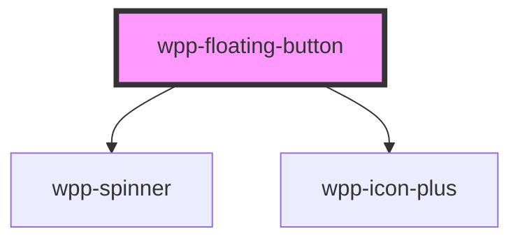

# wpp-floating-button

Create a call to perform the primary, or most common, action on the screen.

<!-- Auto Generated Below -->


## Usage

### Angular

```html
<wpp-floating-button></wpp-floating-button>
<wpp-floating-button>
  <wpp-icon-arrow></wpp-icon-arrow>
</wpp-floating-button>
<wpp-floating-button
  [disabled]='disabled'
  [loading]='loading'
>Button</wpp-floating-button>

<a href='https://savelife.in.ua/en/donate'>
  <wpp-floating-button></wpp-floating-button>
</a>

<form [formGroup]="form" (ngSubmit)="submit()">
  <wpp-floating-button type="submit"></wpp-floating-button>
</form>
```


### React

```tsx
import { WppFloatingButton, WppIconDirections } from '@wppopen/components-library-react'

export const FloatingButtonExample = () => (
  <>
    <WppFloatingButton />
    <WppFloatingButton loading />
    <WppFloatingButton disabled />
    <WppFloatingButton>
      <WppIconDirections />
    </WppFloatingButton>

    <a href="https://savelife.in.ua/en/donate">
        <WppFloatingButton />
    </a>

    <form onSubmit={handleSubmit}>
      <WppFloatingButton type='submit' />
    </form>
  </>
)
```


### Vue

```vue

<script setup lang="ts">
import { WppFloatingButton, WppIconArrow } from '@wppopen/components-library-vue'
</script>

<template>
  <WppFloatingButton />
  <WppFloatingButton loading />
  <WppFloatingButton disabled />
  <WppFloatingButton>
    <WppIconArrow />
  </WppFloatingButton>

  <a href="https://savelife.in.ua/en/donate">
    <WppFloatingButton />
  </a>

  <form @submit="handleSubmit">
    <WppFloatingButton type='submit' />
  </form>
</template>


```


## Properties

| Property         | Attribute          | Description                                                                                                 | Type                                                                                        | Default     |
| ---------------- | ------------------ | ----------------------------------------------------------------------------------------------------------- | ------------------------------------------------------------------------------------------- | ----------- |
| `ariaProps`      | --                 | Contains the button `aria-` props.                                                                          | `AriaProps`                                                                                 | `{}`        |
| `autoFocus`      | `auto-focus`       | If the button should be in focus on page load.                                                              | `boolean`                                                                                   | `false`     |
| `disabled`       | `disabled`         | If the component is disabled.                                                                               | `boolean`                                                                                   | `false`     |
| `form`           | `form`             | Defines the form to which the button belongs.                                                               | `string \| undefined`                                                                       | `undefined` |
| `formAction`     | `form-action`      | Defines where to send the form-data when the form is submitted. Only for buttons with `type="submit"`.      | `string \| undefined`                                                                       | `undefined` |
| `formEncType`    | `form-enc-type`    | Defines how to encode the form-data before sending it to the server. Only for buttons with `type="submit"`. | `"application/x-www-form-urlencoded" \| "multipart/form-data" \| "text/plain" \| undefined` | `undefined` |
| `formMethod`     | `form-method`      | Defines which HTTP method to use when sending the form-data. Only for buttons with `type="submit"`.         | `"get" \| "post" \| undefined`                                                              | `undefined` |
| `formNoValidate` | `form-no-validate` | If the form-data is validated after submission. Only for buttons with `type="submit"`.                      | `boolean`                                                                                   | `false`     |
| `formTarget`     | `form-target`      | Defines where to display a response after form submission. Only for buttons with `type="submit"`.           | `"_blank" \| "_parent" \| "_self" \| "_top" \| undefined`                                   | `undefined` |
| `loading`        | `loading`          | If the component is in loading state.                                                                       | `boolean`                                                                                   | `false`     |
| `name`           | `name`             | Defines the button name.                                                                                    | `string \| undefined`                                                                       | `undefined` |
| `type`           | `type`             | Defines the button type.                                                                                    | `"button" \| "reset" \| "submit"`                                                           | `'button'`  |
| `value`          | `value`            | Defines the button value.                                                                                   | `string \| undefined`                                                                       | `undefined` |


## Methods

### `setFocus() => Promise<void>`

Method that sets focus on the native button.

#### Returns

Type: `Promise<void>`


## Slots

| Slot | Description                                                                                   |
| ---- | --------------------------------------------------------------------------------------------- |
|      | Icon slot, contains `wpp-icon-plus` by default. The default slot, without the name attribute. |


## Shadow Parts

| Part                | Description             |
| ------------------- | ----------------------- |
| `"button"`          | Button element          |
| `"icon-plus"`       | icon plus element       |
| `"spinner"`         | spinner element         |
| `"spinner-wrapper"` | spinner wrapper element |


## CSS Custom Properties

| Name                                 | Description |
| ------------------------------------ | ----------- |
| `--wpp-fb-border-radius`             |             |
| `--wpp-fb-box-shadow`                |             |
| `--wpp-fb-first-border-color-focus`  |             |
| `--wpp-fb-height`                    |             |
| `--wpp-fb-primary-bg-color`          |             |
| `--wpp-fb-primary-bg-color-active`   |             |
| `--wpp-fb-primary-bg-color-disabled` |             |
| `--wpp-fb-primary-bg-color-hover`    |             |
| `--wpp-fb-primary-icon-color`        |             |
| `--wpp-fb-primary-text-color`        |             |
| `--wpp-fb-second-border-color-focus` |             |
| `--wpp-fb-width`                     |             |


## Dependencies

### Depends on

- [wpp-spinner](../wpp-spinner)
- [wpp-icon-plus](../wpp-icon/components/add-and-remove/wpp-icon-plus)

### Graph


----------------------------------------------

*Built with [StencilJS](https://stenciljs.com/)*
